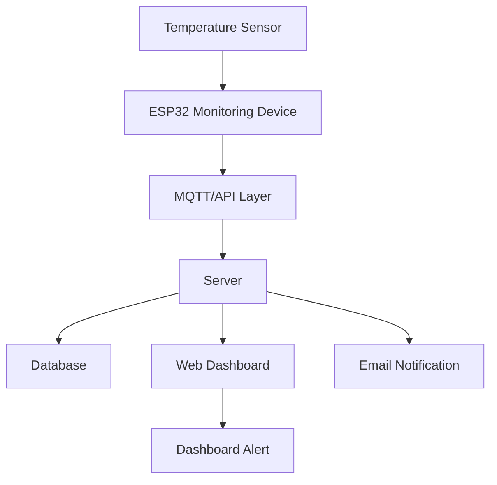
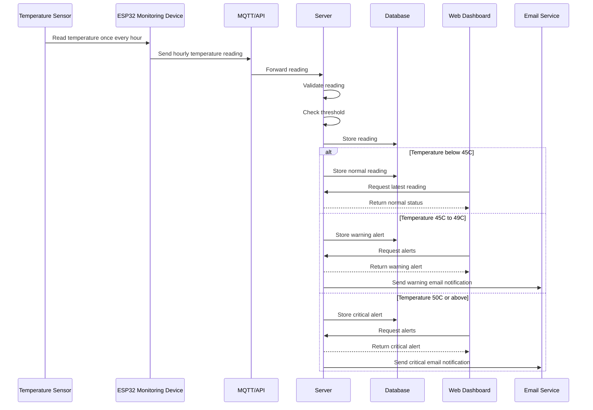
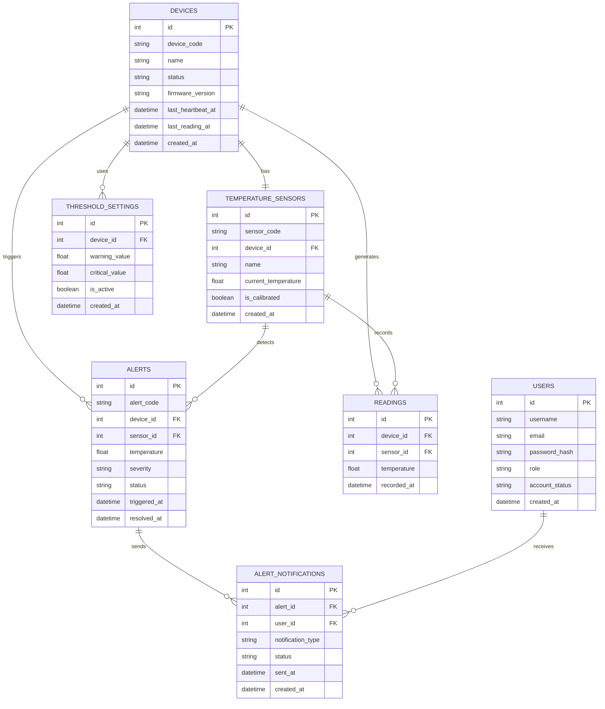

# 🌡️ FlexSight – Temperature Monitoring & Alert System

## 📋 Stage 1 – Team Formation & Idea Development

---

## 📑 Table of Contents

1. [Project Overview](#project-overview)
2. [Problem Statement](#problem-statement)
3. [Proposed Solution](#proposed-solution)
4. [Project Scope](#project-scope)
5. [Target Users & Use Cases](#target-users--use-cases)
6. [Team Formation & Roles](#team-formation--roles)
7. [Collaboration Strategy](#collaboration-strategy)
8. [Brainstorming & Idea Evaluation](#brainstorming--idea-evaluation)
9. [Final Decision Justification](#final-decision-justification)
10. [High-Level System Workflow](#high-level-system-workflow)
11. [Initial Technical Direction](#initial-technical-direction)
12. [Repository Structure](#repository-structure)
13. [Roadmap](#roadmap)
14. [Risks & Constraints](#risks--constraints)
15. [Future Enhancements](#future-enhancements)
16. [Project Summary](#project-summary)


---
# Project Overview

| Item | Description |
|---|---|
| Project Name | FlexSight – Temperature Monitoring & Alert System |
| Project Type | Graduation Project MVP |
| Platform | Web Dashboard |
| Current Scope | Temperature Monitoring Only |
| Core Workflow | Temperature Sensor → ESP32 Monitoring Device → MQTT/API → Server → Database → Web Dashboard → Dashboard Alert / Email Notification |
| Main Goal | Support early response by detecting abnormal temperature levels and generating alerts |

FlexSight is a lightweight temperature monitoring and alert system designed to support early safety response through ESP32 devices, hourly temperature readings, dashboard alerts, and email notifications.

The current MVP focuses on *temperature monitoring only*. The system collects temperature readings from a sensor, sends the readings through MQTT/API using an ESP32 monitoring device, processes the data on the server, stores the readings in a database, and displays readings and alerts on a web dashboard.

When the temperature reaches the configured warning or critical threshold, the system generates a dashboard alert and can send an email notification to responsible users.

---

# Problem Statement

Many operational systems need a simple and automated way to monitor abnormal temperature levels and reduce delayed response.

Manual checking can create several issues:

- Temperature changes may not be detected quickly.
- Critical heat thresholds may go unnoticed.
- Alerts may be delayed or unavailable.
- Monitoring data may not be centralized.
- Responsible users may respond late to abnormal temperature conditions.

FlexSight addresses this problem by providing an hourly temperature monitoring workflow that supports faster detection, centralized visibility, and better alert follow-up.

---

# Proposed Solution

FlexSight provides a web-based temperature monitoring system that follows this workflow:

text
Temperature Sensor
        ↓
ESP32 Monitoring Device
        ↓
MQTT/API
        ↓
Server
        ↓
Database
        ↓
Web Dashboard
        ↓
Dashboard Alert / Email Notification


The system:

- Reads temperature values from a temperature sensor.
- Uses an ESP32 monitoring device to collect and send readings.
- Sends hourly temperature readings through MQTT/API.
- Processes readings on the server.
- Stores readings and alerts in a database.
- Checks readings against warning and critical temperature thresholds.
- Displays device status, readings, and alerts on a web dashboard.
- Sends email notifications when abnormal temperature alerts are generated.

---

# Project Scope

## 4.1 In Scope

| # | Feature | Description |
|---|---|---|
| 1 | Temperature Monitoring | Collect hourly temperature readings from ESP32 monitoring devices |
| 2 | ESP32 Monitoring Device | Use an ESP32-based device to collect and send temperature data |
| 3 | MQTT/API Communication | Send temperature readings from the ESP32 device to the backend |
| 4 | Server Processing | Receive, validate, process, and store temperature data |
| 5 | Threshold Checking | Classify readings as normal, warning, or critical based on configured thresholds |
| 6 | Web Dashboard | Display temperature readings, device status, and alert information |
| 7 | Dashboard Alerts | Show warning and critical alerts when abnormal temperatures are detected |
| 8 | Historical Readings | Store and display previous hourly temperature readings |
| 9 | Email Notifications | Send email notifications when warning or critical alerts occur |
| 10 | User Roles | Support Owner, Admin, and Inspector roles |

## 4.2 Out of Scope

| # | Feature | Status |
|---|---|---|
| 1 | Mobile Application | Out of Scope |
| 2 | Mobile Push Notifications | Out of Scope |
| 3 | SMS Notifications | Out of Scope |
| 4 | Gas Monitoring | Out of Scope |
| 5 | Smoke Monitoring | Out of Scope |
| 6 | Flame Monitoring | Out of Scope |
| 7 | Camera Monitoring | Out of Scope |
| 8 | AI-Based Risk Prediction | Out of Scope |
| 9 | Power Monitoring | Out of Scope |
| 10 | HVAC Monitoring | Out of Scope |
| 11 | Energy Monitoring | Out of Scope |
| 12 | Advanced Analytics | Out of Scope |
| 13 | Third-Party System Integrations | Out of Scope |

These features may be considered in future versions after the temperature monitoring MVP is completed and tested.

---
## 5. Target Users & Use Cases

### 5.1 Target Users

| User Role | Description |
|---|---|
| Owner | Full access to users, devices, readings, alerts, threshold settings, and system settings |
| Admin | Monitors temperature readings, device status, alerts, and dashboard activity |
| Inspector | Follows up on assigned alerts, reviews affected devices, adds notes, and updates incident status |

### 5.2 Target Use Cases

| Use Case | Description |
|---|---|
| Temperature Monitoring | Collect hourly temperature readings from ESP32 monitoring devices |
| Alert Detection | Detect warning and critical temperature levels based on configured thresholds |
| Dashboard Monitoring | Display readings, device status, and alert information in a web dashboard |
| Incident Follow-up | Allow responsible users to acknowledge, follow up, and resolve alerts |
| Email Notification | Notify responsible users when abnormal temperature levels are detected |

---

## 6. Team Formation & Roles

The project team was structured around the main system workflow:

text
Temperature Sensor → Custom Monitoring Node → MQTT/API → Server → Dashboard Alert


## 6. Team Formation & Roles

The project team was divided based on the main areas required to build FlexSight: project leadership, UI/UX design, frontend development, backend development, and programming support.

The team responsibilities are aligned with the main FlexSight workflow:

text
Temperature Sensor → ESP32 Monitoring Device → MQTT/API → Server → Database → Web Dashboard → Dashboard Alert / Email Notification


| Role | Team Member | Main Responsibility |
|---|---|---|
| Team Leader & Frontend Developer | Hamsa Bnian Alammar | Leads the team coordination, follows up on tasks, supports project planning, and builds the frontend dashboard pages using HTML, CSS, and JavaScript |
| UI/UX Designer & Frontend Developer | Munirah Enad Alotaibi | Designs the Figma wireframes, dashboard layout, visual identity, reusable components, and supports frontend implementation based on the final UI screens |
| Programming & Backend Developer | Hanin Taqi Al Sayed Hassan | Handles programming tasks, backend logic, ESP32 monitoring device setup, temperature sensor integration, MQTT/API communication, and supports alert processing |
| Backend Developer | Rabea Younis Thabit | Builds and supports the backend structure, server-side processing, API handling, database connection, and temperature threshold checking |

---

## 7. Collaboration Strategy

### 7.1 Communication Tools

| Tool | Purpose |
|---|---|
| WhatsApp | Quick updates and daily communication |
| Discord | Technical discussions and file sharing |
| Google Meet | Remote meetings and team alignment |
| In-person Meetings | Brainstorming and project planning |

### 7.2 Documentation & Design Tools

| Tool | Purpose |
|---|---|
| Google Docs | Collaborative report writing and editing |
| Canva | Presentation slides and visual materials |
| GitHub | File organization and version control |
| Figma | UI/UX design, wireframes, and prototype |
| SharePoint | Project file storage and team documentation workspace |

### 7.3 Decision-Making

Team decisions are made through group discussion. If the team does not reach a clear agreement, voting is used to select the most suitable option.

The final decision is based on:

- Feasibility
- Clarity
- Technical alignment
- Project timeline
- MVP simplicity

---

## 8. Brainstorming & Idea Evaluation

### 8.1 Brainstorming Techniques

| Technique | Description |
|---|---|
| Mind Mapping | Organized system components, communication methods, sensor options, and alert features visually |
| How Might We Questions | Explored ways to detect abnormal temperature levels and send alerts efficiently |
| Research-Based Discussions | Focused on real incidents, safety challenges, delayed detection, and dashboard alerts |
| SCAMPER | Improved the monitoring idea by modifying existing temperature monitoring concepts |

### 8.2 Ideas Explored

| Idea | Description | Result |
|---|---|---|
| Smart AI Camera | Camera-based system for detecting risks using AI | Rejected |
| Full Fire Detection System | Multi-sensor fire detection system | Rejected |
| Mobile Alert Application | Mobile app for receiving alerts | Rejected |
| FlexSight | Temperature monitoring system using MQTT/API, server processing, dashboard alerts, and email notifications | Selected |

### 8.3 Evaluation Score

| Idea | Feasibility | Impact | Technical Alignment | Scalability | MVP Simplicity | Total |
|---|---:|---:|---:|---:|---:|---:|
| Smart AI Camera | 2 | 5 | 3 | 5 | 2 | 17 |
| Full Fire Detection System | 3 | 5 | 4 | 5 | 2 | 19 |
| Mobile Alert Application | 4 | 3 | 4 | 3 | 4 | 18 |
| FlexSight | 5 | 4 | 5 | 5 | 5 | 24 |

---

## 9. Final Decision Justification

The team selected FlexSight because it addresses a clear temperature monitoring need and can be built using simple, available components within the project timeline.

FlexSight was chosen because it is:

- Feasible within the project timeline
- Aligned with team skills
- Simple enough for an MVP
- Focused on temperature monitoring only
- Supports dashboard alerts and email notifications
- Scalable for future development
- Based on a clear workflow:

text
Temperature Sensor → ESP32 Monitoring Device → MQTT/API → Server → Database → Web Dashboard → Dashboard Alert / Email Notification


---

## 10. System Architecture

### 10.1 Architecture Overview




### 10.2 Core Workflow

text
Temperature Sensor
        ↓
ESP32 Monitoring Device
        ↓
MQTT/API Layer
        ↓
Server Processing
        ↓
Threshold Checking
        ↓
Database Storage
        ↓
Web Dashboard
        ↓
Dashboard Alert / Email Notification


### 10.3 Data Flow



## 11. Technical Stack

| Layer | Technology | Role |
|---|---|---|
| Sensor Layer | Temperature Sensor | Collects temperature readings |
| Device Layer | ESP32 Monitoring Device | Collects one temperature reading every hour and sends it to the backend |
| Communication Layer | MQTT/API | Sends hourly temperature readings from the ESP32 device to the server |
| Server Layer | Python / Flask Backend | Receives readings, validates data, checks thresholds, and processes alerts |
| Database Layer | SQL Database | Stores users, devices, temperature readings, alerts, threshold settings, and email notification records |
| Dashboard Layer | HTML, CSS, JavaScript | Displays hourly readings, device status, alert summaries, and system information |
| Design Layer | Figma | Wireframes, UI design, dashboard screens, and prototype |
| Version Control | GitHub | Repository hosting, version control, and team collaboration |
| Documentation | SharePoint / Google Docs | Team documentation and project files |
---

## 12. Database Design

### 12.1 Tables

| Table | Fields |
|---|---|
| Users | id, username, email, password_hash, role, account_status, created_at |
| Devices | id, device_code, name, status, firmware_version, last_heartbeat_at, last_reading_at, created_at |
| Temperature Sensors | id, sensor_code, device_id, name, current_temperature, is_calibrated, created_at |
| Readings | id, device_id, sensor_id, temperature, recorded_at |
| Alerts | id, alert_code, device_id, sensor_id, temperature, severity, status, triggered_at, resolved_at |
| Threshold Settings | id, device_id, warning_value, critical_value, is_active, created_at |
| Alert Notifications | id, alert_id, user_id, notification_type, status, sent_at, created_at |

### 12.2 Entity Relationship Diagram


---

## 13. API Endpoints

| Method | Endpoint | Purpose |
|---|---|---|
| POST | /api/login | Authenticate users and return access information |
| POST | /api/readings | Receive hourly temperature readings from ESP32 monitoring devices |
| GET | /api/readings | Retrieve stored temperature readings for dashboard and history views |
| GET | /api/alerts | Retrieve active and historical alerts |
| PUT | /api/alerts/{id} | Update alert status after follow-up |
| GET | /api/devices | Retrieve ESP32 device information and current status |
| GET | /api/users | Retrieve system users and assigned roles |
| PUT | /api/settings/threshold | Update warning and critical temperature thresholds |
---

## 14. UI/UX Design — Figma Web Dashboard

FlexSight is designed as a *web-based monitoring dashboard*, not a mobile application.

The interface focuses on hourly temperature readings, device status, dashboard alerts, readings history, user management, and system settings.

### 14.1 Figma Design Objective

The goal of the Figma design is to translate the FlexSight workflow into a clear user interface:

text
Temperature Sensor → ESP32 Monitoring Device → MQTT/API → Server → Database → Web Dashboard → Dashboard Alert / Email Notification


The UI helps users:

- Monitor hourly temperature readings
- Identify normal, warning, and critical temperature levels
- View ESP32 device status
- Review recent and historical alerts
- View readings history
- Manage users based on system roles
- Update temperature threshold settings
- Understand system status quickly without technical complexity


### 14.2 Design Platform

| Item | Description |
|---|---|
| Platform | Web Dashboard |
| Device Type | Desktop-first |
| Main Screen Size | 1440 × 1024 |
| Design Tool | Figma |
| Style | Dark Monitoring Dashboard |
| Current MVP Scope | Temperature Monitoring Only |
| Out of Scope | Mobile app, mobile push notifications, SMS notifications, gas monitoring, smoke monitoring, flame monitoring, camera monitoring, AI-based risk prediction, power monitoring, HVAC monitoring, energy monitoring, advanced analytics, and third-party integrations |

### 14.3 Figma File Structure

text
FlexSight Figma File
│
├── 01 Cover
│   └── Project title, tagline, short description, and dashboard preview
│
├── 02 Project Overview
│   └── Problem, solution, target users, use cases, and project value
│
├── 03 System Architecture
│   └── Visual workflow: Temperature Sensor → ESP32 Monitoring Device → MQTT/API → Server → Database → Web Dashboard → Dashboard Alert / Email Notification
│
├── 04 User Flow
│   └── Login → Dashboard → Devices → Alerts → Readings → Users → Settings
│
├── 05 Wireframes
│   └── Low-fidelity layouts for the main web dashboard screens
│
├── 06 Design System
│   └── Colors, typography, spacing, buttons, cards, badges, inputs, and tables
│
├── 07 Final UI Screens
│   └── High-fidelity web dashboard screens
│
├── 08 Prototype
│   └── Clickable navigation between dashboard screens
│
└── 09 Exported Screens
    └── PNG images used in README and presentation


### 14.4 Design Pages

| Page | Purpose |
|---|---|
| Cover Page | Presents the project identity and dashboard preview |
| Owner Login Page | Allows the Owner to access the system dashboard |
| Admin Login Page | Allows the Admin to access monitoring and alert screens |
| Inspector Login Page | Allows the Inspector to access assigned alerts and follow-up screens |
| Main Dashboard | Displays total devices, online devices, active alerts, critical alerts, hourly temperature trend, and system alerts log |
| Device Management Page | Lists ESP32 monitoring devices, temperature readings, device status, and alert state |
| Alerts Overview Page | Shows active and historical alerts, severity, status, assigned user, and triggered time |
| Alert Details Page | Displays detailed alert information, affected device, temperature value, status, and follow-up notes |
| Readings History Page | Displays historical hourly temperature readings by device and date |
| User Management Page | Allows the Owner to manage users, roles, and permissions |
| System Settings Page | Allows the Owner to update threshold settings and system configuration |

### 14.5 Cover Page Design

text
FlexSight
Temperature Monitoring & Alert System

Hourly temperature monitoring dashboard with device status, dashboard alerts, and email notifications.


### 14.6 Login Page Design

```text
┌──────────────────────────────────────────────────────────────┐
│ Left Branding Section              │ Login Card              │
│                                    │                         │
│ FlexSight                          │ Welcome Back            │
│ Temperature Monitoring             │ Email                   │
│ & Alert System                     │ Password                │
│                                    │ Login Button            │
│ Hourly temperature monitoring      │ Forgot Password         │
│ with dashboard alerts              │                         │
│ and email notifications            │                         │
└──────────────────────────────────────────────────────────────┘
```


### 14.7 Dashboard Page Design

```text
┌────────────────────────────────────────────────────────────────────────────┐
│ Sidebar        │ Top Bar: Dashboard / Admin / Last Reading Time            │
│                ├────────────────────────────────────────────────────────────┤
│ FlexSight      │ [Total Devices] [Online Devices] [Active Alerts] [Critical]│
│ IoT Monitoring │                                                            │
│                │ ┌──────────────────────────────┐ ┌──────────────────────┐ │
│ Dashboard      │ │ Hourly Temperature Trend     │ │ System Alerts Log    │ │
│ Devices        │ │ Latest hourly readings       │ │ Warning / Critical   │ │
│ Alerts         │ │ across ESP32 devices         │ │ Device alerts        │ │
│ Readings       │ └──────────────────────────────┘ └──────────────────────┘ │
│ Users          │                                                            │
│ Settings       │ ┌──────────────────────────────┐ ┌──────────────────────┐ │
│                │ │ Device Status Overview       │ │ System Tools         │ │
│                │ │ Online / Offline / Alerts    │ │ Refresh / Export     │ │
│                │ └──────────────────────────────┘ └──────────────────────┘ │
└────────────────────────────────────────────────────────────────────────────┘
```


### 14.8 Dashboard Metric Cards

| Card | Example Value | Description |
|---|---|---|
| Total Devices | 5 | Total ESP32 monitoring devices |
| Online Devices | 4 | Number of devices currently online |
| Active Alerts | 3 | Number of active warning or critical alerts |
| Critical Alerts | 1 | Number of critical alerts requiring attention |
| Latest Temperature | 47.0°C | Latest hourly temperature reading |


`md
### 14.9 Alerts Page Design

| Column | Description |
|---|---|
| Alert ID | Unique alert identifier |
| Device | ESP32 device that generated the alert |
| Temperature | Recorded temperature value |
| Severity | Normal, Warning, or Critical |
| Status | Active, Acknowledged, Escalated, or Resolved |
| Triggered At | Time when the alert occurred |
| Assigned | User assigned to follow up on the alert |
| Action | View alert details |

Example row:

```text
#AL-9842 | ESP32-01 | 52.5°C | Critical | Active | 14:00 | Inspector | View
```
### 14.11 Readings History Page Design

The Readings History page displays historical hourly temperature readings collected from ESP32 monitoring devices.

Readings history content:

- Device ID
- Temperature value
- Reading status
- Recorded time
- Hourly reading history
- Temperature trend summary
- Normal, warning, and critical readings

### 14.12 Settings Page Design

```text
Warning Threshold: 45°C
Critical Threshold: 50°C
Reading Frequency: Hourly
Alert Type: Dashboard Alert / Email Notification
Device Monitoring: ESP32 Devices
```

### 14.12 Settings Page Design

```text
Warning Threshold: 45°C
Critical Threshold: 50°C
Reading Frequency: Hourly
Alert Type: Dashboard Alert / Email Notification
Device Monitoring: ESP32 Devices
```


### 14.13 Wireframes

Wireframe pages:

- Owner Login Wireframe
- Admin Login Wireframe
- Inspector Login Wireframe
- Main Dashboard Wireframe
- Device Management Wireframe
- Alerts Overview Wireframe
- Alert Details Wireframe
- Readings History Wireframe
- User Management Wireframe
- System Settings Wireframe


### 14.14 Design System

| Usage | Color |
|---|---|
| Main Background | #07111F |
| Sidebar | #050A13 |
| Card Background | #0E1A2B |
| Secondary Card | #102238 |
| Border | #1E2D44 |
| Primary Cyan | #16B8D4 |
| Cyan Highlight | #38D9E8 |
| Normal Green | #22C55E |
| Warning Yellow | #FACC15 |
| Critical Red | #EF4444 |
| Main Text | #F8FAFC |
| Muted Text | #94A3B8 |
| Disabled Text | #64748B |

### 14.15 Typography

| Text Type | Font | Weight | Usage |
|---|---|---|---|
| Main Heading | Inter | Bold | Page titles |
| Section Heading | Inter | SemiBold | Card titles and sections |
| Body Text | Inter | Regular | General text |
| Labels | Inter | Medium | Form labels and table headers |
| Numbers | Inter | Bold | Temperature and metric values |

### 14.16 Spacing & Layout Rules

| Item | Value |
|---|---|
| Frame Size | 1440 × 1024 |
| Sidebar Width | 260px |
| Top Bar Height | 80px |
| Card Radius | 16px |
| Card Padding | 24px |
| Section Gap | 24px |
| Grid Gap | 20px |
| Button Height | 48px |
| Input Height | 48px |

### 14.17 Reusable Components

| Component | Description |
|---|---|
| Primary Button | Used for main actions such as Login and Save |
| Secondary Button | Used for less important actions |
| Input Field | Used in login and settings forms |
| Sidebar Item | Navigation item with active and inactive states |
| Metric Card | Displays hourly temperature readings and system status |
| Alert Badge | Shows Normal, Warning, or Critical severity |
| Status Badge | Shows Online, Offline, or Maintenance |
| Device Card | Displays ESP32 device details and latest reading |
| Chart Card | Contains hourly temperature trend chart |
| Table Row | Used in alerts, devices, readings, users, and settings pages |
| Quick Action Link | Shortcut to important dashboard actions |

### 14.18 Component States

| Component | States |
|---|---|
| Sidebar Item | Default, Hover, Active |
| Button | Default, Hover, Disabled, Loading |
| Alert Badge | Normal, Warning, Critical |
| Status Badge | Online, Offline, Maintenance |
| Input Field | Empty, Focused, Filled, Error |

### 14.19 Prototype Flow

```text
Login
  ↓
Dashboard
  ├── Devices
  ├── Alerts
  ├── Readings
  ├── Users
  └── Settings
```


Interaction flow:

```text
Login Button → Dashboard
Sidebar Dashboard → Dashboard Page
Sidebar Devices → Device Management Page
Sidebar Alerts → Alerts Overview Page
Recent Alert → Alert Details Page
Sidebar Readings → Readings History Page
Sidebar Users → User Management Page
Sidebar Settings → System Settings Page
Save Settings → Dashboard
```


### 14.20 Figma Exported Screens

text
assets/
│
├── figma-cover.png
├── figma-login-page.png
├── figma-dashboard-page.png
├── figma-alerts-page.png
├── figma-nodes-page.png
├── figma-reports-page.png
├── figma-settings-page.png
└── figma-prototype-flow.png


### 14.21 Figma Preview in README

md
### Figma Dashboard Preview


### Figma Prototype Flow


### 14.22 UI Scope Note

The current UI design supports the temperature monitoring MVP only.

Gas detection, smoke detection, flame detection, AI camera detection, and mobile app screens are intentionally not included in the current Figma scope.

They may be added later as future enhancements after the temperature monitoring dashboard is completed.

---

## 15. User Flow

```text
Login
  ↓
Dashboard
  ├── Devices
  ├── Alerts
  ├── Readings
  ├── Users
  └── Settings
```


The user flow starts from the login page. After successful authentication, users are redirected to the dashboard based on their assigned role.

From the dashboard, users can navigate to device management, alerts, readings history, user management, and system settings depending on their permissions.

---


## 16. Repository Structure

```text
FlexSight/
├── README.md
├── docs/
│   ├── stage-1.md
│   ├── stage-2-project-charter.md
│   └── stage-3-technical-documentation.md
├── hardware/
│   ├── sensor_setup.md
│   └── esp32_device_notes.md
├── backend/
│   ├── app/
│   │   ├── main.py
│   │   ├── config.py
│   │   ├── api_routes.py
│   │   ├── alert_engine.py
│   │   ├── models.py
│   │   └── db_handler.py
│   ├── requirements.txt
│   └── README.md
├── database/
│   ├── schema.sql
│   └── seed.sql
├── frontend/
│   ├── index.html
│   ├── dashboard.html
│   ├── devices.html
│   ├── alerts.html
│   ├── readings.html
│   ├── users.html
│   ├── settings.html
│   ├── css/
│   │   └── dashboard.css
│   └── js/
│       ├── api.js
│       ├── dashboard.js
│       ├── devices.js
│       ├── alerts.js
│       ├── readings.js
│       ├── users.js
│       └── settings.js
└── assets/
    ├── figma-owner-login.png
    ├── figma-admin-login.png
    ├── figma-inspector-login.png
    ├── figma-dashboard-page.png
    ├── figma-devices-page.png
    ├── figma-alerts-page.png
    ├── figma-alert-details-page.png
    ├── figma-readings-page.png
    ├── figma-users-page.png
    ├── figma-settings-page.png
    ├── figma-prototype-flow.png
    ├── architecture-diagram.png
    ├── sequence-diagram.png
    └── logo.png
```

---

## 17. Roadmap

| Step | Action |
|---|---|
| Step 1 | Approve project idea and team roles |
| Step 2 | Prepare Stage 1 documentation |
| Step 3 | Define project scope and out-of-scope features |
| Step 4 | Prepare Stage 2 project charter |
| Step 5 | Create user stories and Figma mockups |
| Step 6 | Design system architecture |
| Step 7 | Create components, classes, and database design |
| Step 8 | Define API endpoints |
| Step 9 | Build backend server and alert logic |
| Step 10 | Build frontend dashboard pages |
| Step 11 | Connect frontend with backend API |
| Step 12 | Test temperature readings, dashboard alerts, and email notifications |
| Step 13 | Prepare final demo and project documentation |

---

## 18. Risks & Constraints

| Risk / Constraint | Description | Mitigation |
|---|---|---|
| Internet Connectivity | The system depends on a stable connection for sending hourly temperature readings | Test connection stability and handle failed transmission attempts |
| Sensor Calibration | Temperature accuracy depends on correct sensor calibration | Calibrate the temperature sensor before testing |
| Hardware Quality | Low-quality components may affect temperature readings | Use approved and tested components |
| Fixed Threshold | One threshold may not fit every use case | Allow warning and critical thresholds to be updated in settings |
| Power Supply | The ESP32 monitoring device requires continuous power | Use a stable power source during testing |
| Timeline | Advanced features may exceed the project timeline | Keep the MVP focused on temperature monitoring only |
| Email Delivery | Email notifications may fail due to service or configuration issues | Test email delivery and track notification status |
| False Alerts | Temporary temperature fluctuations may trigger unnecessary alerts | Validate readings before generating alerts |

---

## 19. Future Enhancements

| Future Feature | Description |
|---|---|
| More ESP32 Devices | Support additional ESP32 monitoring devices |
| Configurable Thresholds | Allow warning and critical thresholds to be customized per device |
| Alert Assignment | Assign alerts to specific responsible users |
| Email Delivery Tracking | Track whether alert emails were sent successfully |
| Advanced Report Export | Export temperature readings and alert history |
| Dashboard Performance Summaries | Show summaries for readings, alerts, and device status |
| More Detailed Alert History | Improve filtering and review of previous alerts |
| Additional Role-Based Permissions | Expand access control for Owner, Admin, and Inspector roles |
---

## 20. Project Summary

FlexSight is a web-based temperature monitoring and alert system designed to support early response to abnormal temperature levels.

The project focuses on a clear and achievable MVP:

text
Temperature Sensor → ESP32 Monitoring Device → MQTT/API → Server → Database → Web Dashboard → Dashboard Alert / Email Notification


The system collects hourly temperature readings from ESP32 monitoring devices, sends the readings to the backend through MQTT/API, validates and stores the data, checks warning and critical thresholds, and displays device status, readings, and alerts on the web dashboard.

The MVP is limited to temperature monitoring only. Mobile applications, SMS notifications, gas monitoring, smoke monitoring, flame monitoring, camera monitoring, AI-based risk prediction, power monitoring, HVAC monitoring, energy monitoring, advanced analytics, and third-party integrations are intentionally kept out of scope for the current version.
