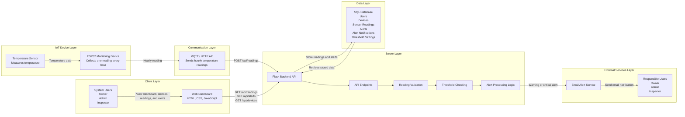

MVP System Architecture

High-Level Package Diagram

High-Level Architecture Diagram

⸻

Architecture Overview

FlexSight is designed as an IoT-based web monitoring platform that follows a layered architecture to ensure clear separation of responsibilities, maintainability, and scalability.

The system consists of an IoT device layer for collecting hourly temperature readings, a communication layer for transmitting readings, a server layer for processing sensor data and alerts, a data layer for storing system records, a client layer for user interaction through the web dashboard, and an external service layer for sending email alert notifications.

The ESP32 monitoring device collects temperature readings from the temperature sensor exactly once every hour and sends the data to the backend using MQTT or HTTP API communication. The backend validates the received data, stores it in the database, checks temperature thresholds, and triggers warning or critical alerts when abnormal readings are detected.

⸻
## System Components

| Component | Technology | Description |
|---|---|---|
| IoT Device | ESP32 Monitoring Device | Collects temperature readings every hour and sends them to the backend system. |
| Sensor | DHT11 Temperature Sensor | Measures temperature  values from the monitored device environment. |
| Frontend | HTML, CSS, JavaScript | Web dashboard used to display readings, alerts, device status, and historical data. |
| Backend | Python + Flask | RESTful API server responsible for receiving readings, validating data, processing alerts, and serving dashboard data. |
| Communication | MQTT / HTTP API | Used to transmit hourly sensor readings from the ESP32 device to the backend system. |
| Database | SQL Database | Stores users, devices, sensor readings, alerts, alert notifications, and threshold settings. |
| Alert Logic | Threshold Monitoring | Checks readings against warning and critical temperature thresholds. |
| Email Notifications | SMTP / Email Service | Sends warning and critical alert notifications to responsible users. |
:::
⸻

Architecture Overview

FlexSight is designed as an IoT-based web monitoring platform that follows a layered architecture to ensure clear separation of responsibilities, maintainability, and scalability.

The system consists of an IoT device layer for collecting hourly temperature readings, a client layer for user interaction through a web dashboard, a server layer for processing sensor data and alerts, a data layer for storing readings and system records, and an external service layer for sending email alert notifications.

The ESP32 monitoring device collects temperature readings from the temperature sensor exactly once every hour and sends the data to the backend using MQTT or HTTP/API communication. The backend validates the received data, stores it in the database, checks temperature thresholds, and triggers warning or critical alerts when abnormal readings are detected.

⸻

System Components

Component	Technology	Description
IoT Device	ESP32 Monitoring Device	Collects temperature readings every hour and sends them to the backend system.
Sensor	Temperature Sensor	Measures temperature values from the monitored device environment.
Frontend	HTML, CSS, JavaScript	Web dashboard used to display readings, alerts, device status, and historical data.
Backend	Python + Flask	RESTful API server responsible for receiving readings, validating data, processing alerts, and serving dashboard data.
Communication	MQTT / HTTP API	Used to transmit hourly temperature readings from the ESP32 device to the backend system.
Database	SQL Database	Stores users, devices, sensor readings, alerts, alert notifications, and threshold settings.
Alert Logic	Threshold Monitoring	Checks readings against warning and critical temperature thresholds.
Email Notifications	SMTP / Email Service	Sends warning and critical alert notifications to responsible users.

⸻

Architectural Principles

Separation of Concerns

Each layer has a clear responsibility. The ESP32 monitoring device collects readings, the backend processes data and alerts, the database stores records, and the dashboard displays information to users.

Scalability

The architecture allows additional ESP32 monitoring devices to be added in the future without changing the overall system structure.

Maintainability

Using a layered structure makes the system easier to update, debug, and expand during future development stages.

Reliability

Temperature readings are validated before storage, and abnormal readings trigger alert logic to support quick response.

Extensibility

The system can later support additional temperature monitoring devices, configurable thresholds, and summary reports while keeping the MVP structure simple.
