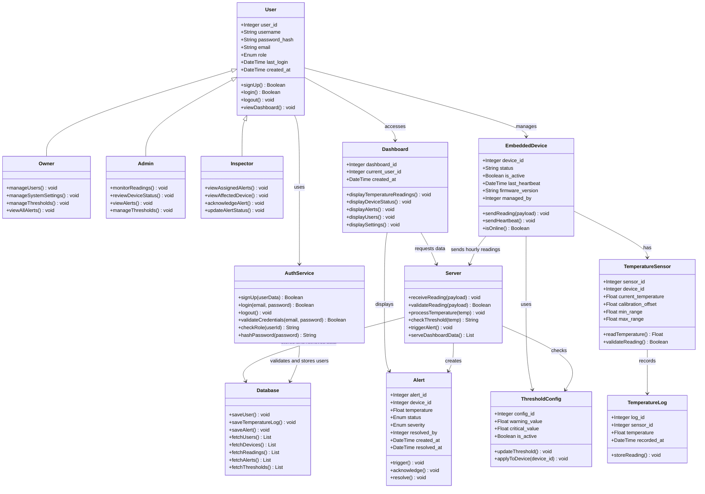

## Database Overview

The FlexSight database is designed to support user authentication, user role management, ESP32 monitoring devices, temperature sensors, hourly temperature readings, threshold configuration, alert processing, and dashboard access.

The schema uses primary keys (PK) and foreign keys (FK) to maintain clear relationships between the main system entities.

The database supports the MVP workflow:

```text
Sign Up / Login → Dashboard Access
Temperature Sensor → ESP32 Monitoring Device → MQTT/API → Server → Database → Web Dashboard → Dashboard Alert
```

---

# Database Schema

## users

- user_id (PK)
- username (UNIQUE)
- password_hash
- email (UNIQUE)
- role (OWNER / ADMIN / INSPECTOR)
- last_login
- created_at

## embedded_devices

- device_id (PK)
- status
- is_active
- last_heartbeat
- firmware_version
- managed_by (FK → users.user_id)

## temperature_sensors

- sensor_id (PK)
- device_id (FK → embedded_devices.device_id)
- current_temperature
- calibration_offset
- min_range
- max_range

## threshold_configs

- config_id (PK)
- warning_value
- critical_value
- is_active

## temperature_logs

- log_id (PK)
- sensor_id (FK → temperature_sensors.sensor_id)
- temperature
- recorded_at

## alerts

- alert_id (PK)
- device_id (FK → embedded_devices.device_id)
- temperature
- status (OPEN / ACKNOWLEDGED / RESOLVED)
- severity (WARNING / CRITICAL)
- resolved_by (FK → users.user_id)
- created_at
- resolved_at

## dashboards

- dashboard_id (PK)
- current_user_id (FK → users.user_id)
- created_at

## device_thresholds

- device_id (FK → embedded_devices.device_id)
- config_id (FK → threshold_configs.config_id)

---

# Relationships

- users 1 → N embedded_devices
- users 1 → N dashboards
- users 1 → N alerts through resolved_by
- embedded_devices 1 → N temperature_sensors
- temperature_sensors 1 → N temperature_logs
- embedded_devices 1 → N alerts
- embedded_devices N → N threshold_configs through device_thresholds
- threshold_configs N → N embedded_devices through device_thresholds
- ---

# Back-end Components

The FlexSight backend is composed of core components responsible for authentication, device monitoring, temperature reading processing, threshold checking, alert generation, database storage, and dashboard communication.

Each component has a clear responsibility and works with other components to support the complete temperature monitoring workflow.

## User

Represents a FlexSight system user who can sign up, log in, access the dashboard, and log out based on an assigned role.

## Owner

Represents the highest-level user responsible for supervising users, devices, readings, alerts, thresholds, and system settings.

## Admin

Represents the operational user responsible for monitoring temperature readings, reviewing device status, and following up on alerts.

## Inspector

Represents the user responsible for viewing assigned alerts, reviewing affected devices, and updating alert status.

## AuthService

Represents the backend authentication logic responsible for sign up, login validation, password hashing, role checking, and log out.

## EmbeddedDevice

Represents the ESP32 monitoring device responsible for collecting temperature readings and sending them to the backend.

## TemperatureSensor

Represents the temperature sensor connected to the ESP32 monitoring device.

## TemperatureLog

Represents hourly temperature readings stored in the database.

## Server

Represents the Flask backend server responsible for receiving, validating, processing, and storing temperature data.

## Database

Represents the MySQL database layer responsible for storing and retrieving users, devices, readings, alerts, thresholds, and dashboard records.

## Alert

Represents a warning or critical event generated when temperature readings exceed the configured threshold.

## Dashboard

Represents the web interface used by authenticated users to view temperature readings, alerts, devices, users, and settings.

## ThresholdConfig

Represents the warning and critical threshold settings used to classify temperature readings.

---

# Class Diagram


---

# Database Design Notes

- The users table supports authentication and role-based access.
- The password_hash field stores hashed passwords instead of plain text passwords.
- The embedded_devices table stores ESP32 monitoring device information.
- The temperature_sensors table stores sensor details linked to ESP32 devices.
- The temperature_logs table stores hourly temperature readings.
- The threshold_configs table stores warning and critical threshold values.
- The alerts table stores warning and critical alerts.
- The dashboards table links dashboard access to the current user.
- The device_thresholds table connects devices with threshold configurations.

---

# Component Responsibility Summary

| Component | Responsibility |
|---|---|
| User | Accesses the system through sign up, login, dashboard usage, and log out |
| AuthService | Handles sign up, login validation, password hashing, role checking, and log out |
| Owner | Manages users, system settings, thresholds, and overall monitoring |
| Admin | Monitors readings, devices, alerts, and dashboard activity |
| Inspector | Follows up on assigned alerts and updates incident status |
| EmbeddedDevice | Sends hourly temperature readings from the ESP32 monitoring device |
| TemperatureSensor | Measures temperature values |
| TemperatureLog | Stores hourly temperature readings |
| Server | Receives readings, validates data, checks thresholds, and provides API responses |
| Database | Stores and retrieves system records |
| Alert | Represents warning and critical temperature incidents |
| Dashboard | Displays readings, devices, alerts, users, and settings |
| ThresholdConfig | Stores warning and critical threshold values |
