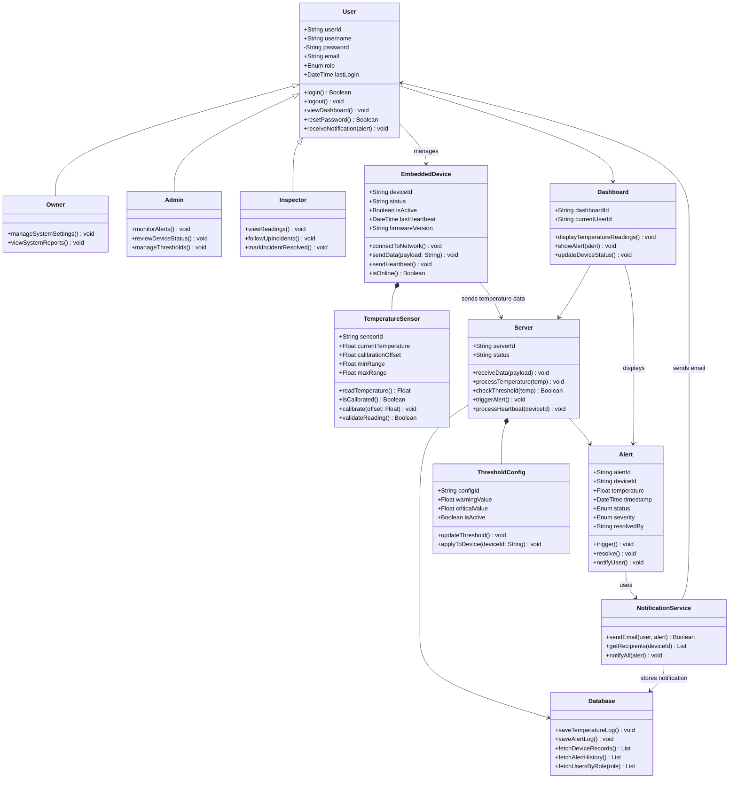

# Components, Classes, and Database Design

## Database Overview

The FlexSight database is designed to support user management, ESP32 monitoring devices, temperature sensors, temperature readings, threshold configuration, alert processing, and notification handling.

The schema uses primary keys (PK) and foreign keys (FK) to maintain clear relationships between the main system entities.

---

# Database Schema

## users

* id (PK)
* username (UNIQUE)
* password_hash
* email (UNIQUE)
* mobile (UNIQUE)
* role (owner / admin / inspector)
* notification_preferences (email)
* account_status (active / inactive / suspended)
* last_login_at
* created_at
* updated_at

## embedded_devices

* id (PK)
* device_code (UNIQUE)
* user_id (FK -> users.id)
* name
* status (online / offline / maintenance / error)
* is_active
* firmware_version
* battery_level
* last_heartbeat_at
* last_seen_at
* created_at
* updated_at

## temperature_sensors

* id (PK)
* sensor_code (UNIQUE)
* device_id (FK -> embedded_devices.id)
* name
* current_temperature
* calibration_offset
* min_range
* max_range
* last_calibration_at
* is_calibrated
* created_at
* updated_at

## sensor_readings

* id (PK)
* device_id (FK -> embedded_devices.id)
* sensor_id (FK -> temperature_sensors.id)
* temperature
* recorded_at

## threshold_configs

* id (PK)
* device_id (FK -> embedded_devices.id)
* name
* warning_value
* critical_value
* cooldown_minutes
* is_active
* created_at
* updated_at

## alerts

* id (PK)
* alert_code (UNIQUE)
* device_id (FK -> embedded_devices.id)
* sensor_id (FK -> temperature_sensors.id)
* temperature
* threshold_value
* severity (warning / critical)
* status (triggered / acknowledged / resolved)
* cooldown_until
* triggered_at
* resolved_at
* resolved_by (FK -> users.id)
* created_at
* updated_at

## alert_notifications

* id (PK)
* alert_id (FK -> alerts.id)
* user_id (FK -> users.id)
* notification_type (email)
* status (sent / failed / pending)
* sent_at
* created_at

---

# Relationships

* users 1 -> N embedded_devices
* embedded_devices 1 -> 1 temperature_sensors
* embedded_devices 1 -> N sensor_readings
* embedded_devices 1 -> N alerts
* embedded_devices 1 -> N threshold_configs
* temperature_sensors 1 -> N sensor_readings
* temperature_sensors 1 -> N alerts
* alerts 1 -> N alert_notifications
* users 1 -> N alert_notifications
* users 1 -> N alerts (resolved_by)

---

# Back-end Components

The FlexSight backend is composed of core components responsible for authentication, device monitoring, temperature reading processing, threshold checking, alert generation, database storage, dashboard communication, and email notification delivery.

Each component has a clear responsibility and works with other components to support the complete temperature monitoring workflow.

## User

Represents a FlexSight system user who can access the platform based on an assigned role.

## Owner

Represents the highest-level user responsible for supervising the full FlexSight system.

## Admin

Represents the operational user responsible for monitoring devices, reviewing alerts, and managing threshold settings.

## Inspector

Represents the user responsible for viewing temperature readings, following up on incidents, and marking alerts as resolved.

## EmbeddedDevice

Represents the ESP32 monitoring node responsible for collecting temperature readings and sending them to the backend.

## TemperatureSensor

Represents the DHT11 temperature sensor connected to the ESP32 device.

## Server

Represents the Flask backend server responsible for receiving, validating, processing, and storing temperature data.

## Database

Represents the SQL database layer responsible for storing and retrieving users, devices, readings, alerts, thresholds, and notification records.

## Alert

Represents a warning or critical event generated when temperature readings exceed the configured threshold.

## Dashboard

Represents the web interface used by users to view temperature readings, alerts, and device status.

## ThresholdConfig

Represents the warning and critical threshold settings used to classify temperature readings.

## NotificationService

Represents the service responsible for sending email alert notifications to responsible users.

The following class diagram visually represents these components, their attributes, methods, and relationships.

---

