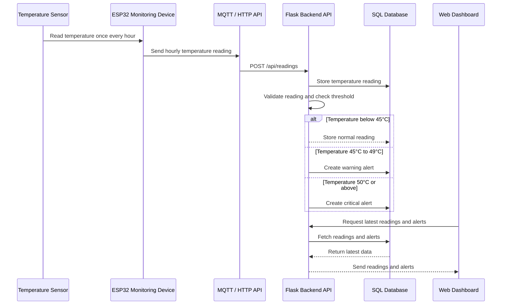

## Use Case 3: Hourly Temperature Monitoring and Alert Generation

### Description

The temperature sensor reads temperature data once every hour. The ESP32 Monitoring Device sends the hourly reading to the Flask Backend API through MQTT or HTTP API. The backend stores the reading, checks the temperature threshold, and creates a warning or critical alert if the reading exceeds the configured threshold. The alert is then displayed on the web dashboard.

### Components Involved

- Temperature Sensor
- ESP32 Monitoring Device
- MQTT / HTTP API
- Flask Backend API
- SQL Database
- Web Dashboard
- | Use Case | Main Purpose |
|---|---|
| User Sign Up | Create a new user account in the FlexSight system. |
| User Login | Authenticate users and grant system access based on role. |
| Hourly Temperature Monitoring & Alert Generation | Collect hourly temperature readings, check thresholds, create alerts, and display them on the dashboard. |
| View Latest Hourly Readings | Display hourly temperature readings, device status, and alert status on the dashboard. |
| User Log Out | End the user session and return to the login page. |
