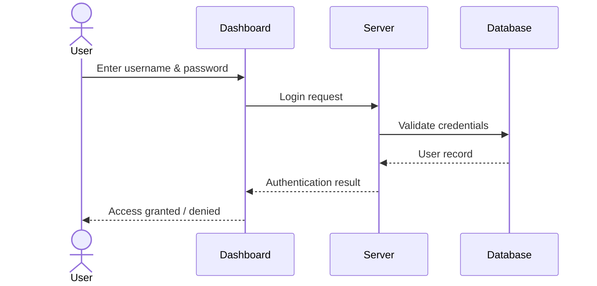
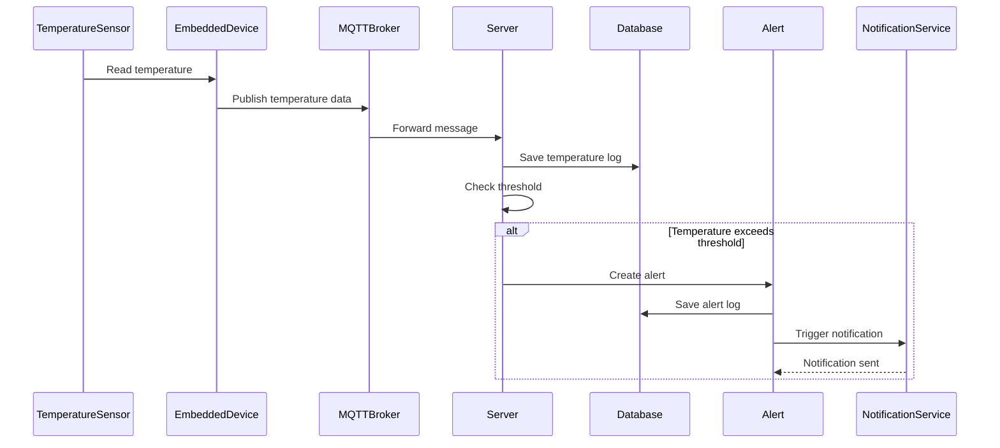
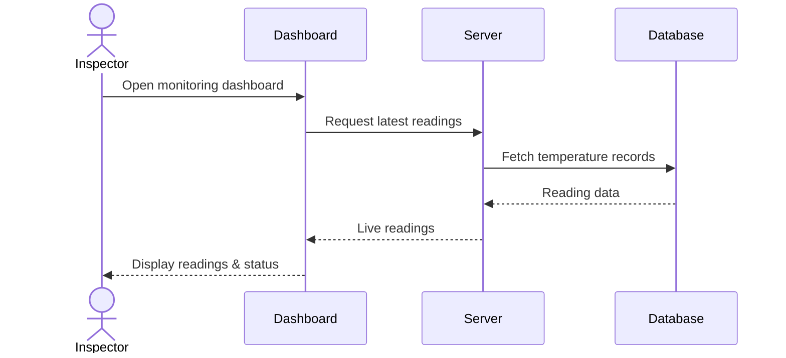

Use Case 1: User Login
Description

The user enters login credentials through the dashboard. The server validates the credentials against the database and returns the authentication result.

- Components Involved
- User
- Dashboard
- Server
- Database

Use Case 2: Temperature Monitoring and Alert Generation
Description

The embedded device reads temperature data from the sensor and sends it through MQTT. The server processes the data, checks thresholds, and creates an alert if the temperature exceeds the configured limit.

- Components Involved
- TemperatureSensor
- EmbeddedDevice
- MQTTBroker
- Server
- Database
- Alert
- NotificationService

Use Case 3: View Live Readings on Dashboard
Description

An inspector or administrator requests real-time monitoring data. The dashboard retrieves the latest readings from the server and displays them.

- Components Involved
- Inspector
- Dashboard
- Server
- Database
  
### Summary of Key Use Cases

| Use Case | Main Purpose |
|---|---|
| **User Login** | Authenticate users and grant system access. |
| **Temperature Monitoring & Alert Generation** | Detect abnormal temperatures and trigger alerts when thresholds are exceeded. |
| **View Live Readings** | Display real-time temperature readings and device status information on the dashboard. |

