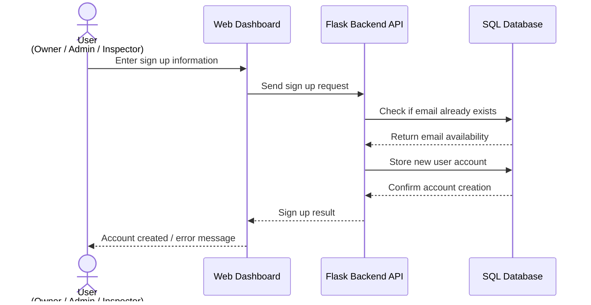
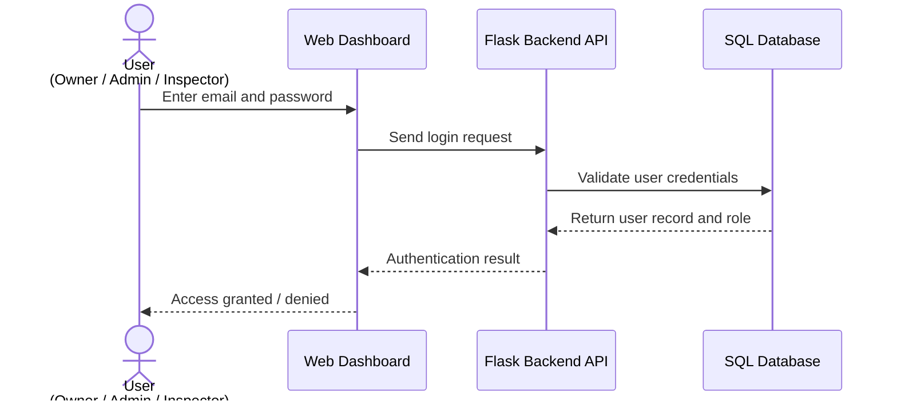
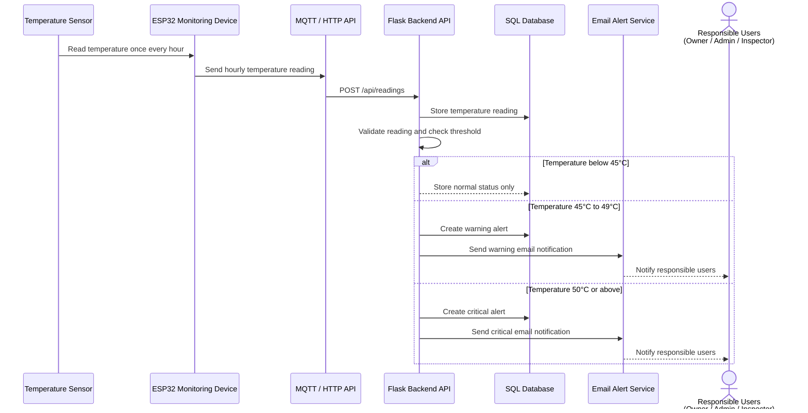
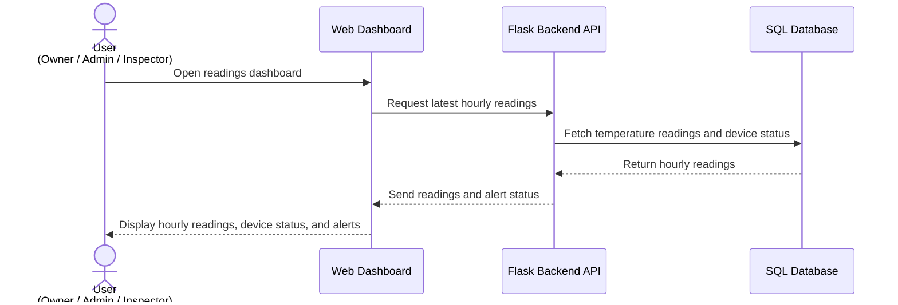
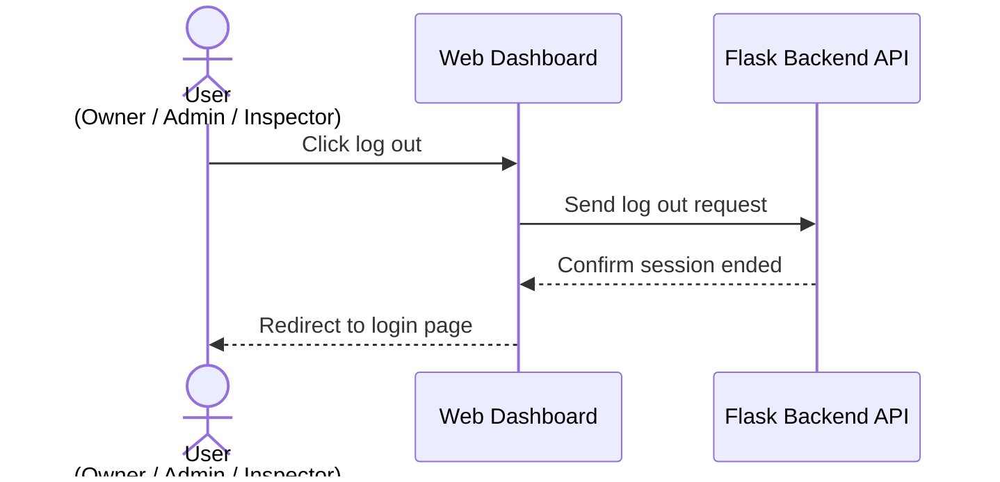

# Sequence Diagrams / Use Cases

## Use Case 1: User Sign Up

### Description

A new user enters account information through the FlexSight web dashboard. The Flask Backend API receives the sign up request, validates the user data, stores the new user account in the SQL database, and returns the account creation result.

### Components Involved

- User
- Web Dashboard
- Flask Backend API
- SQL Database

---

## Use Case 2: User Login

### Description

The user enters login credentials through the FlexSight web dashboard. The Flask Backend API validates the credentials against the SQL database and returns the authentication result based on the user role.

### Components Involved

- User
- Web Dashboard
- Flask Backend API
- SQL Database

---

## Use Case 3: Hourly Temperature Monitoring and Alert Generation

### Description

The temperature sensor reads temperature data once every hour. The ESP32 Monitoring Device sends the hourly reading to the Flask Backend API through MQTT or HTTP API. The backend stores the reading, checks the temperature threshold, and creates an alert if the reading reaches the warning or critical range.

### Components Involved

- Temperature Sensor
- ESP32 Monitoring Device
- MQTT / HTTP API
- Flask Backend API
- SQL Database
- Email Alert Service
- Responsible Users

---

## Use Case 4: View Latest Hourly Readings on Dashboard

### Description

An Owner, Admin, or Inspector opens the dashboard to view the latest hourly temperature readings. The dashboard requests the stored readings from the Flask Backend API, and the API retrieves the data from the SQL database.

### Components Involved

- User
- Web Dashboard
- Flask Backend API
- SQL Database

---

## Use Case 5: User Log Out

### Description

A logged-in user clicks the log out button from the FlexSight dashboard. The web dashboard sends a log out request to the Flask Backend API, the session is ended, and the user is redirected back to the login page.

### Components Involved

- User
- Web Dashboard
- Flask Backend API

---

## Summary of Key Use Cases

| Use Case | Main Purpose |
|---|---|
| User Sign Up | Create a new user account in the FlexSight system. |
| User Login | Authenticate users and grant system access based on role. |
| Hourly Temperature Monitoring & Alert Generation | Collect hourly temperature readings, check thresholds, and create alerts when abnormal temperatures are detected. |
| View Latest Hourly Readings | Display hourly temperature readings, device status, and alert status on the dashboard. |
| User Log Out | End the user session and return to the login page. |
