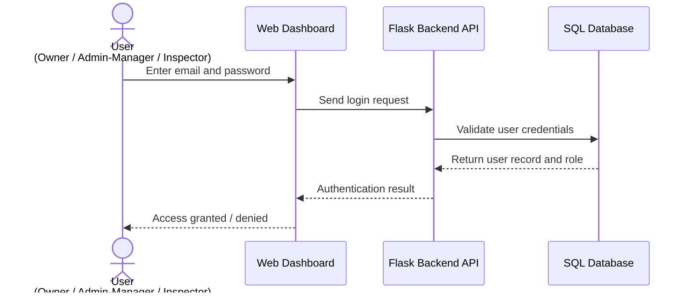
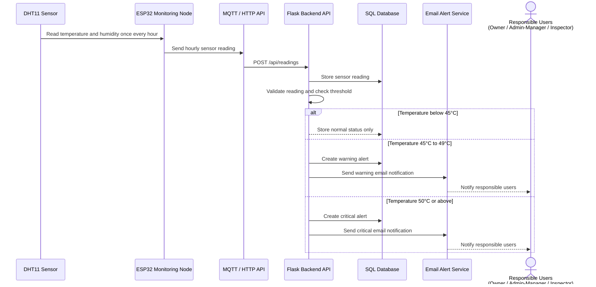
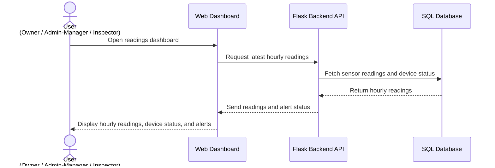

   actor User as User (Owner / Admin-Manager / Inspector)
    participant Dashboard as Web Dashboard
    participant API as Flask Backend API
    participant DB as SQL Database
Sequence Diagrams / Use Cases

Use Case 1: User Login

Description

The user enters login credentials through the FlexSight web dashboard. The Flask Backend API validates the credentials against the SQL database and returns the authentication result based on the user role.

Components Involved

* User
* Web Dashboard
* Flask Backend API
* SQL Database

Use Case 2: Hourly Temperature and Humidity Monitoring and Alert Generation

Description

The DHT11 sensor reads temperature and humidity data once every hour. The ESP32 Monitoring Node sends the hourly reading to the Flask Backend API through MQTT or HTTP API. The backend stores the reading, checks the temperature threshold, and creates an alert if the reading reaches the warning or critical range.

Components Involved

* DHT11 Sensor
* ESP32 Monitoring Node
* MQTT / HTTP API
* Flask Backend API
* SQL Database
* Email Alert Service
* Responsible Users

Use Case 3: View Latest Hourly Readings on Dashboard

Description

An Owner, Admin/Manager, or Inspector opens the dashboard to view the latest hourly temperature and humidity readings. The dashboard requests the stored readings from the Flask Backend API, and the API retrieves the data from the SQL database.

omponents Involved

* User
* Web Dashboard
* Flask Backend API
* SQL Database

## Summary of Key Use Cases

| Use Case | Main Purpose |
|-----------|-------------|
| User Login | Authenticate users and grant system access based on role. |
| Hourly Temperature and Humidity Monitoring & Alert Generation | Collect hourly sensor readings, check thresholds, and create alerts when abnormal temperatures are detected. |
| View Latest Hourly Readings | Display hourly temperature and humidity readings, device status, and alert status on the dashboard. |
