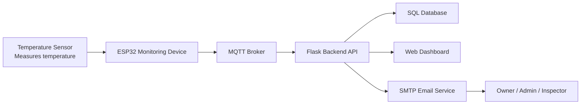
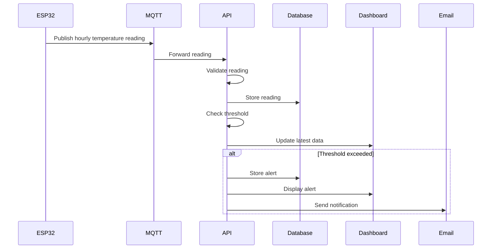

## API Documentation

Purpose

This document defines the external services and internal API endpoints used by the FlexSight Temperature Monitoring System. It explains how temperature data is transmitted, processed, stored, retrieved, and displayed through the dashboard.
---

## External APIs and Services

| Service | Purpose | Reason for Selection |
|---|---|---|
| MQTT Broker | Receives hourly temperature readings from ESP32 devices and forwards them to the backend. | Lightweight, reliable, and suitable for IoT communication. |
| SMTP Email Service | Sends warning and critical alert notifications to responsible users. | Simple, reliable, and appropriate for MVP email notifications. |

---

## System Communication Flow



---

## MQTT Topics Specification

| Topic | Publisher | Subscriber | Purpose |
|---|---|---|---|
| `flexsight/readings` | ESP32 Device | Backend Server | Sends hourly temperature readings. |
| `flexsight/device-status` | ESP32 Device | Backend Server | Reports device online/offline status. |
| `flexsight/alerts` | Backend Server | Dashboard | Publishes generated warning or critical alerts. |

---

## User Roles

| Role | Description |
|---|---|
| Owner | Full access to users, devices, locations, readings, alerts, and system settings. |
| Admin  | Monitors readings, device status, alerts, and operational conditions. |
| Inspector | Follows up on assigned alerts and updates incident status. |

---

## Internal API Overview

| Endpoint | Method | Purpose |
|---|---|---|
| `/api/login` | POST | Authenticate users and return access information. |
| `/api/readings` | POST | Receive hourly temperature readings from ESP32 devices. |
| `/api/readings` | GET | Retrieve stored sensor readings. |
| `/api/alerts` | GET | Retrieve active and historical alerts. |
| `/api/alerts/{id}` | PUT | Update alert status. |
| `/api/devices` | GET | Retrieve device information and status. |
| `/api/users` | GET | Retrieve users and roles. |
| `/api/settings/threshold` | PUT | Update warning and critical temperature thresholds. |

---

## API Processing Flow



---

# API Endpoint Specifications

## 1. POST `/api/login`

### Purpose

Authenticates a user and allows access to the dashboard based on the assigned role.

### Request Body

```json
{
  "username": "admin",
  "password": "password123"
}
```

### Request Fields

| Field | Type | Required | Description |
|---|---|---|---|
| `username` | String | Yes | User login name. |
| `password` | String | Yes | User password. |

### Successful Response

```json
{
  "success": true,
  "role": "admin",
  "token": "jwt_token"
}
```

---

## 2. POST `/api/readings`

### Purpose

Receives temperature readings from ESP32 monitoring devices.

### Request Body

```json
{
  "device_id": "ESP32-01",
  "temperature": 52.0,
  "timestamp": "2026-06-01T14:00:00Z"
}
```

### Request Fields

| Field | Type | Required | Description |
|---|---|---|---|
| `device_id` | String | Yes | Unique ESP32 device identifier. |
| `temperature` | Float | Yes | Temperature value in Celsius. |
| `timestamp` | DateTime | Yes | Time when the reading was collected. |

### Processing Logic


1. Receive the hourly reading from the ESP32 device through MQTT/backend communication.
2. Validate the device ID and temperature value.
3. Store the reading in the SQL database.
4. Compare temperature against warning and critical thresholds.
5. Generate an alert if the threshold is exceeded.
6. Send an email notification when required.
7. Update the dashboard with the latest reading.

### Successful Response

```json
{
  "success": true,
  "message": "Reading stored successfully"
}
```

---

## 3. GET `/api/readings`

### Purpose

Retrieves stored temperature readings for dashboard display and historical review.

### Query Parameters

| Parameter | Type | Required | Description |
|---|---|---|---|
| `device_id` | String | No | Filter readings by device. |
| `start_date` | Date | No | Start date for historical filtering. |
| `end_date` | Date | No | End date for historical filtering. |

### Successful Response

```json
[
  {
    "device_id": "ESP32-01",
    "temperature": 52.0,
    "timestamp": "2026-06-01T14:00:00Z"
  }
]
```

---

## 4. GET `/api/alerts`

### Purpose

Retrieves active and historical alerts for dashboard monitoring and incident follow-up.

### Successful Response

```json
[
  {
    "alert_id": 1,
    "device_id": "ESP32-01",
    "severity": "critical",
    "temperature": 52.0,
    "status": "active",
    "triggered_at": "2026-06-01T14:00:00Z"
  }
]
```

---

## 5. PUT `/api/alerts/{id}`

### Purpose

Updates the status of an alert after review or follow-up.

### Request Body

```json
{
  "status": "resolved",
  "notes": "Issue checked and resolved by inspector."
}
```

### Request Fields

| Field | Type | Required | Description |
|---|---|---|---|
| `status` | String | Yes | New alert status such as resolved or unresolved. |
| `notes` | String | No | Optional follow-up notes. |

### Successful Response

```json
{
  "success": true,
  "message": "Alert updated successfully"
}
```

---

## 6. GET `/api/devices`

### Purpose

Retrieves registered ESP32 monitoring devices and their current status.

### Successful Response

```json
[
  {
    "device_id": "ESP32-01",
    "name": "ESP32 Monitoring Device 01",
    "status": "online",
    "last_reading_at": "2026-06-01T14:00:00Z"
  }
]

```

---

## 8. GET `/api/users`

### Purpose

Retrieves system users and assigned roles for access management.

### Successful Response

```json
[
  {
    "user_id": 1,
    "username": "admin",
    "role": "Admin",
    "account_status": "active"
  }
]
]
```

---

## 9. PUT `/api/settings/threshold`

### Purpose

Updates warning and critical temperature thresholds used by the alert logic.

### Request Body

```json
{
  "warning_threshold": 45,
  "critical_threshold": 50
}
```

### Successful Response

```json
{
  "success": true,
  "message": "Threshold updated successfully"
}
```

---

# Access Control Matrix

| Endpoint | Owner | Admin | Inspector |
|---|---|---|---|
| `POST /api/login` | ✓ | ✓ | ✓ |
| `GET /api/readings` | ✓ | ✓ | ✓ |
| `POST /api/readings` | System | System | System |
| `GET /api/alerts` | ✓ | ✓ | ✓ |
| `PUT /api/alerts/{id}` | ✓ | ✓ | ✓ |
| `GET /api/devices` | ✓ | ✓ | ✓ |
| `GET /api/users` | ✓ | ✗ | ✗ |
| `PUT /api/settings/threshold` | ✓ | ✗ | ✗ |

---

# Error Responses

| Error Case | Example Response |
|---|---|
| Unauthorized access | `{ "success": false, "message": "Unauthorized access" }` |
| Invalid credentials | `{ "success": false, "message": "Invalid username or password" }` |
| Device not found | `{ "success": false, "message": "Device not found" }` |
| Invalid sensor data | `{ "success": false, "message": "Invalid sensor data" }` |
| Internal server error | `{ "success": false, "message": "Internal server error" }` |

---

# API Security

| Security Measure | Purpose |
|---|---|
| Password hashing | Protect stored user passwords. |
| Role-Based Access Control | Restrict access based on user role. |
| Token authentication | Protect internal API endpoints. |
| Input validation | Prevent invalid or unsafe data from being stored. |
| Sensor data validation | Ensure readings are valid before alert processing. |
| Protected admin endpoints | Limit sensitive actions to authorized users. |

---

# Technical Justification

| Decision | Justification |
|---|---|
| MQTT Broker | Lightweight and suitable for ESP32 IoT communication. |
| Flask Backend API | Simple, flexible, and appropriate for RESTful API development. |
| SQL Databasae | |Provides structured storage for users, devices, readings, alerts, alert notifications, and threshold settings |
| SMTP Email Service | Supports automated alert notifications without requiring a mobile app. |
| RESTful API Design | Provides clear communication between dashboard, backend, and database. |

---

# Future Expansion

The API structure allows future expansion without major changes to the core system.

Possible future additions include:

* More ESP32 monitoring devices.
* Configurable alert assignment.
* Advanced report export.
* Email delivery tracking.
* Dashboard performance summaries.
* Additional role-based permission controls.

---

# Conclusion

This API documentation defines the external services and internal endpoints required for the FlexSight Temperature Monitoring System. The design supports IoT data transmission, dashboard monitoring, alert generation, role-based access, email notifications, and future scalability while remaining aligned with the MVP scope.
