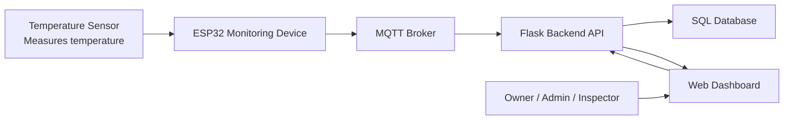
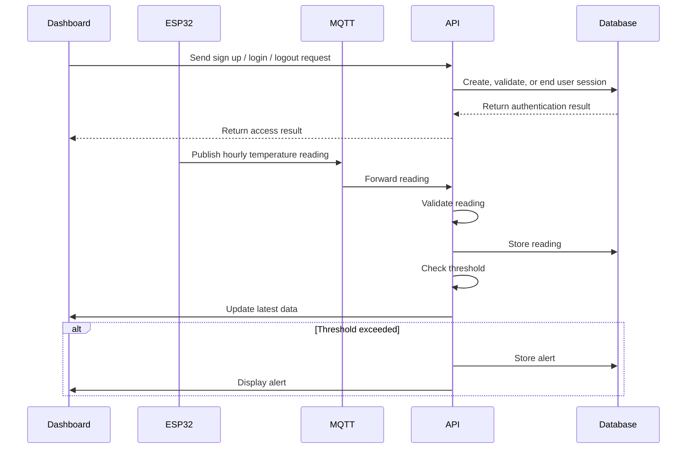

# API Documentation

## Purpose

This document defines the external services and internal API endpoints used by the FlexSight Temperature Monitoring System. It explains how temperature data is transmitted, processed, stored, retrieved, and displayed through the dashboard.

---

## External APIs and Services

| Service | Purpose | Reason for Selection |
|---|---|---|
| MQTT Broker | Receives hourly temperature readings from ESP32 devices and forwards them to the backend. | Lightweight, reliable, and suitable for IoT communication. |

---

## System Communication Flow



---

## MQTT Topics Specification

| Topic | Publisher | Subscriber | Purpose |
|---|---|---|---|
| flexsight/readings | ESP32 Device | Backend Server | Sends temperature readings. |
| flexsight/device-status | ESP32 Device | Backend Server | Reports device online/offline status. |
| flexsight/alerts | Backend Server | Dashboard | Publishes generated warning or critical alerts. |

---

## Multi-Tenant Dashboard Architecture

FlexSight is multi-tenant: every Owner gets their own private Dashboard when they register. Admin and Inspector accounts are created by an Owner and always inherit that Owner's `dashboard_id`.

Every device, sensor reading, alert, and threshold configuration belongs to exactly one dashboard, and every authenticated endpoint filters its data by the caller's `dashboard_id`. Users can never see or modify another dashboard's data.

---

## User Roles

| Role | Description |
|---|---|
| Owner | Registers publicly and owns one Dashboard. Manages dashboard users (creates Admins and Inspectors), manages devices, manages thresholds, views all readings and alerts. |
| Admin | Created by an Owner. Monitors readings and device status, views alerts, manages thresholds. Cannot create users or access other dashboards. |
| Inspector | Created by an Owner. Views and acknowledges alerts and updates alert status only. Cannot manage users, manage settings, or access other dashboards. |

---

## Internal API Overview

| Endpoint | Method | Auth | Purpose |
|---|---|---|---|
| /auth/register-owner | POST | Public | Self-register a new Owner account and its private Dashboard. |
| /auth/login | POST | Public | Authenticate users and return access information. |
| /auth/logout | POST | Token | End the user session. |
| /api/readings | POST | System | Receive hourly temperature readings from ESP32 devices. |
| /users/admin | POST | Owner | Create an Admin account under the Owner's dashboard. |
| /users/inspector | POST | Owner | Create an Inspector account under the Owner's dashboard. |
| /users | GET | Owner | Retrieve the users belonging to the Owner's dashboard. |
| /users/{id} | DELETE | Owner | Remove an Admin or Inspector from the Owner's dashboard. |
| /dashboard | GET | Token | Retrieve summary info for the caller's dashboard. |
| /dashboard/devices | GET | Owner, Admin | Retrieve device information and status for the dashboard. |
| /dashboard/readings | GET | Owner, Admin | Retrieve stored sensor readings for the dashboard. |
| /dashboard/alerts | GET | Token | Retrieve active and historical alerts for the dashboard. |
| /dashboard/alerts/{id} | PUT | Token | Update alert status. |
| /dashboard/settings/threshold | PUT | Owner, Admin | Update warning and critical temperature thresholds for the dashboard. |
---

## API Processing Flow



---

# API Endpoint Specifications

## 1. POST /auth/register-owner

### Purpose

Public, unauthenticated. Self-registers a new Owner account and, in the same transaction, creates the private Dashboard that Owner owns. This is the only way an Owner account is created.

### Request Body

```json
{
  "username": "owner",
  "email": "owner@flexsight.com",
  "password": "password123"
}
```

### Request Fields

| Field | Type | Required | Description |
|---|---|---|---|
| username | String | Yes | User account name. |
| email | String | Yes | User email address. |
| password | String | Yes | User password. |

### Successful Response

```json
{
  "success": true,
  "message": "Owner account created successfully"
}
```

---

## 2. POST /users/admin, POST /users/inspector

### Purpose

Owner-only. Creates an Admin (`/users/admin`) or Inspector (`/users/inspector`) account that automatically inherits the caller's `dashboard_id`.

### Request Body

```json
{
  "username": "inspector",
  "email": "inspector@flexsight.com",
  "password": "password123"
}
```

### Request Fields

| Field | Type | Required | Description |
|---|---|---|---|
| username | String | Yes | User account name. |
| email | String | Yes | User email address. |
| password | String | Yes | User password. |

### Successful Response

```json
{
  "success": true,
  "message": "User account created successfully"
}
```

---

## 3. POST /auth/login

### Purpose

Authenticates a user and allows access to the dashboard based on the assigned role.

### Request Body

```json
{
  "username": "admin",
  "password": "password123"
}
```

### Request Fields

| Field | Type | Required | Description |
|---|---|---|---|
| username | String | Yes | User login name. |
| password | String | Yes | User password. |

### Successful Response

```json
{
  "success": true,
  "role": "Admin",
  "token": "jwt_token"
}
```

---

## 4. POST /auth/logout

### Purpose

Ends the user session and returns the user to the login page.

### Successful Response

```json
{
  "success": true,
  "message": "Logged out successfully"
}
```

---

## 5. POST /api/readings

### Purpose

Receives temperature readings from ESP32 monitoring devices.

### Request Body

```json
{
  "device_id": "ESP32-01",
  "temperature": 52.0,
  "timestamp": "2026-06-01T14:00:00Z"
}
```

### Request Fields

| Field | Type | Required | Description |
|---|---|---|---|
| device_id | String | Yes | Unique ESP32 device identifier. |
| temperature | Float | Yes | Temperature value in Celsius. |
| timestamp | DateTime | Yes | Time when the reading was collected. |

### Processing Logic

1. Receive the hourly reading from the ESP32 device through MQTT/backend communication.
2. Validate the device ID and temperature value.
3. Store the reading in the SQL database.
4. Compare the temperature against warning and critical thresholds.
5. Generate an alert if the threshold is exceeded.
6. Update the dashboard with the latest reading.

### Successful Response

```json
{
  "success": true,
  "message": "Reading stored successfully"
}
```
---

## 6. GET /dashboard/readings

### Purpose

Owner/Admin only. Retrieves temperature readings for devices belonging to the caller's dashboard, for display and historical review.

### Query Parameters

| Parameter | Type | Required | Description |
|---|---|---|---|
| device_id | String | No | Filter readings by device. |
| start_date | Date | No | Start date for historical filtering. |
| end_date | Date | No | End date for historical filtering. |

### Successful Response

```json
[
  {
    "device_id": "ESP32-01",
    "temperature": 52.0,
    "timestamp": "2026-06-01T14:00:00Z"
  }
]
```

---

## 7. GET /dashboard/alerts

### Purpose

Retrieves active and historical alerts belonging to the caller's dashboard for monitoring and incident follow-up.

### Successful Response

```json
[
  {
    "alert_id": 1,
    "device_id": "ESP32-01",
    "severity": "critical",
    "temperature": 52.0,
    "status": "active",
    "triggered_at": "2026-06-01T14:00:00Z"
  }
]
```

---

## 8. PUT /dashboard/alerts/{id}

### Purpose

Updates the status of an alert after review or follow-up. Only alerts belonging to the caller's dashboard can be updated.

### Request Body

```json
{
  "status": "resolved",
  "notes": "Issue checked and resolved by inspector."
}
```

### Request Fields

| Field | Type | Required | Description |
|---|---|---|---|
| status | String | Yes | New alert status such as resolved or unresolved. |
| notes | String | No | Optional follow-up notes. |

### Successful Response

```json
{
  "success": true,
  "message": "Alert updated successfully"
}
```

---

## 9. GET /dashboard/devices

### Purpose

Owner/Admin only. Retrieves the ESP32 monitoring devices registered under the caller's dashboard and their current status.

### Successful Response

```json
[
  {
    "device_id": "ESP32-01",
    "name": "ESP32 Monitoring Device 01",
    "status": "online",
    "last_reading_at": "2026-06-01T14:00:00Z"
  }
]
```

---

## 10. GET /users

### Purpose

Owner-only. Retrieves the users belonging to the caller's dashboard.

### Successful Response

```json
[
  {
    "user_id": 1,
    "username": "admin",
    "role": "Admin",
    "account_status": "active"
  }
]
```

---

## 11. DELETE /users/{id}

### Purpose

Owner-only. Removes an Admin or Inspector account from the caller's dashboard.

Returns **404** if the target user does not belong to the caller's dashboard, and **400** if the target is the dashboard Owner.

### Successful Response

```json
{
  "success": true,
  "message": "User deleted successfully"
}
```

---

## 12. GET /dashboard

### Purpose

Returns a summary of the caller's dashboard. Available to all three roles.

### Successful Response

```json
{
  "dashboard_id": 1,
  "created_at": "2026-06-01T14:00:00Z",
  "owner_username": "owner_user"
}
```

---

## 13. PUT /dashboard/settings/threshold

### Purpose

Owner or Admin. Updates the warning and critical temperature thresholds used by the alert logic for the caller's dashboard.

### Request Body

```json
{
  "warning_threshold": 45,
  "critical_threshold": 50
}
```

### Successful Response

```json
{
  "success": true,
  "message": "Threshold updated successfully"
}
```
---

# Access Control Matrix

| Endpoint | Owner | Admin | Inspector |
|---|---|---|---|
| POST /auth/register-owner | Public | Public | Public |
| POST /auth/login | ✓ | ✓ | ✓ |
| POST /auth/logout | ✓ | ✓ | ✓ |
| POST /api/readings | System | System | System |
| POST /users/admin | ✓ | ✗ | ✗ |
| POST /users/inspector | ✓ | ✗ | ✗ |
| GET /users | ✓ | ✗ | ✗ |
| DELETE /users/{id} | ✓ | ✗ | ✗ |
| GET /dashboard | ✓ | ✓ | ✓ |
| GET /dashboard/devices | ✓ | ✓ | ✗ |
| GET /dashboard/readings | ✓ | ✓ | ✗ |
| GET /dashboard/alerts | ✓ | ✓ | ✓ |
| PUT /dashboard/alerts/{id} | ✓ | ✓ | ✓ |
| PUT /dashboard/settings/threshold | ✓ | ✓ | ✗ |

---

# Error Responses

| Error Case | Example Response |
|---|---|
| Unauthorized access | `{ "success": false, "message": "Unauthorized access" }` |
| Invalid credentials | `{ "success": false, "message": "Invalid username or password" }` |
| User already exists | `{ "success": false, "message": "User already exists" }` |
| Device not found | `{ "success": false, "message": "Device not found" }` |
| Invalid sensor data | `{ "success": false, "message": "Invalid sensor data" }` |
| Internal server error | `{ "success": false, "message": "Internal server error" }` |

---

# API Security

| Security Measure | Purpose |
|---|---|
| Password hashing | Protect stored user passwords. |
| Role-Based Access Control | Restrict access based on user role. |
| Token authentication | Protect internal API endpoints. |
| Input validation | Prevent invalid or unsafe data from being stored. |
| Sensor data validation | Ensure readings are valid before alert processing. |
| Protected admin endpoints | Limit sensitive actions to authorized users. |

---

# Technical Justification

| Decision | Justification |
|---|---|
| MQTT Broker | Lightweight and suitable for ESP32 IoT communication. |
| Flask Backend API | Simple, flexible, and appropriate for RESTful API development. |
| SQL Database | Provides structured storage for users, devices, readings, alerts, and threshold settings. |
| RESTful API Design | Provides clear communication between the dashboard, backend, and database. |

---

# Future Expansion

The API structure allows future expansion without major changes to the core system.

Possible future additions include:

- More ESP32 monitoring devices.
- Configurable alert assignment.
- Advanced report export.
- Dashboard performance summaries.
- Additional role-based permission controls.

---

# Conclusion

This API documentation defines the external services and internal endpoints required for the FlexSight Temperature Monitoring System. The design supports IoT data transmission, dashboard monitoring, alert generation, role-based access, authentication, and future scalability while remaining aligned with the MVP scope.
