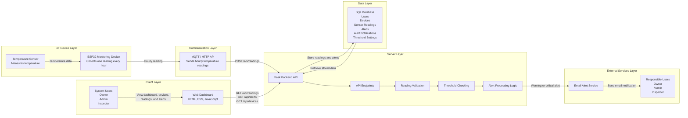
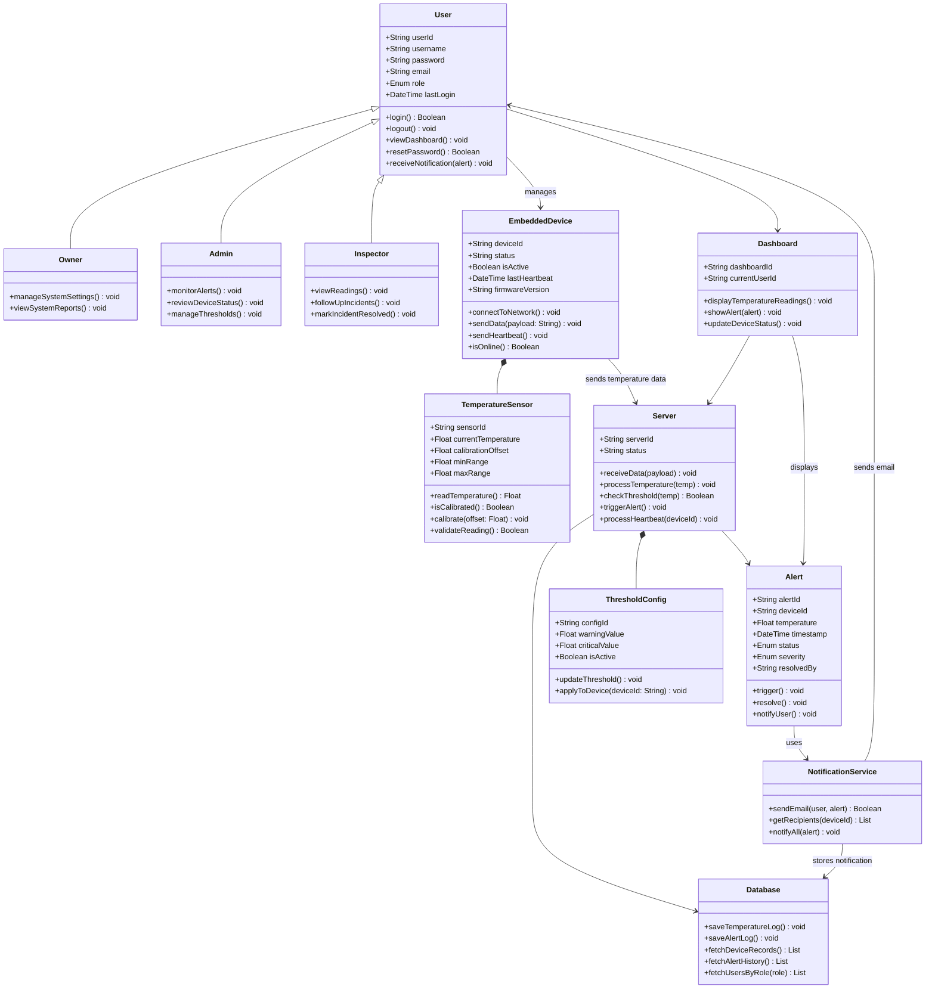
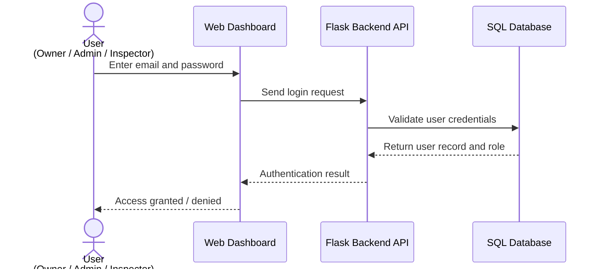
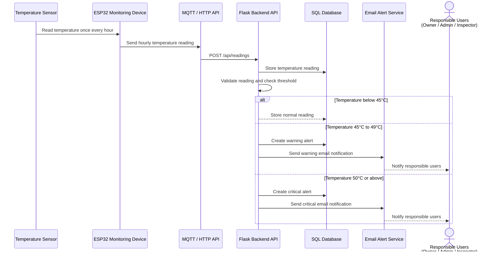
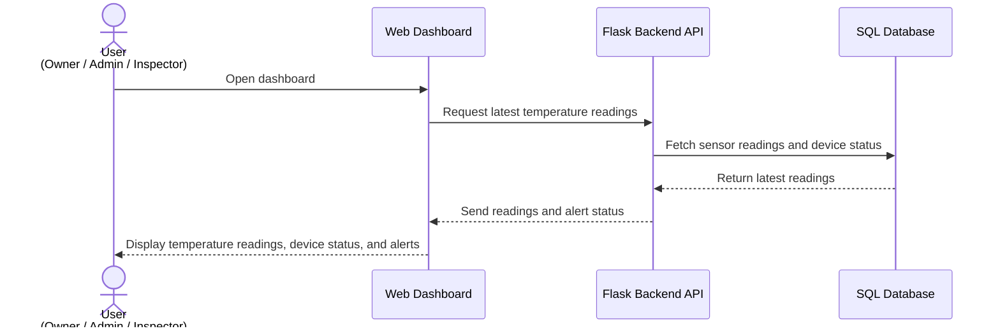
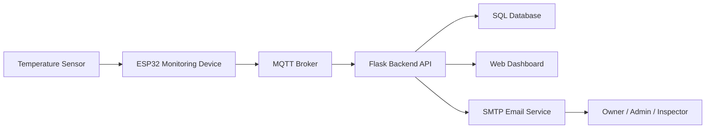
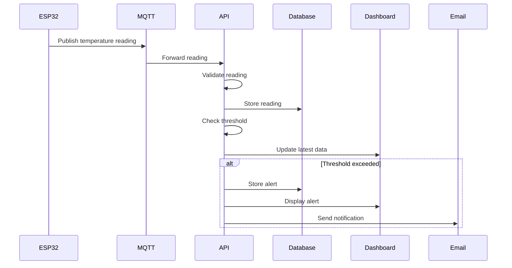

# FlexSight - Technical Documentation

## Stage 3: Technical Documentation

### Temperature Monitoring and Alert System

---

## Table of Contents

1. [Introduction](#introduction)
2. [System Overview](#system-overview)
3. [User Stories and Mockups](#user-stories-and-mockups)
4. [System Architecture](#system-architecture)
5. [Components, Classes, and Database Design](#components-classes-and-database-design)
6. [High-Level Sequence Diagrams](#high-level-sequence-diagrams)
7. [External and Internal APIs](#external-and-internal-apis)
8. [SCM and QA Strategies](#scm-and-qa-strategies)
9. [Technical Justifications](#technical-justifications)
10. [Conclusion](#conclusion)

---

# Introduction

FlexSight is an IoT-based temperature monitoring system designed to support safer and more reliable environmental monitoring in operational environments such as server rooms, warehouses, laboratories, offices, and technical facilities.

This technical documentation translates the project objectives and MVP requirements into a detailed technical plan. It defines the system architecture, user stories, mockups, components, classes, database structure, sequence diagrams, API specifications, source control strategy, quality assurance plan, and technical justifications.

The purpose of this document is to provide the development team with a clear technical blueprint before implementation. It helps ensure that all team members understand how the system is structured, how data flows between components, how alerts are generated, and how the system will be tested and maintained.

---

# System Overview

The FlexSight MVP focuses on monitoring temperature readings using a DHT11 Temperature Sensor connected to an ESP32 monitoring node.

The ESP32 collects sensor readings once every hour and sends the data to the backend system through MQTT or HTTP API communication. The backend validates the incoming readings, stores them in a SQL database, checks temperature threshold values, and generates warning or critical alerts when abnormal temperature levels are detected.

The web dashboard allows authorized users to view device status, temperature readings, historical records, and alert information. The system also supports email notifications to inform responsible users when a warning or critical alert occurs.

FlexSight follows a layered architecture that separates responsibilities across the IoT device layer, communication layer, backend layer, database layer, frontend dashboard, and external notification services.

---

# MVP Scope

The MVP includes the core features required to demonstrate the main monitoring and alerting workflow.

## Included in MVP

- Temperature monitoring.
- ESP32 monitoring node.
- DHT11 sensor integration.
- Hourly sensor readings.
- Device status monitoring.
- SQL database storage.
- Web dashboard.
- Warning and critical alerts.
- Email alert notifications.
- User roles and access control.

## Out of MVP Scope

The following features are excluded from the MVP:

- Mobile application.
- Mobile push notifications.
- SMS notifications.
- AI-based risk prediction.
- Smoke monitoring.
- Gas monitoring.
- Flame monitoring.
- Camera feeds.
- Power monitoring.
- HVAC monitoring.
- Energy monitoring.
- Advanced analytics.
- Enterprise-level reporting.
- External integrations with third-party monitoring platforms.

# User Stories and Mockups

This section defines the functional requirements of the FlexSight platform from the perspective of the system users. The user stories describe the expected interactions between users and the system and are prioritized using the **MoSCoW prioritization method** (Must Have, Should Have, Could Have, Won't Have).

The section also includes the system mockups, which provide an early visualization of the user interface before implementation.

---

# Mockups

The user interface mockups were designed using **Figma** to demonstrate the initial layout of the FlexSight web dashboard and the expected user experience during the MVP phase.

The mockups include the primary system screens such as:

* Login Page
* Dashboard
* Temperature Monitoring
* Alerts Management
* Device Status
* User Management

**Figma Design**

https://www.figma.com/design/16Nuzcwz3B1azhiJiN22X9/FlexSight-Stage-3-Technical-Documentation?node-id=0-1&t=z3ETsKX6XhvQY6iE-1

---

# User Stories

The following user stories describe the expected functionality of the FlexSight platform for each system role.

The stories are categorized using the **MoSCoW prioritization technique** to distinguish between mandatory MVP features and future enhancements.

---

# Persona 1 — Owner

## Must Have (MVP)

* As an Owner, I want to view all users, devices, temperature readings, and alerts, so that I can supervise the entire FlexSight system.
* As an Owner, I want to access the main dashboard, so that I can monitor the overall system status.
* As an Owner, I want to view device status, so that I can know whether each ESP32 monitoring device is online or offline.
* As an Owner, I want to view critical alerts, so that I can identify high-risk temperature issues quickly.
* As an Owner, I want to manage system settings, so that the monitoring process can be controlled at the system level.
* As an Owner, I want to manage warning and critical temperature thresholds, so that the system can detect abnormal temperature levels correctly.
* As an Owner, I want to manage user roles and permissions, so that each user has the correct access level.

## Should Have

* As an Owner, I want to view system performance and alert summaries, so that I can evaluate the effectiveness of the monitoring system.
* As an Owner, I want to view historical hourly temperature readings, so that I can review previous temperature changes.
* As an Owner, I want to manage email notification settings, so that alert emails can be sent to responsible users.

## Could Have

* As an Owner, I want to generate summary reports, so that I can review temperature trends and alert history.
* As an Owner, I want to export system logs, so that I can keep records for documentation and review.

---

# Persona 2 — Admin

## Must Have (MVP)

* As an Admin, I want to view temperature readings from ESP32 devices, so that I can monitor the current temperature status of each device.
* As an Admin, I want to monitor hourly readings, so that I can confirm that FlexSight is collecting readings exactly once every hour.
* As an Admin, I want to view device status, so that I can know whether each monitoring device is working properly.
* As an Admin, I want to see warning and critical alerts on the dashboard, so that I can respond quickly to abnormal temperature levels.
* As an Admin, I want to review active alerts, so that I can prioritize urgent incidents.
* As an Admin, I want to view alert details, so that I can understand the affected device, temperature value, alert severity, and alert time.
* As an Admin, I want to filter readings by device and date, so that I can analyze sensor data easily.

## Should Have

* As an Admin, I want to receive email notifications for abnormal temperatures, so that responsible users are informed even when they are not viewing the dashboard.
* As an Admin, I want to view alert history, so that I can track previous incidents and responses.
* As an Admin, I want to export readings and alert data, so that I can prepare reports when needed.

## Could Have

* As an Admin, I want to view email delivery status, so that I can confirm whether alert notifications were sent successfully.
* As an Admin, I want to refresh device status, so that I can check the latest monitoring condition.

---

# Persona 3 — Inspector

## Must Have (MVP)

* As an Inspector, I want to view assigned alerts, so that I can follow up on reported incidents.
* As an Inspector, I want to view the affected device, so that I can know which ESP32 device needs attention.
* As an Inspector, I want to view temperature readings, so that I can understand the severity of the issue.
* As an Inspector, I want to view alert details including device ID, temperature, severity, and time, so that I can inspect the issue accurately.
* As an Inspector, I want to acknowledge assigned alerts, so that the team knows the alert is being handled.
* As an Inspector, I want to update the alert status as resolved or unresolved, so that the team can track incident follow-up progress.
* As an Inspector, I want to view the affected device status, so that I can know whether the monitoring device is online or offline.

## Should Have

* As an Inspector, I want to add follow-up notes to an alert, so that the response details are documented.
* As an Inspector, I want to view previous alerts for the same device, so that I can identify repeated temperature issues.

## Could Have

* As an Inspector, I want to receive assigned alert notifications, so that I can follow up on incidents faster.

---

# Won't Have in MVP

The following features are intentionally excluded from the first MVP release:

* Mobile application
* Mobile push notifications
* SMS notifications
* AI-based risk prediction
* Smoke monitoring
* Gas monitoring
* Flame monitoring
* Camera feeds
* Power monitoring
* HVAC monitoring
* Energy monitoring
* Advanced analytics
* Enterprise-level reporting
* Third-party monitoring platform integrations

---

## User Stories Summary

The user stories define the functional requirements of FlexSight from the perspective of the three primary user roles: **Owner, Admin, and Inspector**.

Using the MoSCoW prioritization method ensures that the MVP focuses on the essential monitoring and alerting capabilities while leaving advanced features for future releases.

# System Architecture

FlexSight is designed as an IoT-based web monitoring platform that follows a layered architecture to ensure clear separation of responsibilities, maintainability, scalability, and reliability.

The system architecture consists of an IoT Device Layer for collecting hourly temperature readings, a Communication Layer for transmitting data, a Server Layer for validating and processing readings, a Data Layer for storing system records, a Client Layer for user interaction through the web dashboard, and an External Services Layer for sending email alert notifications.

---

## High-Level Architecture Diagram



---

## Architecture Overview

The monitoring process begins when the **Temperature Sensor** measures the temperature value from the monitored environment. The sensor is connected to an **ESP32 Monitoring Device**, which collects one reading every hour and sends the reading to the backend using **MQTT** or **HTTP API** communication.

Once the reading reaches the **Flask Backend API**, the backend validates the received data, stores it in the **SQL Database**, checks the configured warning and critical temperature thresholds, and triggers an alert when abnormal readings are detected.

The **Web Dashboard** retrieves stored readings, alerts, and device information through internal API endpoints. Authorized users such as the **Owner**, **Admin**, and **Inspector** can view dashboard data, device status, readings, and alerts based on their roles.

When a warning or critical alert is generated, the **Email Alert Service** sends an email notification to the responsible users so they can respond quickly to the temperature issue.

---

## System Components

| Component           | Technology                 | Description                                                                                                            |
| ------------------- | -------------------------- | ---------------------------------------------------------------------------------------------------------------------- |
| IoT Device          | ESP32 Monitoring Device    | Collects temperature readings every hour and sends them to the backend system.                                         |
| Sensor              | Temperature Sensor / DHT11 | Measures temperature values from the monitored device environment.                                                     |
| Frontend            | HTML, CSS, JavaScript      | Web dashboard used to display readings, alerts, device status, and historical data.                                    |
| Backend             | Python + Flask             | RESTful API server responsible for receiving readings, validating data, processing alerts, and serving dashboard data. |
| Communication       | MQTT / HTTP API            | Used to transmit hourly temperature readings from the ESP32 device to the backend system.                              |
| Database            | SQL Database               | Stores users, devices, sensor readings, alerts, alert notifications, and threshold settings.                           |
| Alert Logic         | Threshold Monitoring       | Checks readings against warning and critical temperature thresholds.                                                   |
| Email Notifications | SMTP / Email Service       | Sends warning and critical alert notifications to responsible users.                                                   |

---

## Architectural Principles

### Separation of Concerns

Each layer has a clear responsibility. The ESP32 monitoring device collects readings, the backend processes data and alerts, the database stores records, and the dashboard displays information to users.

### Scalability

The architecture allows additional ESP32 monitoring devices to be added in the future without changing the overall system structure.

### Maintainability

Using a layered structure makes the system easier to update, debug, and expand during future development stages.

### Reliability

Temperature readings are validated before storage, and abnormal readings trigger alert logic to support quick response.

### Extensibility

The system can later support additional temperature monitoring devices, configurable thresholds, and summary reports while keeping the MVP structure simple.

# Components, Classes, and Database Design

This section defines the internal structure of the FlexSight platform. It describes the relational database design, database relationships, backend components, and object-oriented classes that support the implementation of the Minimum Viable Product (MVP).

The purpose of this section is to provide developers with a clear understanding of how system data is organized, how different software components interact, and how the backend architecture supports temperature monitoring and alert generation.

---

# Database Overview

The FlexSight database is designed to support user management, ESP32 monitoring devices, temperature sensors, temperature readings, threshold configuration, alert processing, and notification handling.

The schema uses Primary Keys (PK) and Foreign Keys (FK) to maintain clear relationships between the main system entities while ensuring data consistency and integrity.

---

# Database Schema

## users

- id (PK)
- username (UNIQUE)
- password_hash
- email (UNIQUE)
- mobile (UNIQUE)
- role (owner / admin / inspector)
- notification_preferences (email)
- account_status (active / inactive / suspended)
- last_login_at
- created_at
- updated_at

---

## embedded_devices

- id (PK)
- device_code (UNIQUE)
- user_id (FK -> users.id)
- name
- status (online / offline / maintenance / error)
- is_active
- firmware_version
- battery_level
- last_heartbeat_at
- last_seen_at
- created_at
- updated_at

---

## temperature_sensors

- id (PK)
- sensor_code (UNIQUE)
- device_id (FK -> embedded_devices.id)
- name
- current_temperature
- calibration_offset
- min_range
- max_range
- last_calibration_at
- is_calibrated
- created_at
- updated_at

---

## sensor_readings

- id (PK)
- device_id (FK -> embedded_devices.id)
- sensor_id (FK -> temperature_sensors.id)
- temperature
- recorded_at

---

## threshold_configs

- id (PK)
- device_id (FK -> embedded_devices.id)
- name
- warning_value
- critical_value
- cooldown_minutes
- is_active
- created_at
- updated_at

---

## alerts

- id (PK)
- alert_code (UNIQUE)
- device_id (FK -> embedded_devices.id)
- sensor_id (FK -> temperature_sensors.id)
- temperature
- threshold_value
- severity (warning / critical)
- status (triggered / acknowledged / resolved)
- cooldown_until
- triggered_at
- resolved_at
- resolved_by (FK -> users.id)
- created_at
- updated_at

---

## alert_notifications

- id (PK)
- alert_id (FK -> alerts.id)
- user_id (FK -> users.id)
- notification_type (email)
- status (sent / failed / pending)
- sent_at
- created_at

---

# Database Relationships

The following relationships define how the database entities interact with one another throughout the FlexSight platform.

- users 1 -> N embedded_devices
- embedded_devices 1 -> 1 temperature_sensors
- embedded_devices 1 -> N sensor_readings
- embedded_devices 1 -> N alerts
- embedded_devices 1 -> N threshold_configs
- temperature_sensors 1 -> N sensor_readings
- temperature_sensors 1 -> N alerts
- alerts 1 -> N alert_notifications
- users 1 -> N alert_notifications
- users 1 -> N alerts (resolved_by)

- ---

# Back-end Components

The FlexSight backend is composed of several core components responsible for authentication, device monitoring, temperature reading processing, threshold checking, alert generation, database storage, dashboard communication, and email notification delivery.

Each component has a specific responsibility and collaborates with other components to support the complete temperature monitoring workflow.

### User

Represents a FlexSight system user who can access the platform according to an assigned role.

### Owner

Represents the highest-level user responsible for supervising the entire FlexSight platform and managing system settings.

### Admin

Represents the operational user responsible for monitoring devices, reviewing alerts, and managing threshold configurations.

### Inspector

Represents the user responsible for monitoring temperature readings, following up on incidents, and resolving alerts.

### EmbeddedDevice

Represents the ESP32 monitoring device responsible for collecting temperature readings and transmitting them to the backend server.

### TemperatureSensor

Represents the temperature sensor connected to the ESP32 monitoring device.

### Server

Represents the Flask backend server responsible for receiving, validating, processing, and storing temperature readings.

### Database

Represents the SQL database responsible for storing users, devices, temperature readings, alerts, threshold configurations, and notification records.

### Alert

Represents a warning or critical event generated whenever the measured temperature exceeds the configured threshold values.

### Dashboard

Represents the web dashboard used by authorized users to monitor temperature readings, alerts, and device status.

### ThresholdConfig

Represents the warning and critical threshold settings used to classify temperature readings.

### NotificationService

Represents the service responsible for sending email notifications to responsible users whenever a warning or critical alert is generated.

---

# Class Diagram

The following Class Diagram illustrates the primary backend classes, their attributes, methods, and relationships.



The Class Diagram illustrates the primary backend classes used within the FlexSight platform. It defines the attributes, methods, and relationships between users, monitoring devices, sensors, backend services, alerts, dashboards, and notification services.

The object-oriented design separates responsibilities into dedicated classes, making the backend easier to maintain, extend, and test while supporting the complete temperature monitoring workflow.

---

## Design Summary

The FlexSight backend follows an object-oriented architecture combined with a relational SQL database to provide a reliable and maintainable monitoring platform.

This design separates responsibilities across users, monitoring devices, sensors, server processing, alert generation, dashboard visualization, and notification services. The modular architecture also supports future enhancements such as additional monitoring devices, configurable threshold policies, and expanded reporting capabilities without major architectural changes.

# High-Level Sequence Diagrams

This section illustrates the primary interactions between the main components of the FlexSight platform during the most important system workflows.

The sequence diagrams describe how users, devices, the backend server, the database, and notification services communicate to accomplish key operations within the Minimum Viable Product (MVP).

---

# Use Case 1 – User Login

## Description

An authorized user accesses the FlexSight web dashboard by entering their login credentials. The Flask Backend API validates the credentials against the SQL database and returns the authentication result based on the user's assigned role.

## Sequence Diagram



### Components Involved

* User
* Web Dashboard
* Flask Backend API
* SQL Database

---

# Use Case 2 – Hourly Temperature Monitoring and Alert Generation

## Description

The temperature sensor measures the temperature once every hour. The ESP32 Monitoring Device sends the hourly reading to the Flask Backend API through MQTT or HTTP API communication.

The backend validates the received reading, stores it in the SQL database, checks the configured threshold values, and generates either a warning or critical alert whenever abnormal temperatures are detected.

## Sequence Diagram



### Components Involved

* Temperature Sensor
* ESP32 Monitoring Device
* MQTT / HTTP API
* Flask Backend API
* SQL Database
* Email Alert Service
* Responsible Users

---

# Use Case 3 – View Latest Temperature Readings

## Description

An Owner, Admin, or Inspector opens the FlexSight dashboard to view the most recent temperature readings.

The dashboard requests the latest stored readings from the Flask Backend API, which retrieves the required data from the SQL database before returning the results to the dashboard.

## Sequence Diagram



### Components Involved

* User
* Web Dashboard
* Flask Backend API
* SQL Database

---

# Summary of Key Use Cases

| Use Case                                               | Main Purpose                                                                                                                           |
| ------------------------------------------------------ | -------------------------------------------------------------------------------------------------------------------------------------- |
| **User Login**                                         | Authenticate users and grant access according to their assigned role.                                                                  |
| **Hourly Temperature Monitoring and Alert Generation** | Collect hourly temperature readings, validate them, evaluate threshold values, and generate warning or critical alerts when necessary. |
| **View Latest Temperature Readings**                   | Display the latest temperature readings, device status, and alert information on the web dashboard.                                    |

# External and Internal APIs

This section defines the external services and internal API endpoints used by the FlexSight platform. It explains how temperature readings are transmitted, processed, stored, and displayed through the web dashboard.

The API follows RESTful architecture to ensure reliable communication between the ESP32 monitoring device, Flask backend server, SQL database, and dashboard interface.

---

# External Services

The FlexSight platform communicates with external services to support IoT communication and email notifications.

| Service            | Purpose                                                                                       | Reason for Selection                                                    |
| ------------------ | --------------------------------------------------------------------------------------------- | ----------------------------------------------------------------------- |
| MQTT Broker        | Receives temperature readings from ESP32 monitoring devices and forwards them to the backend. | Lightweight, reliable, and optimized for IoT communication.             |
| SMTP Email Service | Sends warning and critical alert notifications to responsible users.                          | Reliable and suitable for automated email notifications within the MVP. |

---

# System Communication Flow



The communication flow begins when the temperature sensor collects a reading. The ESP32 monitoring device transmits the reading through the MQTT Broker to the Flask Backend API. After validation, the backend stores the reading in the SQL database, updates the dashboard, and sends email notifications whenever abnormal temperatures are detected.

---

# MQTT Topics Specification

| Topic                     | Publisher      | Subscriber     | Purpose                                         |
| ------------------------- | -------------- | -------------- | ----------------------------------------------- |
| `flexsight/readings`      | ESP32 Device   | Backend Server | Sends hourly temperature readings.              |
| `flexsight/device-status` | ESP32 Device   | Backend Server | Reports device online/offline status.           |
| `flexsight/alerts`        | Backend Server | Dashboard      | Publishes generated warning or critical alerts. |

---

# User Roles

| Role      | Description                                                           |
| --------- | --------------------------------------------------------------------- |
| Owner     | Full access to users, devices, readings, alerts, and system settings. |
| Admin     | Monitors readings, device status, alerts, and operational conditions. |
| Inspector | Follows up on assigned alerts and updates incident status.            |

---

# Internal API Overview

The following REST API endpoints provide communication between the dashboard, backend server, SQL database, and monitoring devices.

| Endpoint                  | Method | Purpose                                                     |
| ------------------------- | ------ | ----------------------------------------------------------- |
| `/api/login`              | POST   | Authenticate users and return access information.           |
| `/api/readings`           | POST   | Receive temperature readings from ESP32 monitoring devices. |
| `/api/readings`           | GET    | Retrieve stored temperature readings.                       |
| `/api/alerts`             | GET    | Retrieve active and historical alerts.                      |
| `/api/alerts/{id}`        | PUT    | Update alert status.                                        |
| `/api/devices`            | GET    | Retrieve monitoring device information and current status.  |
| `/api/users`              | GET    | Retrieve users and assigned roles.                          |
| `/api/settings/threshold` | PUT    | Update warning and critical temperature thresholds.         |

---

# API Processing Flow



The backend validates incoming readings, stores valid data in the SQL database, evaluates warning and critical thresholds, updates the dashboard, and triggers email notifications whenever abnormal temperatures are detected.

---

# API Endpoint Specifications

## 1. POST `/api/login`

### Purpose

Authenticates a user and allows access to the dashboard according to the assigned role.

### Request Body

```json
{
  "username": "admin",
  "password": "password123"
}
```

### Request Fields

| Field      | Type   | Required | Description      |
| ---------- | ------ | -------- | ---------------- |
| `username` | String | Yes      | User login name. |
| `password` | String | Yes      | User password.   |

### Successful Response

```json
{
  "success": true,
  "role": "admin",
  "token": "jwt_token"
}
```

---

## 2. POST `/api/readings`

### Purpose

Receives temperature readings from ESP32 monitoring devices.

### Request Body

```json
{
  "device_id": "ESP32-001",
  "temperature": 35.4,
  "timestamp": "2026-06-01T10:00:00Z"
}
```

### Request Fields

| Field         | Type     | Required | Description                          |
| ------------- | -------- | -------- | ------------------------------------ |
| `device_id`   | String   | Yes      | Unique ESP32 device identifier.      |
| `temperature` | Float    | Yes      | Temperature value in Celsius.        |
| `timestamp`   | DateTime | Yes      | Time when the reading was collected. |

### Processing Logic

1. Receive temperature reading from the ESP32 monitoring device.
2. Validate the received device ID and sensor data.
3. Store the reading in the SQL database.
4. Compare the temperature against the configured thresholds.
5. Generate an alert if a warning or critical threshold is exceeded.
6. Send email notifications when required.
7. Update the dashboard with the latest reading.

### Successful Response

```json
{
  "success": true,
  "message": "Reading stored successfully"
}
```

---

## 3. GET `/api/readings`

### Purpose

Retrieves stored temperature readings for dashboard display and historical review.

### Query Parameters

| Parameter    | Type   | Required | Description                          |
| ------------ | ------ | -------- | ------------------------------------ |
| `device_id`  | String | No       | Filter readings by device.           |
| `start_date` | Date   | No       | Start date for historical filtering. |
| `end_date`   | Date   | No       | End date for historical filtering.   |

### Successful Response

```json
[
  {
    "device_id": "ESP32-001",
    "temperature": 35.4,
    "timestamp": "2026-06-01T10:00:00Z"
  }
]
```

---

## 4. GET `/api/alerts`

### Purpose

Retrieves active and historical alerts for dashboard monitoring and incident follow-up.

### Successful Response

```json
[
  {
    "alert_id": 1,
    "device_id": "ESP32-001",
    "severity": "critical",
    "temperature": 52.3,
    "status": "active",
    "triggered_at": "2026-06-01T10:00:00Z"
  }
]
```

---

## 5. PUT `/api/alerts/{id}`

### Purpose

Updates the status of an alert after review or follow-up.

### Request Body

```json
{
  "status": "resolved",
  "notes": "Issue checked and resolved by inspector."
}
```

### Request Fields

| Field    | Type   | Required | Description               |
| -------- | ------ | -------- | ------------------------- |
| `status` | String | Yes      | Updated alert status.     |
| `notes`  | String | No       | Optional follow-up notes. |

### Successful Response

```json
{
  "success": true,
  "message": "Alert updated successfully"
}
```

---

## 6. GET `/api/devices`

### Purpose

Retrieves registered ESP32 monitoring devices and their current status.

### Successful Response

```json
[
  {
    "device_id": "ESP32-001",
    "name": "Temperature Sensor 1",
    "status": "online",
    "last_seen_at": "2026-06-01T10:00:00Z"
  }
]
```

---

## 7. GET `/api/users`

### Purpose

Retrieves system users and assigned roles for access management.

### Successful Response

```json
[
  {
    "user_id": 1,
    "username": "admin",
    "role": "Admin",
    "account_status": "active"
  }
]
```

---

## 8. PUT `/api/settings/threshold`

### Purpose

Updates the warning and critical temperature thresholds used by the alert logic.

### Request Body

```json
{
  "warning_threshold": 45,
  "critical_threshold": 50
}
```

### Successful Response

```json
{
  "success": true,
  "message": "Threshold updated successfully"
}
```

---

# Access Control Matrix

| Endpoint                      |  Owner |  Admin | Inspector |
| ----------------------------- | :----: | :----: | :-------: |
| `POST /api/login`             |    ✓   |    ✓   |     ✓     |
| `GET /api/readings`           |    ✓   |    ✓   |     ✓     |
| `POST /api/readings`          | System | System |   System  |
| `GET /api/alerts`             |    ✓   |    ✓   |     ✓     |
| `PUT /api/alerts/{id}`        |    ✓   |    ✓   |     ✓     |
| `GET /api/devices`            |    ✓   |    ✓   |     ✓     |
| `GET /api/users`              |    ✓   |    ✗   |     ✗     |
| `PUT /api/settings/threshold` |    ✓   |    ✗   |     ✗     |

---

# Error Responses

| Error Case            | Example Response                                                  |
| --------------------- | ----------------------------------------------------------------- |
| Unauthorized Access   | `{ "success": false, "message": "Unauthorized access" }`          |
| Invalid Credentials   | `{ "success": false, "message": "Invalid username or password" }` |
| Device Not Found      | `{ "success": false, "message": "Device not found" }`             |
| Invalid Sensor Data   | `{ "success": false, "message": "Invalid sensor data" }`          |
| Internal Server Error | `{ "success": false, "message": "Internal server error" }`        |

---

# API Security

The FlexSight platform applies multiple security mechanisms to protect system resources and user information.

| Security Measure                   | Purpose                                                     |
| ---------------------------------- | ----------------------------------------------------------- |
| Password Hashing                   | Protect stored user passwords.                              |
| Role-Based Access Control          | Restrict system access according to user roles.             |
| Token Authentication               | Secure protected API endpoints.                             |
| Input Validation                   | Prevent invalid or malicious data from entering the system. |
| Sensor Data Validation             | Ensure only valid temperature readings are processed.       |
| Protected Administrative Endpoints | Restrict sensitive operations to authorized users only.     |

---

# Technical Justification

The selected technologies support the functional and non-functional requirements of the FlexSight MVP while maintaining simplicity, scalability, and maintainability.

| Technology         | Justification                                                                    |
| ------------------ | -------------------------------------------------------------------------------- |
| MQTT Broker        | Lightweight and efficient protocol designed for IoT communication.               |
| Flask Backend API  | Simple and flexible framework for developing RESTful APIs.                       |
| SQL Database       | Provides structured storage with reliable relationships between system entities. |
| SMTP Email Service | Enables automatic alert notifications without requiring a mobile application.    |
| RESTful API Design | Simplifies communication between devices, backend services, and the dashboard.   |

---

# Future Expansion

The API architecture has been designed to support future enhancements without major modifications to the current implementation.

Possible future improvements include:

* Mobile application integration.
* SMS notification service.
* Additional environmental sensors.
* Advanced reporting and analytics.
* AI-based predictive alerting.
* Real-time dashboard updates using WebSockets.
* Integration with third-party monitoring platforms.

---

# Conclusion

The API documentation defines the communication layer of the FlexSight platform by specifying the external services, internal REST API endpoints, request and response formats, security mechanisms, and access control policies.

This design enables secure communication between the ESP32 monitoring devices, backend server, SQL database, and web dashboard while supporting the project's MVP objectives and allowing future system expansion.

# SCM and QA Strategies

This section defines the Source Control Management (SCM) and Quality Assurance (QA) strategies adopted for the FlexSight project. These practices ensure organized collaboration, version control, testing, and software quality throughout the project lifecycle.

The proposed workflow enables team members to collaborate efficiently while maintaining code quality, minimizing integration issues, and ensuring that the Minimum Viable Product (MVP) meets the required functional and technical requirements.

---

# Team Structure

The FlexSight development team is organized according to project responsibilities.

| Team Members                         | Responsibilities                                                                                                     |
| ------------------------------------ | -------------------------------------------------------------------------------------------------------------------- |
| **Hamsa Alammar & Munirah Alotaibi** | Frontend development, dashboard implementation, user interface components, and user experience improvements.         |
| **Rabeea Thabet & Hanin Alhassan**   | Backend development, MQTT communication, API implementation, database integration, and temperature monitoring logic. |
| **All Team Members**                 | Testing, bug reporting, reviewing project updates, integration testing, and maintaining software quality.            |

---

# Source Control Management (SCM)

## Version Control

The FlexSight project uses **Git** and **GitHub** as the primary version control system.

Each team member develops assigned tasks locally, performs testing, commits completed work, and pushes updates to the shared GitHub repository.

Before starting any new task, team members pull the latest repository changes to ensure synchronization with the current project version.

---

## Commit Strategy

Meaningful and descriptive commit messages are used to improve repository history and simplify project tracking.

### Commit Examples

```text
feat: add dashboard temperature card
feat: implement alert notification logic
fix: correct temperature validation
test: add API endpoint tests
docs: update technical documentation
```

---

## Code Review

Each completed feature is reviewed before being merged into the shared project.

### Code Review Checklist

* Assigned functionality is fully implemented.
* Code performs as expected.
* No conflicts exist with other project modules.
* Reported issues are resolved.
* Coding standards are maintained.

---

## Team Development Workflow

1. Select the assigned task.
2. Implement the required functionality locally.
3. Test the completed implementation.
4. Commit the changes.
5. Push updates to GitHub.
6. Pull the latest repository changes.
7. Perform integration testing after combining all completed tasks.
8. Review the complete system before final submission.

---

# Quality Assurance (QA)

## Testing Strategy

Quality assurance is a shared responsibility among all team members.

The project applies multiple testing approaches to verify system reliability.

### Unit Testing

Individual functions and backend modules are tested independently.

Examples include:

* Temperature validation functions.
* Alert generation logic.
* API utility functions.
* Authentication functions.

---

### Integration Testing

Integration testing verifies communication between the major system components.

Integration scenarios include:

* Temperature Sensor → ESP32 Monitoring Device
* ESP32 → MQTT Broker
* MQTT Broker → Flask Backend API
* Backend → SQL Database
* Backend → Web Dashboard
* Backend → Email Notification Service

---

### Manual Testing

Manual testing verifies complete user workflows from the dashboard.

Examples include:

* User authentication.
* Viewing temperature readings.
* Viewing device status.
* Viewing active alerts.
* Resolving alerts.
* Updating threshold settings.

---

# Testing Tools

| Tool            | Purpose                                                              |
| --------------- | -------------------------------------------------------------------- |
| **Pytest**      | Backend unit testing.                                                |
| **Postman**     | API endpoint testing and response validation.                        |
| **Web Browser** | Dashboard functionality, responsiveness, and user interface testing. |
| **GitHub**      | Collaboration, version control, and code review.                     |

---

# Project-Specific QA Coverage

| Workflow            | Validation                                                                                           |
| ------------------- | ---------------------------------------------------------------------------------------------------- |
| Sensor Monitoring   | Verify that temperature readings are received successfully from the ESP32 monitoring device.         |
| Data Storage        | Verify that temperature readings are stored correctly in the SQL database.                           |
| Dashboard           | Verify that the dashboard displays the latest readings and device status correctly.                  |
| Alert Generation    | Verify that warning and critical alerts are generated when configured threshold values are exceeded. |
| API Communication   | Verify that all REST API endpoints return valid requests and responses.                              |
| Email Notifications | Verify that email notifications are delivered whenever warning or critical alerts are triggered.     |

---

# Manual Critical Flows

The following critical user workflows are validated before project submission.

1. The temperature sensor measures a temperature reading.
2. The ESP32 monitoring device sends the reading to the backend.
3. The backend validates and stores the received reading.
4. The dashboard retrieves and displays the latest temperature reading.
5. The backend generates an alert when the temperature exceeds the configured threshold.
6. The Email Notification Service sends an alert email to the responsible users.

---

# Development Workflow

```text
Task Assignment
        │
        ▼
Local Development
        │
        ▼
Local Testing
        │
        ▼
Git Commit
        │
        ▼
Push to GitHub
        │
        ▼
Pull Latest Changes
        │
        ▼
Integration Testing
        │
        ▼
Final Review
        │
        ▼
Project Submission
```

---

# Final Project Validation

Before submitting the project, the team performs a complete validation process.

### Validation Checklist

* Verify that all system modules work together correctly.
* Execute required unit and integration tests.
* Resolve remaining defects and reported issues.
* Perform complete manual testing.
* Validate dashboard functionality.
* Verify alert generation and email notification delivery.
* Prepare the final project for submission.

---

# SCM Strategy Summary

* Git and GitHub version control.
* Shared repository collaboration.
* Meaningful commit messages.
* Local testing before pushing changes.
* Code review before integration.
* Continuous synchronization among team members.

---

# QA Strategy Summary

* Unit Testing.
* Integration Testing.
* Manual Testing.
* API Testing using Postman.
* Backend Testing using Pytest.
* Dashboard Testing using Web Browsers.
* Final end-to-end system validation before project submission.

---

# Conclusion

The SCM and QA strategy provides a structured development workflow that supports effective collaboration, reliable version control, continuous testing, and high software quality.

By combining GitHub-based source control, systematic testing practices, and collaborative code reviews, the FlexSight team can deliver a stable, maintainable, and reliable MVP while supporting future system enhancements.
