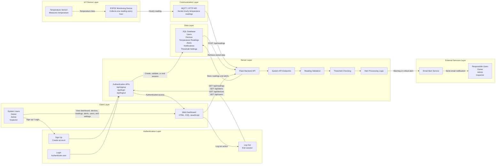
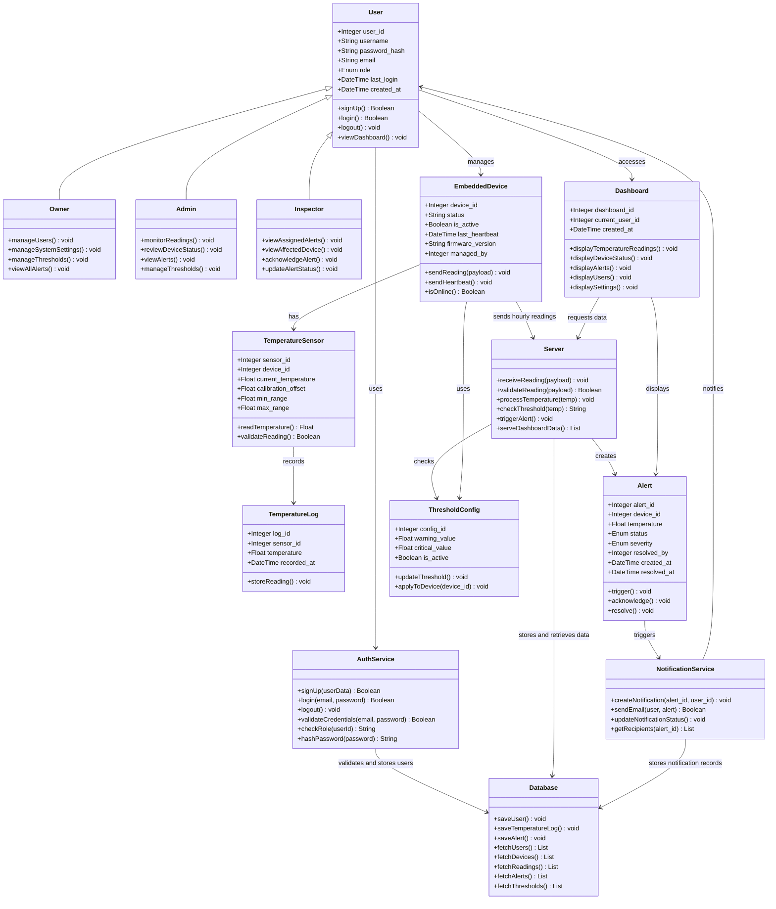
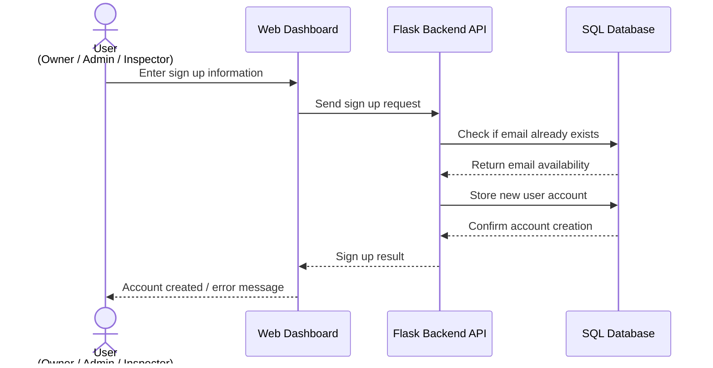
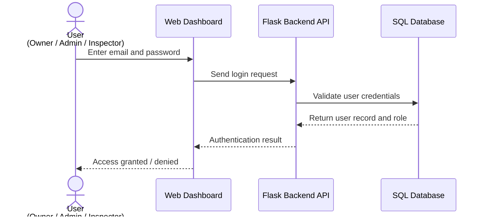
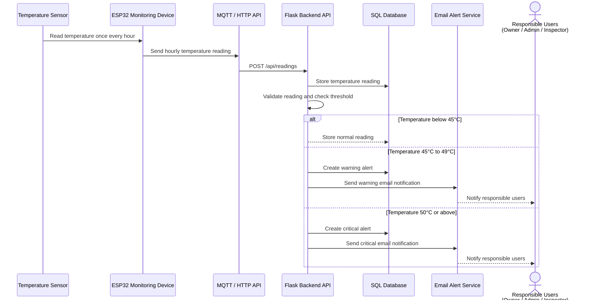
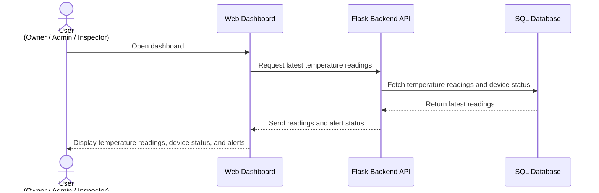
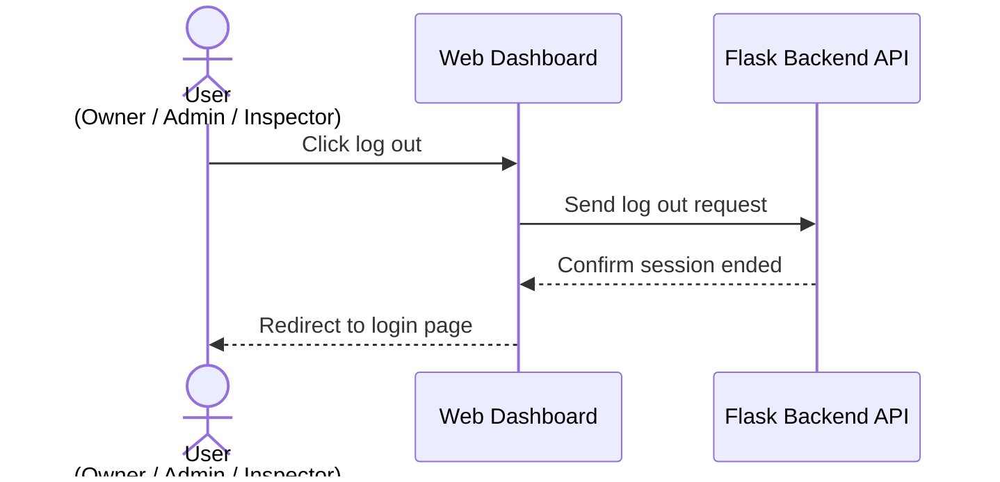
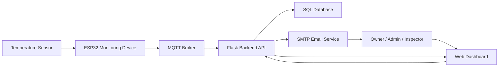
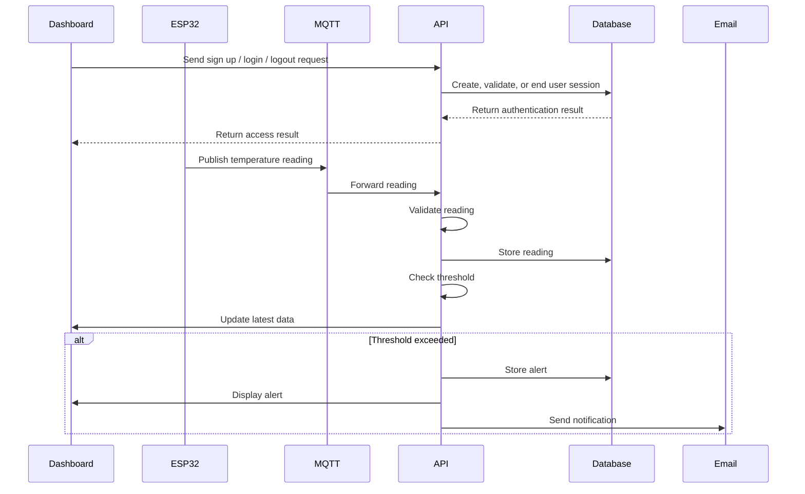

# FlexSight - Technical Documentation

## Stage 3: Technical Documentation

### Temperature Monitoring and Alert System

---

## Table of Contents

1. [Introduction](#introduction)
2. [System Overview](#system-overview)
3. [MVP Scope](#mvp-scope)
4. [User Stories and Mockups](#user-stories-and-mockups)
5. [System Architecture](#system-architecture)
6. [Components, Classes, and Database Design](#components-classes-and-database-design)
7. [High-Level Sequence Diagrams](#high-level-sequence-diagrams)
8. [External and Internal APIs](#external-and-internal-apis)
9. [SCM and QA Strategies](#scm-and-qa-strategies)
10. [Technical Justifications](#technical-justifications)
11. [Conclusion](#conclusion)

---

# Introduction

FlexSight is an IoT-based temperature monitoring system designed to support safer and more reliable monitoring in operational environments.

This technical documentation translates the project objectives and MVP requirements into a detailed technical plan. It defines the system architecture, user stories, mockups, components, classes, database structure, sequence diagrams, API specifications, source control strategy, quality assurance plan, and technical justifications.

The purpose of this document is to provide the development team with a clear technical blueprint before implementation. It helps ensure that all team members understand how the system is structured, how data flows between components, how alerts are generated, how users access the dashboard, and how the system will be tested and maintained.

---

# System Overview

The FlexSight MVP focuses on monitoring temperature readings using a temperature sensor connected to an ESP32 monitoring device.

The ESP32 monitoring device collects temperature readings once every hour and sends the data to the backend system through MQTT or HTTP API communication. The backend validates the incoming readings, stores them in a SQL database, checks temperature threshold values, and generates warning or critical alerts when abnormal temperature levels are detected.

The web dashboard allows authorized users to sign up, log in, view device status, temperature readings, historical records, alert information, users, and settings based on their assigned roles.

The system also supports log out functionality and email notifications to inform responsible users when a warning or critical alert occurs.

FlexSight follows a layered architecture that separates responsibilities across the authentication layer, IoT device layer, communication layer, backend layer, database layer, frontend dashboard, and external notification services.

---

# MVP Scope

The MVP includes the core features required to demonstrate the main monitoring and alerting workflow.

## Included in MVP

- User sign up.
- User login.
- User log out.
- Role-based access for Owner, Admin, and Inspector.
- Temperature monitoring.
- ESP32 monitoring device.
- Temperature sensor integration.
- Hourly temperature readings.
- Device status monitoring.
- SQL database storage.
- Web dashboard.
- Warning and critical alerts.
- Email alert notifications.
- Threshold settings.
- User management.

## Out of MVP Scope

The following features are excluded from the MVP:

- Mobile application.
- Mobile push notifications.
- SMS notifications.
- AI-based risk prediction.
- Smoke monitoring.
- Gas monitoring.
- Flame monitoring.
- Camera feeds.
- Power monitoring.
- HVAC monitoring.
- Energy monitoring.
- Advanced analytics.
- Enterprise-level reporting.
- External integrations with third-party monitoring platforms.

---

# User Stories and Mockups

This section defines the functional requirements of the FlexSight platform from the perspective of the system users. The user stories describe the expected interactions between users and the system and are prioritized using the *MoSCoW prioritization method*.

The section also includes the system mockups, which provide an early visualization of the user interface before implementation.

---

# Mockups

The user interface mockups were designed using *Figma* to demonstrate the initial layout of the FlexSight web dashboard and the expected user experience during the MVP phase.

The mockups include the primary system screens such as:

- Sign Up Page
- Login Page
- Dashboard
- Temperature Monitoring
- Alerts Management
- Device Status
- User Management
- Settings Page
- Log Out Action

*Figma Design*

https://www.figma.com/design/16Nuzcwz3B1azhiJiN22X9/FlexSight-Stage-3-Technical-Documentation?node-id=0-1&t=z3ETsKX6XhvQY6iE-1

---

# User Stories

The following user stories describe the expected functionality of the FlexSight platform for each system role.

The stories are categorized using the *MoSCoW prioritization technique* to distinguish between mandatory MVP features and future enhancements.

---

## Authentication User Stories

### Must Have (MVP)

As a new user, I want to sign up, so that I can create an account and access the FlexSight system.

As a registered user, I want to log in, so that I can access the dashboard based on my assigned role.

As a logged-in user, I want to log out, so that I can end my session safely.

As a user, I want the system to validate my login information, so that only authorized users can access the dashboard.

As a user, I want to access dashboard pages based on my role, so that I only see the features allowed for my account.

### Should Have

As a user, I want to see an error message when my login information is incorrect, so that I can understand why access failed.

As a user, I want to be redirected to the login page after logging out, so that I know my session has ended.

### Could Have

As a user, I want password rules during sign up, so that my account is more secure.

---

## Persona 1 — Owner

### Must Have (MVP)

As an Owner, I want to sign up and log in, so that I can access the FlexSight dashboard securely.

As an Owner, I want to view all users, devices, temperature readings, and alerts, so that I can supervise the entire FlexSight system.

As an Owner, I want to access the main dashboard, so that I can monitor the overall system status.

As an Owner, I want to view device status, so that I can know whether each ESP32 monitoring device is online or offline.

As an Owner, I want to view critical alerts, so that I can identify high-risk temperature issues quickly.

As an Owner, I want to manage system settings, so that the monitoring process can be controlled at the system level.

As an Owner, I want to manage warning and critical temperature thresholds, so that the system can detect abnormal temperature levels correctly.

As an Owner, I want to manage user roles and permissions, so that each user has the correct access level.

As an Owner, I want to view registered users, so that I can manage user access to the FlexSight system.

As an Owner, I want to log out, so that I can end my dashboard session safely.

### Should Have

As an Owner, I want to view system performance and alert summaries, so that I can evaluate the effectiveness of the monitoring system.

As an Owner, I want to view historical hourly temperature readings, so that I can review previous temperature changes.

As an Owner, I want to manage email notification settings, so that alert emails can be sent to responsible users.

### Could Have

As an Owner, I want to generate summary reports, so that I can review temperature trends and alert history.

As an Owner, I want to export system logs, so that I can keep records for documentation and review.

---

## Persona 2 — Admin

### Must Have (MVP)

As an Admin, I want to log in, so that I can access the monitoring dashboard securely.

As an Admin, I want to view temperature readings from ESP32 devices, so that I can monitor the current temperature status of each device.

As an Admin, I want to monitor hourly readings, so that I can confirm that FlexSight is collecting readings once every hour.

As an Admin, I want to view device status, so that I can know whether each monitoring device is working properly.

As an Admin, I want to see warning and critical alerts on the dashboard, so that I can respond quickly to abnormal temperature levels.

As an Admin, I want to review active alerts, so that I can prioritize urgent incidents.

As an Admin, I want to view alert details, so that I can understand the affected device, temperature value, alert severity, and alert time.

As an Admin, I want to filter readings by device and date, so that I can analyze sensor data easily.

As an Admin, I want to log out, so that I can end my dashboard session safely.

### Should Have

As an Admin, I want to receive email notifications for abnormal temperatures, so that responsible users are informed even when they are not viewing the dashboard.

As an Admin, I want to view alert history, so that I can track previous incidents and responses.

As an Admin, I want to export readings and alert data, so that I can prepare reports when needed.

### Could Have

As an Admin, I want to view email delivery status, so that I can confirm whether alert notifications were sent successfully.

As an Admin, I want to refresh device status, so that I can check the latest monitoring condition.

---

## Persona 3 — Inspector

### Must Have (MVP)

As an Inspector, I want to log in, so that I can access assigned alerts securely.

As an Inspector, I want to view assigned alerts, so that I can follow up on reported incidents.

As an Inspector, I want to view the affected device, so that I can know which ESP32 device needs attention.

As an Inspector, I want to view temperature readings, so that I can understand the severity of the issue.

As an Inspector, I want to view alert details including device ID, temperature, severity, and time, so that I can inspect the issue accurately.

As an Inspector, I want to acknowledge assigned alerts, so that the team knows the alert is being handled.

As an Inspector, I want to update the alert status as resolved or unresolved, so that the team can track incident follow-up progress.

As an Inspector, I want to view the affected device status, so that I can know whether the monitoring device is online or offline.

As an Inspector, I want to log out, so that I can end my dashboard session safely.

### Should Have

As an Inspector, I want to add follow-up notes to an alert, so that the response details are documented.

As an Inspector, I want to view previous alerts for the same device, so that I can identify repeated temperature issues.

### Could Have

As an Inspector, I want to receive assigned alert notifications, so that I can follow up on incidents faster.

---

## Won't Have in MVP

The following features are intentionally excluded from the first MVP release:

- Mobile application.
- Mobile push notifications.
- SMS notifications.
- AI-based risk prediction.
- Smoke monitoring.
- Gas monitoring.
- Flame monitoring.
- Camera feeds.
- Power monitoring.
- HVAC monitoring.
- Energy monitoring.
- Advanced analytics.
- Enterprise-level reporting.
- Third-party monitoring platform integrations.

---

## User Stories Summary

The user stories define the functional requirements of FlexSight from the perspective of authentication and the three primary user roles: *Owner, Admin, and Inspector*.

Using the MoSCoW prioritization method ensures that the MVP focuses on the essential authentication, monitoring, alerting, and dashboard capabilities while leaving advanced features for future releases.

---

# System Architecture

FlexSight is designed as an IoT-based web monitoring platform that follows a layered architecture to ensure clear separation of responsibilities, maintainability, scalability, and reliability.

The system architecture consists of an Authentication Layer for user access, an IoT Device Layer for collecting hourly temperature readings, a Communication Layer for transmitting data, a Server Layer for validating and processing readings, a Data Layer for storing system records, a Client Layer for user interaction through the web dashboard, and an External Services Layer for sending email alert notifications.

---

## High-Level Architecture Diagram



---

## Architecture Overview

The system starts when a user signs up or logs in through the authentication pages. The backend validates the user account and role, then grants authenticated access to the web dashboard.

The monitoring process begins when the *Temperature Sensor* measures the temperature value from the monitored environment. The sensor is connected to an *ESP32 Monitoring Device, which collects one reading every hour and sends the reading to the backend using **MQTT* or *HTTP API* communication.

Once the reading reaches the *Flask Backend API, the backend validates the received data, stores it in the **SQL Database*, checks the configured warning and critical temperature thresholds, and triggers an alert when abnormal readings are detected.

The *Web Dashboard* retrieves stored readings, alerts, device information, users, and settings through internal API endpoints. Authorized users such as the *Owner, **Admin, and **Inspector* can view dashboard data based on their roles.

When a warning or critical alert is generated, the *Email Alert Service* sends an email notification to the responsible users so they can respond quickly to the temperature issue.

---

## System Components

| Component | Technology | Description |
|---|---|---|
| Authentication | Flask Backend / User Session Logic | Allows users to sign up, log in, access the dashboard, and log out. |
| IoT Device | ESP32 Monitoring Device | Collects temperature readings every hour and sends them to the backend system. |
| Sensor | Temperature Sensor | Measures temperature values from the monitored environment. |
| Frontend | HTML, CSS, JavaScript | Web dashboard used to display readings, alerts, device status, users, settings, and historical data. |
| Backend | Python + Flask | RESTful API server responsible for authentication, receiving readings, validating data, processing alerts, and serving dashboard data. |
| Communication | MQTT / HTTP API | Used to transmit hourly temperature readings from the ESP32 device to the backend system. |
| Database | SQL Database | Stores users, devices, temperature readings, alerts, notifications, threshold settings, and dashboard records. |
| Alert Logic | Threshold Monitoring | Checks readings against normal, warning, and critical temperature thresholds. |
| Email Notifications | SMTP / Email Service | Sends warning and critical alert notifications to responsible users. |

---

## Architectural Principles

### Separation of Concerns

Each layer has a clear responsibility. Authentication manages user access, the ESP32 monitoring device collects readings, the backend processes data and alerts, the database stores records, and the dashboard displays information to users.

### Scalability

The architecture allows additional ESP32 monitoring devices to be added in the future without changing the overall system structure.

### Maintainability

Using a layered structure makes the system easier to update, debug, test, and expand during future development stages.

### Reliability

Temperature readings are validated before storage, and abnormal readings trigger alert logic to support quick response.

### Security

The authentication flow helps restrict dashboard access to authorized users only. Users can sign up, log in, and log out, while role-based access supports different permissions for Owner, Admin, and Inspector.

### Extensibility

The system can later support additional temperature monitoring devices, configurable thresholds, and summary reports while keeping the MVP structure simple.

---

# Components, Classes, and Database Design

This section defines the internal structure of the FlexSight platform. It describes the relational database design, database relationships, backend components, and object-oriented classes that support the implementation of the MVP.

---

# Database Overview

The FlexSight database is designed to support user authentication, user role management, ESP32 monitoring devices, temperature sensors, hourly temperature readings, threshold configuration, alert processing, dashboard access, and notification handling.

The schema uses Primary Keys (PK) and Foreign Keys (FK) to maintain clear relationships between the main system entities while ensuring data consistency and integrity.

---

# Database Schema

## users

- user_id (PK)
- username (UNIQUE)
- password_hash
- email (UNIQUE)
- role (OWNER / ADMIN / INSPECTOR)
- last_login
- created_at

---

## embedded_devices

- device_id (PK)
- status
- is_active
- last_heartbeat
- firmware_version
- managed_by (FK → users.user_id)

---

## temperature_sensors

- sensor_id (PK)
- device_id (FK → embedded_devices.device_id)
- current_temperature
- calibration_offset
- min_range
- max_range

---

## threshold_configs

- config_id (PK)
- warning_value
- critical_value
- is_active

---

## temperature_logs

- log_id (PK)
- sensor_id (FK → temperature_sensors.sensor_id)
- temperature
- recorded_at

---

## alerts

- alert_id (PK)
- device_id (FK → embedded_devices.device_id)
- temperature
- status (OPEN / ACKNOWLEDGED / RESOLVED)
- severity (WARNING / CRITICAL)
- resolved_by (FK → users.user_id)
- created_at
- resolved_at

---

## dashboards

- dashboard_id (PK)
- current_user_id (FK → users.user_id)
- created_at

---

## notifications

- notification_id (PK)
- alert_id (FK → alerts.alert_id)
- user_id (FK → users.user_id)
- notification_type
- sent_at
- status (PENDING / SENT / FAILED)

---

## device_thresholds

- device_id (FK → embedded_devices.device_id)
- config_id (FK → threshold_configs.config_id)

---

# Database Relationships

- users 1 → N embedded_devices
- users 1 → N dashboards
- users 1 → N notifications
- users 1 → N alerts through resolved_by
- embedded_devices 1 → N temperature_sensors
- temperature_sensors 1 → N temperature_logs
- embedded_devices 1 → N alerts
- alerts 1 → N notifications
- embedded_devices N → N threshold_configs through device_thresholds
- threshold_configs N → N embedded_devices through device_thresholds

---

# Back-end Components

The FlexSight backend is composed of core components responsible for authentication, device monitoring, temperature reading processing, threshold checking, alert generation, database storage, dashboard communication, and notification handling.

### User

Represents a FlexSight system user who can sign up, log in, access the dashboard, and log out based on an assigned role.

### Owner

Represents the highest-level user responsible for supervising users, devices, readings, alerts, thresholds, and system settings.

### Admin

Represents the operational user responsible for monitoring temperature readings, reviewing device status, and following up on alerts.

### Inspector

Represents the user responsible for viewing assigned alerts, reviewing affected devices, and updating alert status.

### AuthService

Represents the backend authentication logic responsible for sign up, login validation, password hashing, role checking, and log out.

### EmbeddedDevice

Represents the ESP32 monitoring device responsible for collecting temperature readings and sending them to the backend.

### TemperatureSensor

Represents the temperature sensor connected to the ESP32 monitoring device.

### TemperatureLog

Represents hourly temperature readings stored in the database.

### Server

Represents the Flask backend server responsible for receiving, validating, processing, and storing temperature data.

### Database

Represents the SQL database layer responsible for storing and retrieving users, devices, readings, alerts, thresholds, dashboards, and notification records.

### Alert

Represents a warning or critical event generated when temperature readings exceed the configured threshold.

### Dashboard

Represents the web interface used by authenticated users to view temperature readings, alerts, devices, users, and settings.

### ThresholdConfig

Represents the warning and critical threshold settings used to classify temperature readings.

### NotificationService

Represents the service responsible for creating and tracking alert notification records.

---

# Class Diagram



---

## Design Summary

The FlexSight backend follows an object-oriented architecture combined with a relational SQL database to provide a reliable and maintainable monitoring platform.

This design separates responsibilities across users, authentication, monitoring devices, sensors, server processing, alert generation, dashboard visualization, threshold configuration, and notification services.

---

# High-Level Sequence Diagrams

This section illustrates the primary interactions between the main components of the FlexSight platform during the most important system workflows.

---

# Use Case 1 — User Sign Up

## Description

A new user enters account information through the FlexSight web dashboard. The Flask Backend API receives the sign up request, validates the user data, stores the new user account in the SQL database, and returns the account creation result.

## Sequence Diagram




### Components Involved

- User
- Web Dashboard
- Flask Backend API
- SQL Database

---

# Use Case 2 — User Login

## Description

An authorized user accesses the FlexSight web dashboard by entering login credentials. The Flask Backend API validates the credentials against the SQL database and returns the authentication result based on the user's assigned role.

## Sequence Diagram




### Components Involved

- User
- Web Dashboard
- Flask Backend API
- SQL Database

---

# Use Case 3 — Hourly Temperature Monitoring and Alert Generation

## Description

The temperature sensor measures the temperature once every hour. The ESP32 Monitoring Device sends the hourly reading to the Flask Backend API through MQTT or HTTP API communication.

The backend validates the received reading, stores it in the SQL database, checks the configured threshold values, and generates either a warning or critical alert whenever abnormal temperatures are detected.

## Sequence Diagram




### Components Involved

- Temperature Sensor
- ESP32 Monitoring Device
- MQTT / HTTP API
- Flask Backend API
- SQL Database
- Email Alert Service
- Responsible Users

---

# Use Case 4 — View Latest Temperature Readings

## Description

An Owner, Admin, or Inspector opens the FlexSight dashboard to view the most recent temperature readings.

The dashboard requests the latest stored readings from the Flask Backend API, which retrieves the required data from the SQL database before returning the results to the dashboard.

## Sequence Diagram




### Components Involved

- User
- Web Dashboard
- Flask Backend API
- SQL Database

---

# Use Case 5 — User Log Out

## Description

A logged-in user clicks the log out button from the FlexSight dashboard. The web dashboard sends a log out request to the Flask Backend API, the session is ended, and the user is redirected back to the login page.

## Sequence Diagram




### Components Involved

- User
- Web Dashboard
- Flask Backend API

---

# Summary of Key Use Cases

| Use Case | Main Purpose |
|---|---|
| User Sign Up | Create a new user account in the FlexSight system. |
| User Login | Authenticate users and grant access according to their assigned role. |
| Hourly Temperature Monitoring and Alert Generation | Collect hourly temperature readings, validate them, evaluate threshold values, and generate warning or critical alerts when necessary. |
| View Latest Temperature Readings | Display the latest temperature readings, device status, and alert information on the web dashboard. |
| User Log Out | End the user session and return to the login page. |

---

# External and Internal APIs

This section defines the external services and internal API endpoints used by the FlexSight platform. It explains how temperature readings are transmitted, processed, stored, and displayed through the web dashboard.

The API follows RESTful architecture to ensure reliable communication between the ESP32 monitoring device, Flask backend server, SQL database, and dashboard interface.

---

# External Services

| Service | Purpose | Reason for Selection |
|---|---|---|
| MQTT Broker | Receives temperature readings from ESP32 monitoring devices and forwards them to the backend. | Lightweight, reliable, and optimized for IoT communication. |
| SMTP Email Service | Sends warning and critical alert notifications to responsible users. | Reliable and suitable for automated email notifications within the MVP. |

---

# System Communication Flow




---

# MQTT Topics Specification

| Topic | Publisher | Subscriber | Purpose |
|---|---|---|---|
| flexsight/readings | ESP32 Device | Backend Server | Sends hourly temperature readings. |
| flexsight/device-status | ESP32 Device | Backend Server | Reports device online/offline status. |
| flexsight/alerts | Backend Server | Dashboard | Publishes generated warning or critical alerts. |

---

# User Roles

| Role | Description |
|---|---|
| Owner | Full access to users, devices, readings, alerts, and system settings. |
| Admin | Monitors readings, device status, alerts, and operational conditions. |
| Inspector | Follows up on assigned alerts and updates incident status. |

---

# Internal API Overview

| Endpoint | Method | Purpose |
|---|---|---|
| /api/signup | POST | Create a new user account. |
| /api/login | POST | Authenticate users and return access information. |
| /api/logout | POST | End the user session. |
| /api/readings | POST | Receive temperature readings from ESP32 monitoring devices. |
| /api/readings | GET | Retrieve stored temperature readings. |
| /api/alerts | GET | Retrieve active and historical alerts. |
| /api/alerts/{id} | PUT | Update alert status. |
| /api/devices | GET | Retrieve monitoring device information and current status. |
| /api/users | GET | Retrieve users and assigned roles. |
| /api/settings/threshold | PUT | Update warning and critical temperature thresholds. |

---

# API Processing Flow




---

# API Endpoint Specifications

## 1. POST /api/signup

### Purpose

Creates a new user account in the FlexSight system.

### Request Body

```json
{
  "username": "inspector",
  "email": "inspector@flexsight.com",
  "password": "password123",
  "role": "Inspector"
}
```


### Request Fields

| Field | Type | Required | Description |
|---|---|---|---|
| username | String | Yes | User account name. |
| email | String | Yes | User email address. |
| password | String | Yes | User password. |
| role | String | Yes | User role such as Owner, Admin, or Inspector. |

### Successful Response

```json
{
  "success": true,
  "message": "User account created successfully"
}
```


---

## 2. POST /api/login

### Purpose

Authenticates a user and allows access to the dashboard according to the assigned role.

### Request Body

```json
{
  "email": "admin@flexsight.com",
  "password": "password123"
}
```


### Request Fields

| Field | Type | Required | Description |
|---|---|---|---|
| email | String | Yes | User email address. |
| password | String | Yes | User password. |

### Successful Response

```json
{
  "success": true,
  "role": "Admin",
  "token": "jwt_token"
}
```


---

## 3. POST /api/logout

### Purpose

Ends the user session and returns the user to the login page.

### Successful Response

```json
{
  "success": true,
  "message": "Logged out successfully"
}
```


---

## 4. POST /api/readings

### Purpose

Receives temperature readings from ESP32 monitoring devices.

### Request Body

```json
{
  "device_id": "ESP32-001",
  "temperature": 35.4,
  "timestamp": "2026-06-01T10:00:00Z"
}
```


### Request Fields

| Field | Type | Required | Description |
|---|---|---|---|
| device_id | String | Yes | Unique ESP32 device identifier. |
| temperature | Float | Yes | Temperature value in Celsius. |
| timestamp | DateTime | Yes | Time when the reading was collected. |

### Processing Logic

1. Receive temperature reading from the ESP32 monitoring device.
2. Validate the received device ID and temperature value.
3. Store the reading in the SQL database.
4. Compare the temperature against the configured thresholds.
5. Generate an alert if a warning or critical threshold is exceeded.
6. Send email notifications when required.
7. Update the dashboard with the latest reading.

### Successful Response

```json
{
  "success": true,
  "message": "Reading stored successfully"
}
```


---

## 5. GET /api/readings

### Purpose

Retrieves stored temperature readings for dashboard display and historical review.

### Query Parameters

| Parameter | Type | Required | Description |
|---|---|---|---|
| device_id | String | No | Filter readings by device. |
| start_date | Date | No | Start date for historical filtering. |
| end_date | Date | No | End date for historical filtering. |

### Successful Response

```json
[
  {
    "device_id": "ESP32-001",
    "temperature": 35.4,
    "timestamp": "2026-06-01T10:00:00Z"
  }
]
```


---

## 6. GET /api/alerts

### Purpose

Retrieves active and historical alerts for dashboard monitoring and incident follow-up.

### Successful Response

```json
[
  {
    "alert_id": 1,
    "device_id": "ESP32-001",
    "severity": "critical",
    "temperature": 52.3,
    "status": "active",
    "triggered_at": "2026-06-01T10:00:00Z"
  }
]
```


---

## 7. PUT /api/alerts/{id}

### Purpose

Updates the status of an alert after review or follow-up.

### Request Body

```json
{
  "status": "resolved",
  "notes": "Issue checked and resolved by inspector."
}
```


### Request Fields

| Field | Type | Required | Description |
|---|---|---|---|
| status | String | Yes | Updated alert status. |
| notes | String | No | Optional follow-up notes. |

### Successful Response

```json
{
  "success": true,
  "message": "Alert updated successfully"
}
```


---

## 8. GET /api/devices

### Purpose

Retrieves registered ESP32 monitoring devices and their current status.

### Successful Response

```json
[
  {
    "device_id": "ESP32-001",
    "name": "ESP32 Monitoring Device 01",
    "status": "online",
    "last_seen_at": "2026-06-01T10:00:00Z"
  }
]
```


---

## 9. GET /api/users

### Purpose

Retrieves system users and assigned roles for access management.

### Successful Response

```json
[
  {
    "user_id": 1,
    "username": "admin",
    "role": "Admin",
    "account_status": "active"
  }
]
```


---

## 10. PUT /api/settings/threshold

### Purpose

Updates the warning and critical temperature thresholds used by the alert logic.

### Request Body

```json
{
  "warning_threshold": 45,
  "critical_threshold": 50
}
```


### Successful Response

```json
{
  "success": true,
  "message": "Threshold updated successfully"
}
```


---

# Access Control Matrix

| Endpoint | Owner | Admin | Inspector |
|---|---|---|---|
| POST /api/signup | ✓ | ✓ | ✓ |
| POST /api/login | ✓ | ✓ | ✓ |
| POST /api/logout | ✓ | ✓ | ✓ |
| GET /api/readings | ✓ | ✓ | ✓ |
| POST /api/readings | System | System | System |
| GET /api/alerts | ✓ | ✓ | ✓ |
| PUT /api/alerts/{id} | ✓ | ✓ | ✓ |
| GET /api/devices | ✓ | ✓ | ✓ |
| GET /api/users | ✓ | ✗ | ✗ |
| PUT /api/settings/threshold | ✓ | ✗ | ✗ |

---

# Error Responses

| Error Case | Example Response |
|---|---|
| Unauthorized Access | { "success": false, "message": "Unauthorized access" } |
| Invalid Credentials | { "success": false, "message": "Invalid username or password" } |
| User Already Exists | { "success": false, "message": "User already exists" } |
| Device Not Found | { "success": false, "message": "Device not found" } |
| Invalid Sensor Data | { "success": false, "message": "Invalid sensor data" } |
| Internal Server Error | { "success": false, "message": "Internal server error" } |

---

# API Security

| Security Measure | Purpose |
|---|---|
| Password Hashing | Protect stored user passwords. |
| Role-Based Access Control | Restrict system access according to user roles. |
| Token Authentication | Secure protected API endpoints. |
| Input Validation | Prevent invalid or malicious data from entering the system. |
| Sensor Data Validation | Ensure only valid temperature readings are processed. |
| Protected Administrative Endpoints | Restrict sensitive operations to authorized users only. |

---

# SCM and QA Strategies

This section defines the Source Control Management and Quality Assurance strategies adopted for the FlexSight project.

---

# Team Structure

| Team Members | Responsibilities |
|---|---|
| Hamsa Alammar & Munirah Alotaibi | Frontend development, dashboard implementation, authentication pages, user interface components, and user experience improvements. |
| Rabeea Thabet & Hanin Alhassan | Backend development, MQTT communication, API implementation, authentication endpoints, database integration, and temperature monitoring logic. |
| All Team Members | Testing, bug reporting, reviewing project updates, integration testing, and maintaining software quality. |

---

# Source Control Management

## Version Control

The FlexSight project uses *Git* and *GitHub* as the primary version control system.

Each team member develops assigned tasks locally, performs testing, commits completed work, and pushes updates to the shared GitHub repository.

Before starting any new task, team members pull the latest repository changes to ensure synchronization with the current project version.

---

## Commit Strategy

text
feat: add sign up page
feat: add login page
feat: add logout button
feat: add dashboard temperature card
feat: implement alert notification logic
feat: add authentication API endpoints
fix: correct temperature validation
fix: correct login form validation
test: add API endpoint tests
test: test authentication flow
docs: update technical documentation


---

## Code Review Checklist

- Assigned functionality is fully implemented.
- Code performs as expected.
- Authentication flow works correctly.
- API endpoints return correct responses.
- Dashboard displays correct data.
- No conflicts exist with other project modules.
- Reported issues are resolved.
- Coding standards are maintained.

---

# Quality Assurance

## Testing Strategy

Quality assurance is a shared responsibility among all team members.

### Unit Testing

Examples include:

- Temperature validation functions.
- Threshold checking logic.
- Alert generation logic.
- Login validation logic.
- Sign up validation logic.
- API utility functions.

### Integration Testing

Integration scenarios include:

- Sign up page and backend API.
- Login page and backend API.
- Log out action and backend API.
- ESP32 monitoring device and MQTT/API communication.
- Backend and SQL database.
- Backend and web dashboard.
- Backend and email notification service.

### Manual Testing

Manual testing verifies complete user workflows from the dashboard.

Examples include:

- User sign up.
- User login.
- User log out.
- Viewing temperature readings.
- Viewing device status.
- Viewing active alerts.
- Updating alert status.
- Updating threshold settings.

---

# Testing Tools

| Tool | Purpose |
|---|---|
| Pytest | Backend unit testing. |
| Postman | API endpoint testing and response validation. |
| Web Browser | Dashboard functionality, responsiveness, and user interface testing. |
| GitHub | Collaboration, version control, and code review. |
| MySQL Workbench / Terminal | Database table, records, and query validation. |

---

# Project-Specific QA Coverage

| Workflow | Validation |
|---|---|
| Authentication | Verify that users can sign up, log in, access the dashboard, and log out. |
| Role Access | Verify that Owner, Admin, and Inspector users access the correct features. |
| Sensor Monitoring | Verify that temperature readings are received successfully from the ESP32 monitoring device. |
| Data Storage | Verify that temperature readings are stored correctly in the SQL database. |
| Dashboard | Verify that the dashboard displays the latest readings and device status correctly. |
| Alert Generation | Verify that warning and critical alerts are generated when configured threshold values are exceeded. |
| API Communication | Verify that all REST API endpoints return valid requests and responses. |
| Email Notifications | Verify that notification records are created when warning or critical alerts occur. |

---

# Manual Critical Flows

1. A new user signs up using the Sign Up page.
2. A registered user logs in using the Login page.
3. The user accesses the dashboard based on the assigned role.
4. The ESP32 monitoring device sends an hourly temperature reading.
5. The backend validates and stores the received reading.
6. The dashboard retrieves and displays the latest temperature reading.
7. The backend generates a warning alert when the temperature reaches the warning range.
8. The backend generates a critical alert when the temperature reaches or exceeds 50°C.
9. Notification records are created for warning or critical alerts.
10. The user logs out and returns to the login page.

---

# Technical Justifications

| Technology | Justification |
|---|---|
| ESP32 Monitoring Device | Suitable for collecting sensor data and sending readings to the backend. |
| Temperature Sensor | Provides temperature values required for the monitoring MVP. |
| MQTT / HTTP API | Supports communication between the ESP32 monitoring device and backend system. |
| Flask Backend API | Simple and flexible framework for developing RESTful APIs. |
| SQL Database | Provides structured storage for users, devices, readings, alerts, notifications, dashboards, and threshold settings. |
| HTML, CSS, JavaScript | Suitable for building a simple web dashboard MVP. |
| SMTP Email Service | Enables automatic alert notifications without requiring a mobile application. |
| GitHub | Supports team collaboration, version control, and project documentation. |
| Figma | Supports UI/UX design, mockups, and prototype planning. |

---

# Conclusion

This technical documentation defines the main technical structure of the FlexSight Temperature Monitoring System.

The document covers the system overview, MVP scope, user stories, mockups, system architecture, database design, backend components, sequence diagrams, API documentation, SCM strategy, QA strategy, and technical justifications.

The MVP supports user sign up, login, log out, hourly temperature monitoring, ESP32 monitoring device communication, database storage, dashboard display, threshold checking, warning and critical alerts, email notification records, and role-based access for Owner, Admin, and Inspector.

FlexSight remains focused on temperature monitoring and basic authentication only, while keeping advanced features out of scope for future versions.
