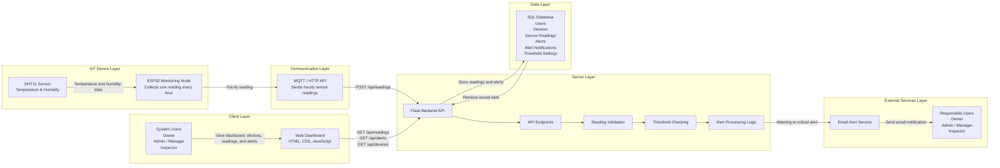

# FlexSight - Technical Documentation

## Stage 3

### Temperature & Humidity Monitoring and Alert System

---

# Introduction

## Purpose of this Document

This Technical Documentation provides a comprehensive overview of the FlexSight MVP from a technical perspective. It defines the system architecture, software components, database design, interaction flows, API specifications, source control strategy, and quality assurance processes that guide the implementation of the project.

The document serves as a technical blueprint for the development team, ensuring that all members share a common understanding of the system structure, communication flow, and implementation approach before development progresses further.

---

## Project Overview

FlexSight is an IoT-based Temperature and Humidity Monitoring System designed to improve environmental monitoring and operational safety in facilities such as server rooms, warehouses, laboratories, and industrial environments.

The system continuously collects temperature and humidity readings using a DHT11 sensor connected to an ESP32 monitoring node. Sensor readings are transmitted to the backend through MQTT or HTTP APIs, where they are validated, stored, and analyzed.

Whenever the measured temperature reaches predefined warning or critical thresholds, the backend automatically generates alerts and sends email notifications to responsible users. All collected data, device status, and alerts are displayed through a web-based dashboard, allowing users to monitor monitored environments in real time.

---

## Project Objectives

The primary objectives of the FlexSight MVP are:

* Monitor environmental temperature and humidity using ESP32 monitoring devices.
* Collect and store sensor readings every hour.
* Automatically detect abnormal temperature levels based on predefined thresholds.
* Generate warning and critical alerts whenever unsafe conditions are detected.
* Notify responsible users through email notifications.
* Provide a centralized dashboard for monitoring devices, readings, and alerts.
* Build a scalable architecture that supports future expansion with additional monitoring devices and sensors.

---

## Scope of the MVP

The current MVP focuses on the core monitoring functionality required to demonstrate the feasibility of the FlexSight platform.

### Included in the MVP

* Temperature monitoring
* Humidity monitoring
* ESP32 monitoring node
* DHT11 sensor integration
* Hourly sensor readings
* Alert generation
* Email notifications
* Device status monitoring
* Historical readings
* Web dashboard
* User authentication and role management

### Out of Scope

The following features are intentionally excluded from the MVP:

* Mobile application
* SMS notifications
* Push notifications
* AI-based prediction
* Smoke detection
* Gas detection
* Flame detection
* Camera integration
* Energy monitoring
* HVAC monitoring
* Enterprise analytics

---

# System Overview

FlexSight follows a layered IoT architecture that separates responsibilities into multiple independent layers. Each layer performs a dedicated function, improving maintainability, scalability, and reliability.

The monitoring process begins with the DHT11 Temperature and Humidity Sensor, which measures environmental conditions once every hour. The ESP32 Monitoring Node collects these readings and transmits them to the backend using MQTT or HTTP communication.

The Flask Backend API validates incoming readings, stores them in the SQL database, evaluates threshold values, and generates warning or critical alerts whenever abnormal temperatures are detected.

Finally, the Web Dashboard retrieves the processed data through REST APIs and presents live readings, device status, historical records, and alert information to authorized users.

This layered architecture enables the system to remain modular while allowing future enhancements such as additional sensors, multiple monitoring nodes, configurable thresholds, and advanced reporting features without significant architectural changes.

# User Stories and Mockups

This section defines the functional requirements of the FlexSight MVP from the users' perspective. User Stories describe the expected system behavior for each user role and help prioritize features according to the MoSCoW prioritization technique.

The main goal is to ensure that the MVP focuses on delivering the essential monitoring and alert functionalities while allowing future expansion through additional features.

---

## 0.1 User Stories

The following user roles have been identified for the FlexSight platform:

* **Owner**
* **Admin / Manager**
* **Inspector**

Each role has specific permissions and responsibilities within the system.

### Prioritization Method

The project uses the **MoSCoW prioritization technique** to classify requirements:

| Priority        | Description                                                                           |
| --------------- | ------------------------------------------------------------------------------------- |
| **Must Have**   | Essential features required for the MVP.                                              |
| **Should Have** | Important features that improve usability but are not critical for the first release. |
| **Could Have**  | Optional enhancements that may be implemented if time permits.                        |
| **Won't Have**  | Features intentionally excluded from the MVP and planned for future releases.         |

---

### Personas

The complete User Stories for the following personas are included in this documentation:

* **Owner**
* **Admin / Manager**
* **Inspector**

Each User Story follows the standard format:

> **As a [user role], I want to [perform an action], so that [achieve a goal].**

The complete prioritized User Stories are provided in the following section.

> *(Paste your complete User Stories here exactly as prepared by the team.)*

---

## 0.2 Mockups

To visualize the FlexSight user interface before implementation, low-fidelity and high-fidelity mockups were designed using **Figma**.

The mockups illustrate the primary screens of the MVP, including:

* Login Screen
* Dashboard
* Device Monitoring
* Alerts Page
* Alert Details
* Historical Readings
* User Management
* System Settings

These mockups provide a clear understanding of the user experience and support communication between designers and developers before implementation begins.

### Figma Design

> https://www.figma.com/design/16Nuzcwz3B1azhiJiN22X9/FlexSight-Stage-3-Technical-Documentation

---

The mockups represent the expected appearance of the FlexSight web dashboard and serve as the visual foundation for frontend development throughout the MVP implementation.

# System Architecture

The FlexSight platform follows a layered IoT architecture that separates system responsibilities into independent layers. This architecture improves maintainability, scalability, and reliability while allowing future expansion without affecting the core system.

The system consists of an IoT device layer responsible for collecting environmental data, a communication layer that transfers sensor readings, a server layer that processes incoming data and generates alerts, a data layer for persistent storage, a client layer for user interaction, and an external service layer for email notifications.

---

## High-Level Architecture Diagram



---

## Architecture Overview

The monitoring process begins with the **DHT11 Temperature and Humidity Sensor**, which measures environmental conditions every hour. The sensor is connected to an **ESP32 Monitoring Node**, responsible for collecting sensor readings and transmitting them to the backend through **MQTT** or **HTTP APIs**.

Once the readings reach the **Flask Backend API**, the system validates the received data before storing it in the SQL database. After validation, the backend compares the temperature values against predefined warning and critical thresholds.

If the temperature exceeds the configured threshold values, the system automatically generates an alert, stores it in the database, and triggers an email notification to the responsible users.

Finally, the **Web Dashboard** retrieves the processed data through RESTful APIs and displays live readings, historical records, device status, and alert information according to the user's role.

---

# System Components

| Component                | Technology                          | Description                                                                                               |
| ------------------------ | ----------------------------------- | --------------------------------------------------------------------------------------------------------- |
| **IoT Device**           | ESP32 Monitoring Node               | Collects temperature and humidity readings every hour and sends them to the backend server.               |
| **Sensor**               | DHT11 Temperature & Humidity Sensor | Measures environmental temperature and humidity values from the monitored location.                       |
| **Communication Layer**  | MQTT / HTTP API                     | Transfers sensor readings securely from the ESP32 device to the backend system.                           |
| **Frontend**             | HTML, CSS, JavaScript               | Provides a responsive web dashboard for monitoring devices, readings, alerts, and system status.          |
| **Backend**              | Python + Flask                      | Processes incoming sensor data, validates readings, generates alerts, and provides RESTful APIs.          |
| **Database**             | SQL Database                        | Stores users, devices, sensor readings, alerts, threshold configurations, and system records.             |
| **Alert Engine**         | Threshold Monitoring Logic          | Evaluates incoming readings against configured threshold values and generates warning or critical alerts. |
| **Notification Service** | SMTP / Email Service                | Sends automatic email notifications to responsible users when abnormal temperatures are detected.         |

---

# Architectural Principles

### Separation of Concerns

Each layer performs a dedicated responsibility. Sensor devices collect environmental data, communication protocols transfer the data, the backend processes business logic, the database stores information, and the dashboard presents the processed results to end users.

---

### Scalability

The architecture supports adding multiple ESP32 monitoring nodes and additional monitored locations without requiring major architectural modifications.

---

### Maintainability

Using a layered architecture simplifies debugging, maintenance, and future feature development by keeping responsibilities clearly separated.

---

### Reliability

Incoming sensor readings are validated before storage. The backend continuously evaluates threshold values to ensure abnormal temperatures are detected accurately and appropriate alerts are generated.

---

### Extensibility

The architecture has been designed to support future enhancements, including additional sensors, configurable threshold profiles, advanced reporting, mobile applications, and real-time monitoring capabilities while preserving the current MVP structure.

# Components, Classes, and Database Design

This section describes the internal structure of the FlexSight system. It defines the major software components, object-oriented classes, and database structure that together support the implementation of the MVP.

The purpose of this design is to provide a clear technical blueprint for developers by illustrating how system components interact, how data is organized, and how the backend is structured before implementation.

---

# System Components

The FlexSight platform is composed of several major components that work together to collect, process, store, and display environmental monitoring data.

| Component                      | Responsibility                                                                                |
| ------------------------------ | --------------------------------------------------------------------------------------------- |
| **Temperature Sensor (DHT11)** | Measures temperature and humidity values from the monitored environment.                      |
| **ESP32 Monitoring Node**      | Collects sensor readings and transmits them to the backend every hour.                        |
| **MQTT / HTTP Communication**  | Transfers sensor readings securely from the ESP32 device to the backend server.               |
| **Flask Backend API**          | Processes incoming readings, validates data, stores records, and generates alerts.            |
| **SQL Database**               | Stores users, devices, sensor readings, alerts, notifications, and system configuration data. |
| **Web Dashboard**              | Displays live readings, device status, historical data, and alerts for authenticated users.   |
| **Notification Service**       | Sends email notifications whenever warning or critical alerts are generated.                  |

---

# Class Design

The backend follows an object-oriented design in which each class represents a specific entity or service within the FlexSight platform.

The Class Diagram illustrates the relationships between users, monitoring devices, sensors, alerts, backend services, and supporting components.

## Class Diagram

```


```

The main classes included in the system are:

* User
* Owner
* AdminManager
* Inspector
* EmbeddedDevice
* TemperatureSensor
* MQTTBroker
* Server
* Database
* Alert
* Dashboard
* ThresholdConfig
* NotificationService

These classes define the responsibilities, attributes, methods, and relationships required to support the system's monitoring and alert functionality.

---

# Database Design

The FlexSight platform uses a relational SQL database to organize system information and maintain data integrity.

The database stores user accounts, organizations, monitoring devices, sensors, readings, threshold configurations, alerts, and system configuration records.

## Database Schema

## Database Schema

The FlexSight platform uses a relational SQL database to organize system data and maintain strong relationships between users, organizations, monitoring devices, sensors, readings, alerts, and system configurations.

The following schema defines the database tables, primary keys (PK), foreign keys (FK), and important attributes used throughout the system.

### users

```text
id (PK)
username (UNIQUE)
password_hash
email (UNIQUE)
mobile (UNIQUE)
role (owner / organisation_owner / admin_manager / inspector)
notification_preferences (email / sms / push / all)
account_status (active / inactive / suspended)
last_login_at
created_at
updated_at
```

### organizations

```text
id (PK)
name
owner_id (FK -> users.id)
address
contact_email
contact_mobile
is_active
created_at
updated_at
```

### organization_members

```text
id (PK)
organization_id (FK -> organizations.id)
user_id (FK -> users.id)
role_in_org (admin / inspector / viewer)
assigned_at
created_at
```

### locations

```text
id (PK)
organization_id (FK -> organizations.id)
name
address
city
district
latitude
longitude
is_active
created_at
updated_at
```

### embedded_devices

```text
id (PK)
device_code (UNIQUE)
organization_id (FK -> organizations.id)
location_id (FK -> locations.id)
name
status (online / offline / maintenance / error)
is_active
firmware_version
battery_level
last_heartbeat_at
last_seen_at
created_at
updated_at
```

### temperature_sensors

```text
id (PK)
sensor_code (UNIQUE)
device_id (FK -> embedded_devices.id)
name
current_temp
calibration_offset
min_range
max_range
last_calibration_at
is_calibrated
created_at
updated_at
```

### sensor_readings

```text
id (PK)
device_id (FK -> embedded_devices.id)
sensor_id (FK -> temperature_sensors.id)
temperature_value
recorded_at
```

### mqtt_brokers

```text
id (PK)
broker_url
port
default_topic
use_tls
max_connections
status (active / inactive)
created_at
updated_at
```

### device_broker_mapping

```text
id (PK)
device_id (FK -> embedded_devices.id)
broker_id (FK -> mqtt_brokers.id)
topic
auth_token_hash
assigned_at
```

### servers

```text
id (PK)
server_name
host_url
status (active / inactive / maintenance)
cpu_usage
memory_usage
created_at
updated_at
```

### databases

```text
id (PK)
server_id (FK -> servers.id)
db_connection
db_type (relational / time_series)
backup_schedule
status
created_at
updated_at
```

### threshold_configs

```text
id (PK)
organization_id (FK -> organizations.id)
name
threshold_value
warning_value
cooldown_minutes
is_active
applied_to (organization / location / device)
created_at
updated_at
```

### alerts

```text
id (PK)
alert_code (UNIQUE)
device_id (FK -> embedded_devices.id)
sensor_id (FK -> temperature_sensors.id)
temperature
threshold_value
severity (info / warning / critical / emergency)
status (triggered / acknowledged / resolved / escalated)
cooldown_until
triggered_at
resolved_at
resolved_by (FK -> users.id)
created_at
updated_at
```

---

## Entity Relationship Diagram (ERD)

> *(Insert the ER Diagram here.)*

The ER Diagram illustrates the relationships between all major database tables, including users, organizations, monitoring devices, sensor readings, alerts, and threshold configurations.

The relational database design improves data consistency, minimizes redundancy, and simplifies future system expansion while maintaining efficient query performance.
