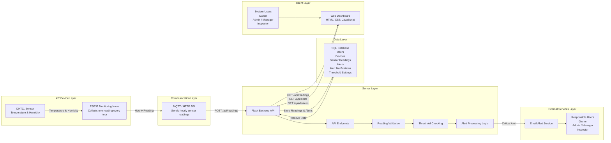
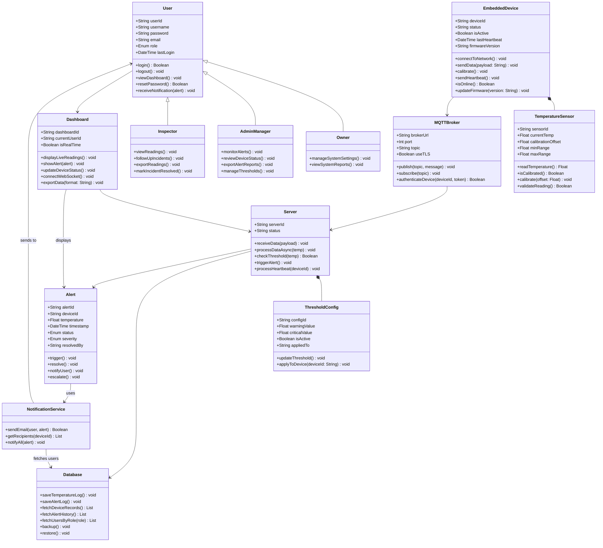

# FlexSight - Technical Documentation

## Stage 3: Technical Documentation

### Temperature and Humidity Monitoring and Alert System

---

## Table of Contents

1. [Introduction](#introduction)
2. [System Overview](#system-overview)
3. [User Stories and Mockups](#user-stories-and-mockups)
4. [System Architecture](#system-architecture)
5. [Components, Classes, and Database Design](#components-classes-and-database-design)
6. [High-Level Sequence Diagrams](#high-level-sequence-diagrams)
7. [External and Internal APIs](#external-and-internal-apis)
8. [SCM and QA Strategies](#scm-and-qa-strategies)
9. [Technical Justifications](#technical-justifications)
10. [Conclusion](#conclusion)

---

# Introduction

FlexSight is an IoT-based temperature and humidity monitoring system designed to support safer and more reliable environmental monitoring in operational environments such as server rooms, warehouses, laboratories, offices, and technical facilities.

This technical documentation translates the project objectives and MVP requirements into a detailed technical plan. It defines the system architecture, user stories, mockups, components, classes, database structure, sequence diagrams, API specifications, source control strategy, quality assurance plan, and technical justifications.

The purpose of this document is to provide the development team with a clear technical blueprint before implementation. It helps ensure that all team members understand how the system is structured, how data flows between components, how alerts are generated, and how the system will be tested and maintained.

---

# System Overview

The FlexSight MVP focuses on monitoring temperature and humidity readings using a DHT11 sensor connected to an ESP32 monitoring node.

The ESP32 collects sensor readings once every hour and sends the data to the backend system through MQTT or HTTP API communication. The backend validates the incoming readings, stores them in a SQL database, checks temperature threshold values, and generates warning or critical alerts when abnormal temperature levels are detected.

The web dashboard allows authorized users to view device status, temperature and humidity readings, historical records, and alert information. The system also supports email notifications to inform responsible users when a warning or critical alert occurs.

FlexSight follows a layered architecture that separates responsibilities across the IoT device layer, communication layer, backend layer, database layer, frontend dashboard, and external notification services.

---

# MVP Scope

The MVP includes the core features required to demonstrate the main monitoring and alerting workflow.

## Included in MVP

- Temperature monitoring.
- Humidity monitoring.
- ESP32 monitoring node.
- DHT11 sensor integration.
- Hourly sensor readings.
- Device status monitoring.
- SQL database storage.
- Web dashboard.
- Warning and critical alerts.
- Email alert notifications.
- User roles and access control.

## Out of MVP Scope

The following features are excluded from the MVP:

- Mobile application.
- Mobile push notifications.
- SMS notifications.
- AI-based risk prediction.
- Smoke monitoring.
- Gas monitoring.
- Flame monitoring.
- Camera feeds.
- Power monitoring.
- HVAC monitoring.
- Energy monitoring.
- Advanced analytics.
- Enterprise-level reporting.
- External integrations with third-party monitoring platforms.

- # User Stories and Mockups

This section defines the functional requirements of the FlexSight MVP from the users' perspective. User Stories describe the expected functionality of the system based on each user role. These stories help the development team understand user needs and prioritize features for the MVP.

The project follows the **MoSCoW prioritization method**, which classifies features into Must Have, Should Have, Could Have, and Won't Have categories.

---

## User Stories

The following User Stories define the primary functional requirements of the FlexSight MVP. They are organized according to the MoSCoW prioritization method and grouped by user role.

---

## Persona 1: Owner

### Must Have (MVP)

* As an Owner, I want to view all users, devices, readings, and alerts, so that I can supervise the entire FlexSight system.
* As an Owner, I want to access dashboard data across all monitored environments, so that I can monitor the overall system status.
* As an Owner, I want to view critical alerts from all monitored environments, so that I can identify high-risk situations quickly.
* As an Owner, I want to manage system settings, so that the monitoring process can be controlled at the system level.
* As an Owner, I want to view device status, so that I can know whether each ESP32 monitoring device is online or offline.

### Should Have

* As an Owner, I want to manage user roles and permissions, so that each user has the correct access level.
* As an Owner, I want to view system performance and alert summaries, so that I can evaluate the effectiveness of the monitoring system.
* As an Owner, I want to view historical hourly temperature and humidity readings, so that I can review previous environmental changes.

### Could Have

* As an Owner, I want to generate summary reports, so that I can review temperature trends and alert history.
* As an Owner, I want to customize warning and critical temperature thresholds, so that alert levels match the needs of each monitored device or sector.

---

## Persona 2: Admin / Manager

### Must Have (MVP)

* As an Admin/Manager, I want to view temperature and humidity readings from ESP32 devices, so that I can monitor the current environmental status of each monitored device.
* As an Admin/Manager, I want to see warning and critical alerts on the dashboard, so that I can respond quickly to abnormal temperature levels.
* As an Admin/Manager, I want to view device status, so that I can know whether each monitoring device is working properly.
* As an Admin/Manager, I want to filter readings by sector, device, and date, so that I can analyze sensor data easily.
* As an Admin/Manager, I want to review active alerts, so that I can prioritize urgent incidents.
* As an Admin/Manager, I want to view warning and critical alerts, so that I can follow up on operational safety issues.

### Should Have

* As an Admin/Manager, I want to receive email notifications for abnormal temperatures, so that responsible users are informed even when they are not viewing the dashboard.
* As an Admin/Manager, I want to view alert history, so that I can track previous incidents and responses.
* As an Admin/Manager, I want to monitor hourly readings, so that I can confirm that FlexSight is collecting readings exactly once every hour.

### Could Have

* As an Admin/Manager, I want to view email delivery status, so that I can confirm whether alert notifications were sent successfully.
* As an Admin/Manager, I want to export readings and alert data, so that I can prepare reports when needed.

---

## Persona 3: Inspector

### Must Have (MVP)

* As an Inspector, I want to view assigned alerts and affected devices, so that I can follow up on reported incidents.
* As an Inspector, I want to view temperature and humidity readings, so that I can understand the severity of the issue.
* As an Inspector, I want to view alert details including device ID, temperature, humidity, and time, so that I can inspect the issue accurately.
* As an Inspector, I want to update the alert status as resolved or unresolved, so that the team can track incident follow-up progress.
* As an Inspector, I want to view the affected device status, so that I can know whether the monitoring device is online or offline.

### Should Have

* As an Inspector, I want to add follow-up notes to an alert, so that the response details are documented.
* As an Inspector, I want to view previous alerts for the same device, so that I can identify repeated temperature issues.

### Could Have

* As an Inspector, I want to receive assigned alert notifications, so that I can follow up on incidents faster.

---

## Won't Have (Out of MVP Scope)

The following features are intentionally excluded from the MVP and may be considered in future releases:

* Mobile application.
* Mobile push notifications.
* SMS notifications.
* AI-based risk prediction.
* Smoke monitoring.
* Gas monitoring.
* Flame monitoring.
* Camera feeds.
* Power monitoring.
* HVAC monitoring.
* Energy monitoring.
* Advanced analytics.
* Enterprise-level reporting.
* External integrations with third-party monitoring platforms.

---

# Mockups

To visualize the user interface before implementation, several mockups were designed to represent the main screens of the FlexSight dashboard.

These mockups provide a clear understanding of the system layout and user experience before development begins.

The mockups include:

* Login Screen
* Dashboard
* Devices Screen
* Alert Details Screen
* Alert Notification
* History Screen

## Figma Design

https://www.figma.com/design/16Nuzcwz3B1azhiJiN22X9/FlexSight-Stage-3-Technical-Documentation

The Figma prototype serves as the visual reference for the frontend implementation and demonstrates the expected appearance and navigation flow of the FlexSight web dashboard.

# System Architecture

The FlexSight platform follows a layered Internet of Things (IoT) architecture that separates system responsibilities into independent layers. This design improves scalability, maintainability, reliability, and simplifies future system expansion.

The architecture consists of six main layers: the IoT Device Layer, Communication Layer, Server Layer, Data Layer, Client Layer, and External Services Layer. Each layer has a specific responsibility while working together to provide real-time environmental monitoring and alert generation.

---

## High-Level Architecture Diagram

---

## Architecture Overview

The monitoring process starts with the DHT11 Temperature and Humidity Sensor, which measures environmental conditions once every hour. The ESP32 Monitoring Node collects these readings and transmits them to the backend using MQTT or HTTP communication.

The Flask Backend API validates the incoming readings before storing them in the SQL database. Once the readings are stored, the backend evaluates the configured threshold values to determine whether the recorded temperature is within the normal range or requires a warning or critical alert.

If abnormal temperatures are detected, the backend automatically generates an alert and sends an email notification to the responsible users. The Web Dashboard continuously retrieves processed data from the backend and displays live readings, historical records, alerts, and device status according to each user's permissions.

---

## System Components

| Component            | Technology                          | Description                                                                  |
| -------------------- | ----------------------------------- | ---------------------------------------------------------------------------- |
| IoT Device           | ESP32 Monitoring Node               | Collects temperature and humidity readings every hour.                       |
| Sensor               | DHT11 Temperature & Humidity Sensor | Measures environmental temperature and humidity values.                      |
| Communication        | MQTT / HTTP API                     | Transfers sensor readings from ESP32 to the backend server.                  |
| Backend              | Python + Flask                      | Processes readings, validates data, generates alerts, and exposes REST APIs. |
| Database             | SQL Database                        | Stores users, devices, sensor readings, alerts, and system configuration.    |
| Frontend             | HTML, CSS, JavaScript               | Displays live monitoring information through a web dashboard.                |
| Notification Service | SMTP / Email                        | Sends automatic email notifications for warning and critical alerts.         |

---

## Architectural Principles

### Separation of Concerns

Each layer has a dedicated responsibility, reducing complexity and making the system easier to maintain.

### Scalability

The architecture supports adding additional ESP32 monitoring nodes, sensors, and monitored environments without major architectural changes.

### Maintainability

The layered design allows individual system components to be modified or upgraded independently.

### Reliability

Sensor readings are validated before storage to ensure that alerts are generated only from valid environmental data.

### Extensibility

Future features such as additional sensors, configurable thresholds, mobile applications, and advanced analytics can be added without redesigning the core architecture.

# Components, Classes, and Database Design

This section describes the internal structure of the FlexSight platform. It defines the major software components, object-oriented classes, and database structure used to support the implementation of the Minimum Viable Product (MVP).

The objective of this design is to provide developers with a clear technical blueprint that explains how the system components interact, how responsibilities are distributed between classes, and how the overall backend architecture supports environmental monitoring and alert generation.

---

# System Components

The FlexSight platform is composed of several integrated hardware and software components that work together to collect, process, store, and display environmental monitoring data.

| Component                      | Responsibility                                                                               |
| ------------------------------ | -------------------------------------------------------------------------------------------- |
| **Temperature Sensor (DHT11)** | Measures environmental temperature and humidity values.                                      |
| **ESP32 Monitoring Node**      | Collects sensor readings every hour and transmits them to the backend.                       |
| **MQTT / HTTP Communication**  | Transfers sensor readings from the ESP32 device to the backend server.                       |
| **Flask Backend API**          | Validates sensor readings, processes alerts, stores records, and exposes RESTful APIs.       |
| **SQL Database**               | Stores users, organizations, devices, sensor readings, alerts, and threshold configurations. |
| **Web Dashboard**              | Displays live readings, alerts, historical data, and device status.                          |
| **Notification Service**       | Sends automatic email notifications whenever warning or critical alerts are generated.       |

---

# Class Design

The backend follows an object-oriented design where each class represents a specific entity or service within the FlexSight platform.

The following Class Diagram illustrates the relationships between users, monitoring devices, sensors, backend services, alerts, dashboards, and notification components.

## Class Diagram

The Class Diagram represents the primary software classes used within the FlexSight platform. It illustrates the attributes, methods, and relationships that define how different components collaborate throughout the system.

The design separates responsibilities across user management, device monitoring, sensor communication, backend processing, alert generation, dashboard visualization, and notification services. This object-oriented approach improves maintainability, scalability, and future system expansion while keeping each component focused on a specific responsibility.

# Database Design

The FlexSight platform uses a relational SQL database to organize and manage all system information. The database is designed to maintain data integrity, reduce redundancy, and support efficient communication between the backend, monitoring devices, and dashboard.

Each table has a specific responsibility, while primary keys (PK) and foreign keys (FK) define the relationships between different entities. This structure allows the system to efficiently manage users, organizations, monitoring devices, sensor readings, alerts, and system configurations.

---

## Database Schema

### users

- id (PK)
- username (UNIQUE)
- password_hash
- email (UNIQUE)
- mobile (UNIQUE)
- role (owner / organisation_owner / admin_manager / inspector)
- notification_preferences (email / sms / push / all)
- account_status (active / inactive / suspended)
- last_login_at
- created_at
- updated_at

---

### organizations

- id (PK)
- name
- owner_id (FK → users.id)
- address
- contact_email
- contact_mobile
- is_active
- created_at
- updated_at

---

### organization_members

- id (PK)
- organization_id (FK → organizations.id)
- user_id (FK → users.id)
- role_in_org (admin / inspector / viewer)
- assigned_at
- created_at

---

### locations

- id (PK)
- organization_id (FK → organizations.id)
- name
- address
- city
- district
- latitude
- longitude
- is_active
- created_at
- updated_at

---

### embedded_devices

- id (PK)
- device_code (UNIQUE)
- organization_id (FK → organizations.id)
- location_id (FK → locations.id)
- name
- status (online / offline / maintenance / error)
- is_active
- firmware_version
- battery_level
- last_heartbeat_at
- last_seen_at
- created_at
- updated_at

---

### temperature_sensors

- id (PK)
- sensor_code (UNIQUE)
- device_id (FK → embedded_devices.id)
- name
- current_temp
- calibration_offset
- min_range
- max_range
- last_calibration_at
- is_calibrated
- created_at
- updated_at

---

### sensor_readings

- id (PK)
- device_id (FK → embedded_devices.id)
- sensor_id (FK → temperature_sensors.id)
- temperature_value
- recorded_at

---

### mqtt_brokers

- id (PK)
- broker_url
- port
- default_topic
- use_tls
- max_connections
- status (active / inactive)
- created_at
- updated_at

---

### device_broker_mapping

- id (PK)
- device_id (FK → embedded_devices.id)
- broker_id (FK → mqtt_brokers.id)
- topic
- auth_token_hash
- assigned_at

---

### servers

- id (PK)
- server_name
- host_url
- status (active / inactive / maintenance)
- cpu_usage
- memory_usage
- created_at
- updated_at

---

### databases

- id (PK)
- server_id (FK → servers.id)
- db_connection
- db_type (relational / time_series)
- backup_schedule
- status
- created_at
- updated_at

---

### threshold_configs

- id (PK)
- organization_id (FK → organizations.id)
- name
- threshold_value
- warning_value
- cooldown_minutes
- is_active
- applied_to (organization / location / device)
- created_at
- updated_at

---

### alerts

- id (PK)
- alert_code (UNIQUE)
- device_id (FK → embedded_devices.id)
- sensor_id (FK → temperature_sensors.id)
- temperature
- threshold_value
- severity (info / warning / critical / emergency)
- status (triggered / acknowledged / resolved / escalated)
- cooldown_until
- triggered_at
- resolved_at
- resolved_by (FK → users.id)
- created_at
- updated_at

- ---

# Database Relationships

The FlexSight database uses relational links between tables to maintain data consistency and ensure efficient communication between different system components.

Primary keys (PK) uniquely identify each record, while foreign keys (FK) establish relationships between entities such as users, organizations, devices, sensors, readings, and alerts.

The following relationships define the overall database structure:

- Users (1) → (1) Organizations (Owner)
- Organizations (1) → (N) Organization Members
- Organization Members (N) → (1) Users
- Organizations (1) → (N) Locations
- Organizations (1) → (N) Embedded Devices
- Organizations (1) → (N) Threshold Configurations
- Locations (1) → (N) Embedded Devices
- Embedded Devices (1) → (1) Temperature Sensors
- Embedded Devices (1) → (N) Sensor Readings
- Embedded Devices (1) → (N) Alerts
- Embedded Devices (N) → (N) MQTT Brokers (via Device Broker Mapping)
- Temperature Sensors (1) → (N) Sensor Readings
- Temperature Sensors (1) → (N) Alerts
- MQTT Brokers (N) → (N) Servers
- Servers (1) → (N) Databases
- Threshold Configurations (1) → (N) Threshold Device Mapping
- Alerts (1) → (N) Alert Notifications
- Users (1) → (N) Dashboards
- Users (1) → (N) Admin Actions
- Users (1) → (N) Audit Logs

---

# Entity Relationship Diagram (ERD)

The Entity Relationship Diagram (ERD) provides a visual representation of how the database entities are connected through primary and foreign keys.

It illustrates the relationships between users, organizations, locations, monitoring devices, sensors, sensor readings, alerts, threshold configurations, servers, and notification services. The ERD serves as a blueprint for the database implementation and helps developers understand how information flows between different entities.

---

## Database Design Summary

The relational database structure was selected because it provides strong data consistency, clear entity relationships, and efficient querying capabilities.

The schema separates users, organizations, monitoring devices, sensors, readings, alerts, and configuration settings into dedicated tables, reducing data redundancy while improving maintainability and scalability.

This design also allows FlexSight to support future enhancements such as additional monitoring devices, configurable thresholds, advanced reporting, and larger multi-organization deployments without significant changes to the overall database architecture.
