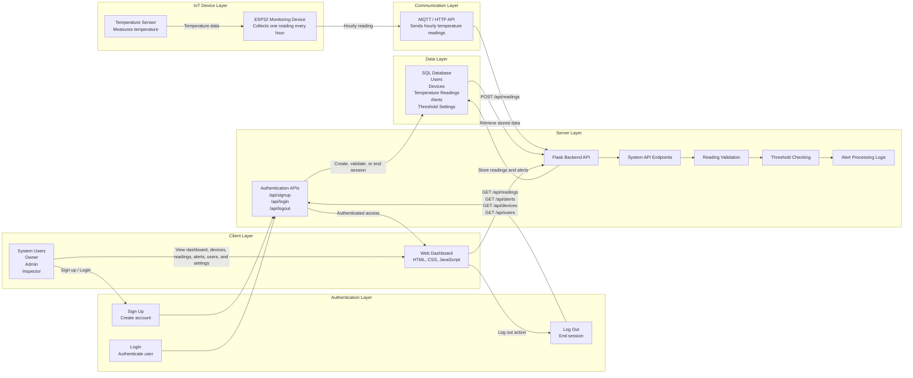
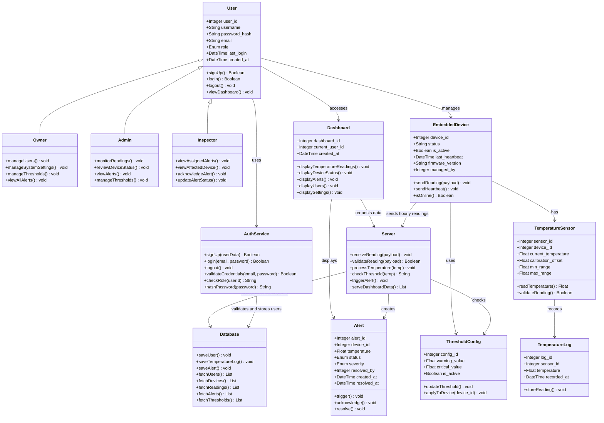

# FlexSight - Technical Documentation

## Stage 3: Technical Documentation

### Temperature Monitoring and Alert System

---

## Table of Contents

1. [Introduction](#introduction)
2. [System Overview](#system-overview)
3. [MVP Scope](#mvp-scope)
4. [User Stories and Mockups](#user-stories-and-mockups)
5. [System Architecture](#system-architecture)
6. [Components, Classes, and Database Design](#components-classes-and-database-design)
7. [High-Level Sequence Diagrams](#high-level-sequence-diagrams)
8. [External and Internal APIs](#external-and-internal-apis)
9. [SCM and QA Strategies](#scm-and-qa-strategies)
10. [Technical Justifications](#technical-justifications)
11. [Conclusion](#conclusion)

---

# Introduction

FlexSight is an IoT-based temperature monitoring system designed to support safer and more reliable monitoring in operational environments.

This technical documentation translates the project objectives and MVP requirements into a detailed technical plan. It defines the system architecture, user stories, mockups, components, classes, database structure, sequence diagrams, API specifications, source control strategy, quality assurance plan, and technical justifications.

The purpose of this document is to provide the development team with a clear technical blueprint before implementation. It helps ensure that all team members understand how the system is structured, how data flows between components, how alerts are generated, how users access the dashboard, and how the system will be tested and maintained.

---

# System Overview

The FlexSight MVP focuses on monitoring temperature readings using a temperature sensor connected to an ESP32 monitoring device.

The ESP32 monitoring device collects temperature readings once every hour and sends the data to the backend system through MQTT or HTTP API communication. The backend validates the incoming readings, stores them in a SQL database, checks temperature threshold values, and generates warning or critical alerts when abnormal temperature levels are detected.

The web dashboard allows authorized users to sign up, log in, view device status, temperature readings, historical records, alert information, users, and settings based on their assigned roles.

The system also supports log out functionality. Alerts are displayed directly on the web dashboard whenever abnormal temperature levels are detected.

FlexSight follows a layered architecture that separates responsibilities across the authentication layer, IoT device layer, communication layer, backend layer, database layer, frontend dashboard, and alert processing logic.

---

# MVP Scope

The MVP includes the core features required to demonstrate the main monitoring and alerting workflow.

## Included in MVP

- User sign up.
- User login.
- User log out.
- Role-based access for Owner, Admin, and Inspector.
- Temperature monitoring.
- ESP32 monitoring device.
- Temperature sensor integration.
- Hourly temperature readings.
- Device status monitoring.
- SQL database storage.
- Web dashboard.
- Warning and critical alerts.
- Threshold settings.
- User management.

## Out of MVP Scope

The following features are excluded from the MVP:

- Mobile application.
- Mobile push notifications.
- SMS notifications.
- AI-based risk prediction.
- Smoke monitoring.
- Gas monitoring.
- Flame monitoring.
- Camera feeds.
- Power monitoring.
- HVAC monitoring.
- Energy monitoring.
- Advanced analytics.
- Enterprise-level reporting.
- External integrations with third-party monitoring platforms.

---

# User Stories and Mockups

This section defines the functional requirements of the FlexSight platform from the perspective of the system users. The user stories describe the expected interactions between users and the system and are prioritized using the MoSCoW prioritization method.

The section also includes the system mockups, which provide an early visualization of the user interface before implementation.

---

# Mockups

The user interface mockups were designed using Figma to demonstrate the initial layout of the FlexSight web dashboard and the expected user experience during the MVP phase.

The mockups include:

- Sign Up Page
- Login Page
- Dashboard
- Temperature Monitoring
- Alerts Management
- Device Status
- User Management
- Settings Page
- Log Out Action

**Figma Design**

https://www.figma.com/design/16Nuzcwz3B1azhiJiN22X9/FlexSight-Stage-3-Technical-Documentation?node-id=0-1&t=z3ETsKX6XhvQY6iE-1

# User Stories

The following user stories describe the expected functionality of the FlexSight platform for each system role.

The stories are categorized using the *MoSCoW prioritization technique* to distinguish between mandatory MVP features and future enhancements.

---

## Authentication User Stories

### Must Have (MVP)

As a new user, I want to sign up, so that I can create an account and access the FlexSight system.

As a registered user, I want to log in, so that I can access the dashboard based on my assigned role.

As a logged-in user, I want to log out, so that I can end my session safely.

As a user, I want the system to validate my login information, so that only authorized users can access the dashboard.

As a user, I want to access dashboard pages based on my role, so that I only see the features allowed for my account.

### Should Have

As a user, I want to see an error message when my login information is incorrect, so that I can understand why access failed.

As a user, I want to be redirected to the login page after logging out, so that I know my session has ended.

### Could Have

As a user, I want password rules during sign up, so that my account is more secure.

---

## Persona 1 — Owner

### Must Have (MVP)

As an Owner, I want to sign up and log in, so that I can access the FlexSight dashboard securely.

As an Owner, I want to view all users, devices, temperature readings, and alerts, so that I can supervise the entire FlexSight system.

As an Owner, I want to access the main dashboard, so that I can monitor the overall system status.

As an Owner, I want to view device status, so that I can know whether each ESP32 monitoring device is online or offline.

As an Owner, I want to view critical alerts, so that I can identify high-risk temperature issues quickly.

As an Owner, I want to manage system settings, so that the monitoring process can be controlled at the system level.

As an Owner, I want to manage warning and critical temperature thresholds, so that the system can detect abnormal temperature levels correctly.

As an Owner, I want to manage user roles and permissions, so that each user has the correct access level.

As an Owner, I want to view registered users, so that I can manage user access to the FlexSight system.

As an Owner, I want to log out, so that I can end my dashboard session safely.

### Should Have

As an Owner, I want to view system performance and alert summaries, so that I can evaluate the effectiveness of the monitoring system.

As an Owner, I want to view historical hourly temperature readings, so that I can review previous temperature changes.

### Could Have

As an Owner, I want to generate summary reports, so that I can review temperature trends and alert history.

As an Owner, I want to export system logs, so that I can keep records for documentation and review.

---

## Persona 2 — Admin

### Must Have (MVP)

As an Admin, I want to log in, so that I can access the monitoring dashboard securely.

As an Admin, I want to view temperature readings from ESP32 devices, so that I can monitor the current temperature status of each device.

As an Admin, I want to monitor hourly readings, so that I can confirm that FlexSight is collecting readings once every hour.

As an Admin, I want to view device status, so that I can know whether each monitoring device is working properly.

As an Admin, I want to see warning and critical alerts on the dashboard, so that I can respond quickly to abnormal temperature levels.

As an Admin, I want to review active alerts, so that I can prioritize urgent incidents.

As an Admin, I want to view alert details, so that I can understand the affected device, temperature value, alert severity, and alert time.

As an Admin, I want to filter readings by device and date, so that I can analyze sensor data easily.

As an Admin, I want to log out, so that I can end my dashboard session safely.

### Should Have

As an Admin, I want to view alert history, so that I can track previous incidents and responses.

As an Admin, I want to export readings and alert data, so that I can prepare reports when needed.

### Could Have

As an Admin, I want to refresh device status, so that I can check the latest monitoring condition.

---

## Persona 3 — Inspector

### Must Have (MVP)

As an Inspector, I want to log in, so that I can access assigned alerts securely.

As an Inspector, I want to view assigned alerts, so that I can follow up on reported incidents.

As an Inspector, I want to view the affected device, so that I can know which ESP32 device needs attention.

As an Inspector, I want to view temperature readings, so that I can understand the severity of the issue.

As an Inspector, I want to view alert details including device ID, temperature, severity, and time, so that I can inspect the issue accurately.

As an Inspector, I want to acknowledge assigned alerts, so that the team knows the alert is being handled.

As an Inspector, I want to update the alert status as resolved or unresolved, so that the team can track incident follow-up progress.

As an Inspector, I want to view the affected device status, so that I can know whether the monitoring device is online or offline.

As an Inspector, I want to log out, so that I can end my dashboard session safely.

### Should Have

As an Inspector, I want to add follow-up notes to an alert, so that the response details are documented.

As an Inspector, I want to view previous alerts for the same device, so that I can identify repeated temperature issues.

---

## Won't Have in MVP

The following features are intentionally excluded from the first MVP release:

- Mobile application.
- Mobile push notifications.
- SMS notifications.
- AI-based risk prediction.
- Smoke monitoring.
- Gas monitoring.
- Flame monitoring.
- Camera feeds.
- Power monitoring.
- HVAC monitoring.
- Energy monitoring.
- Advanced analytics.
- Enterprise-level reporting.
- Third-party monitoring platform integrations.

---

## User Stories Summary

The user stories define the functional requirements of FlexSight from the perspective of authentication and the three primary user roles: *Owner, Admin, and Inspector*.

Using the MoSCoW prioritization method ensures that the MVP focuses on the essential authentication, monitoring, alerting, and dashboard capabilities while leaving advanced features for future releases.

# System Architecture

FlexSight is designed as an IoT-based web monitoring platform that follows a layered architecture to ensure clear separation of responsibilities, maintainability, scalability, and reliability.

The system architecture consists of an Authentication Layer for user access, an IoT Device Layer for collecting hourly temperature readings, a Communication Layer for transmitting data, a Server Layer for validating and processing readings, a Data Layer for storing system records, and a Client Layer for user interaction through the web dashboard.

---

## High-Level Architecture Diagram

---

## Architecture Overview

The system starts when a user signs up or logs in through the authentication pages. The backend validates the user account and role, then grants authenticated access to the web dashboard.

The monitoring process begins when the **Temperature Sensor** measures the temperature value from the monitored environment. The sensor is connected to an **ESP32 Monitoring Device**, which collects one reading every hour and sends the reading to the backend using **MQTT** or **HTTP API** communication.

Once the reading reaches the **Flask Backend API**, the backend validates the received data, stores it in the **SQL Database**, checks the configured warning and critical temperature thresholds, and generates an alert when abnormal readings are detected.

The **Web Dashboard** retrieves stored readings, alerts, device information, users, and settings through internal API endpoints. Authorized users such as the **Owner**, **Admin**, and **Inspector** can view dashboard data based on their assigned roles.

When a warning or critical alert is generated, it is displayed on the dashboard so users can respond quickly to the temperature issue.

---

## System Components

| Component | Technology | Description |
|---|---|---|
| Authentication | Flask Backend / User Session Logic | Allows users to sign up, log in, access the dashboard, and log out. |
| IoT Device | ESP32 Monitoring Device | Collects temperature readings every hour and sends them to the backend system. |
| Sensor | Temperature Sensor | Measures temperature values from the monitored environment. |
| Frontend | HTML, CSS, JavaScript | Web dashboard used to display readings, alerts, device status, users, settings, and historical data. |
| Backend | Python + Flask | RESTful API server responsible for authentication, receiving readings, validating data, processing alerts, and serving dashboard data. |
| Communication | MQTT / HTTP API | Used to transmit hourly temperature readings from the ESP32 device to the backend system. |
| Database | SQL Database | Stores users, devices, temperature readings, alerts, threshold settings, and dashboard records. |
| Alert Logic | Threshold Monitoring | Checks readings against normal, warning, and critical temperature thresholds. |

---

## Architectural Principles

### Separation of Concerns

Each layer has a clear responsibility. Authentication manages user access, the ESP32 monitoring device collects readings, the backend processes data and alerts, the database stores records, and the dashboard displays information to users.

### Scalability

The architecture allows additional ESP32 monitoring devices to be added in the future without changing the overall system structure.

### Maintainability

Using a layered structure makes the system easier to update, debug, test, and expand during future development stages.

### Reliability

Temperature readings are validated before storage, and abnormal readings trigger alert logic to support quick response.

### Security

The authentication flow helps restrict dashboard access to authorized users only. Users can sign up, log in, and log out, while role-based access supports different permissions for Owner, Admin, and Inspector.

### Extensibility

The system can later support additional temperature monitoring devices, configurable thresholds, and summary reports while keeping the MVP structure simple.

# Components, Classes, and Database Design

This section defines the internal structure of the FlexSight platform. It describes the relational database design, database relationships, backend components, and object-oriented classes that support the implementation of the MVP.

---

# Database Overview

The FlexSight database is designed to support user authentication, user role management, ESP32 monitoring devices, temperature sensors, hourly temperature readings, threshold configuration, alert processing, and dashboard access.

The schema uses Primary Keys (PK) and Foreign Keys (FK) to maintain clear relationships between the main system entities while ensuring data consistency and integrity.

---

# Database Schema

## users

- user_id (PK)
- username (UNIQUE)
- password_hash
- email (UNIQUE)
- role (OWNER / ADMIN / INSPECTOR)
- last_login
- created_at

---

## embedded_devices

- device_id (PK)
- status
- is_active
- last_heartbeat
- firmware_version
- managed_by (FK → users.user_id)

---

## temperature_sensors

- sensor_id (PK)
- device_id (FK → embedded_devices.device_id)
- current_temperature
- calibration_offset
- min_range
- max_range

---

## threshold_configs

- config_id (PK)
- warning_value
- critical_value
- is_active

---

## temperature_logs

- log_id (PK)
- sensor_id (FK → temperature_sensors.sensor_id)
- temperature
- recorded_at

---

## alerts

- alert_id (PK)
- device_id (FK → embedded_devices.device_id)
- temperature
- status (OPEN / ACKNOWLEDGED / RESOLVED)
- severity (WARNING / CRITICAL)
- resolved_by (FK → users.user_id)
- created_at
- resolved_at

---

## dashboards

- dashboard_id (PK)
- current_user_id (FK → users.user_id)
- created_at

---

## device_thresholds

- device_id (FK → embedded_devices.device_id)
- config_id (FK → threshold_configs.config_id)

---

# Database Relationships

- users 1 → N embedded_devices
- users 1 → N dashboards
- users 1 → N alerts through resolved_by
- embedded_devices 1 → N temperature_sensors
- temperature_sensors 1 → N temperature_logs
- embedded_devices 1 → N alerts
- embedded_devices N → N threshold_configs through device_thresholds
- threshold_configs N → N embedded_devices through device_thresholds

---

# Back-end Components

The FlexSight backend is composed of core components responsible for authentication, device monitoring, temperature reading processing, threshold checking, alert generation, database storage, and dashboard communication.

### User

Represents a FlexSight system user who can sign up, log in, access the dashboard, and log out based on an assigned role.

### Owner

Represents the highest-level user responsible for supervising users, devices, readings, alerts, thresholds, and system settings.

### Admin

Represents the operational user responsible for monitoring temperature readings, reviewing device status, and following up on alerts.

### Inspector

Represents the user responsible for viewing assigned alerts, reviewing affected devices, and updating alert status.

### AuthService

Represents the backend authentication logic responsible for sign up, login validation, password hashing, role checking, and log out.

### EmbeddedDevice

Represents the ESP32 monitoring device responsible for collecting temperature readings and sending them to the backend.

### TemperatureSensor

Represents the temperature sensor connected to the ESP32 monitoring device.

### TemperatureLog

Represents hourly temperature readings stored in the database.

### Server

Represents the Flask backend server responsible for receiving, validating, processing, and storing temperature data.

### Database

Represents the SQL database layer responsible for storing and retrieving users, devices, readings, alerts, thresholds, and dashboards.

### Alert

Represents a warning or critical event generated when temperature readings exceed the configured threshold.

### Dashboard

Represents the web interface used by authenticated users to view temperature readings, alerts, devices, users, and settings.

### ThresholdConfig

Represents the warning and critical threshold settings used to classify temperature readings

---

# Class Diagram

---

## Design Summary

The FlexSight backend follows an object-oriented architecture combined with a relational SQL database to provide a reliable and maintainable monitoring platform.

This design separates responsibilities across users, authentication, monitoring devices, sensors, server processing, alert generation, dashboard visualization, and threshold configuration.
