# Database Testing Evidence

This document provides evidence that the FlexSight database was created and tested successfully during Stage 4.

The database was tested using MySQL Workbench and VS Code Terminal. The testing confirmed that the database, tables, sample data, and relationships were created correctly.

---

## 1. Show Databases

This screenshot shows that the MySQL database temperature_monitoring_system was created successfully.

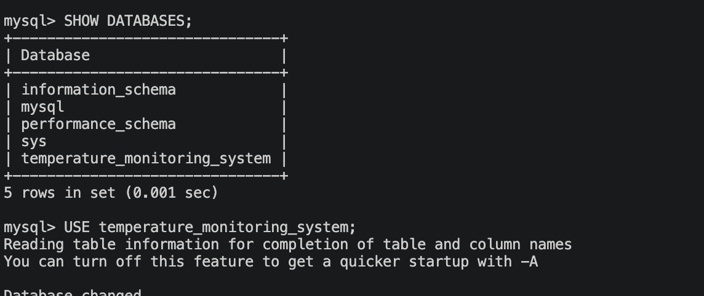

---

## 2. Show Tables

This screenshot shows all database tables created successfully.

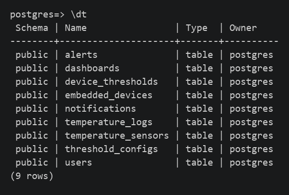

---

## 3. Users Table

This screenshot shows the sample users inserted into the database with their assigned roles: OWNER, ADMIN, and INSPECTOR.

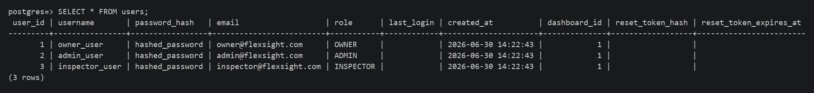

---

## 4. Embedded Devices Table

This screenshot shows the embedded devices stored in the database, including device status, activity state, heartbeat time, firmware version, and assigned manager.

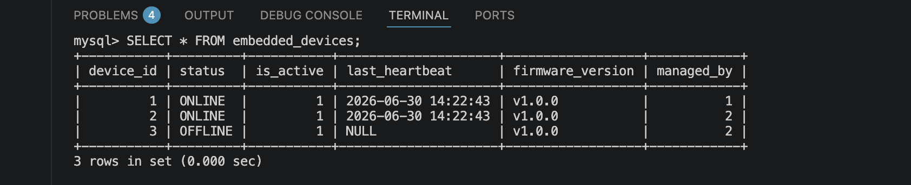

---

## 5. Temperature Sensors Table

This screenshot shows the temperature sensors linked to embedded devices, including current temperature, calibration offset, and sensor range.

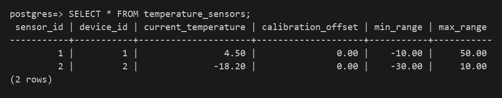

---

## 6. Threshold Configurations Table

This screenshot shows the warning and critical temperature thresholds used by the system.

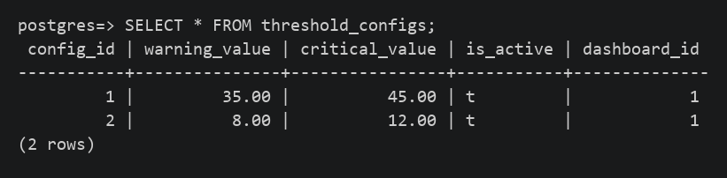

---

## 7. Temperature Logs Table

This screenshot shows stored temperature readings in the database. The sample data includes normal, warning, and critical temperature values.

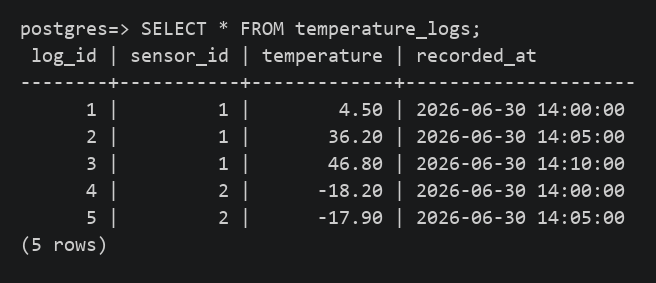

---

## 8. Alerts Table

This screenshot shows warning and critical alerts generated from abnormal temperature readings.

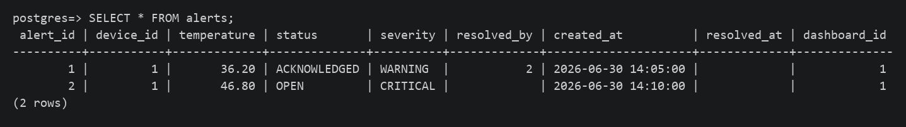

---

## 9. Notifications Table

This screenshot shows notification records linked to alerts and users.

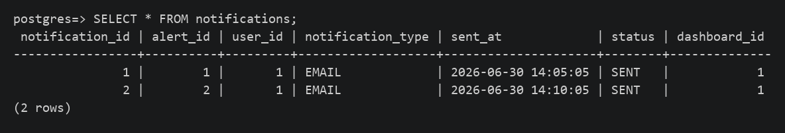

---

## 10. Dashboards Table

This screenshot shows the dashboard record linked to the current user in the database.

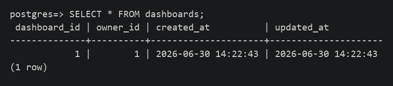

---

## 11. Device Thresholds Table

This screenshot shows the relationship between embedded devices and threshold configurations.

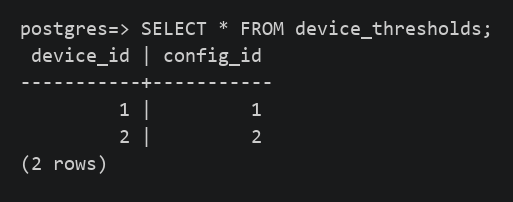

---

## Database Testing Summary

The database was tested successfully. The tables were created, sample data was inserted, and SELECT queries confirmed that users, embedded devices, temperature sensors, threshold configurations, temperature logs, alerts, dashboards, notifications, and device threshold relationships are stored correctly.

This evidence supports Stage 4 testing requirements by showing that the database layer of the MVP is working before continuing with backend models, API development, and dashboard integration.
